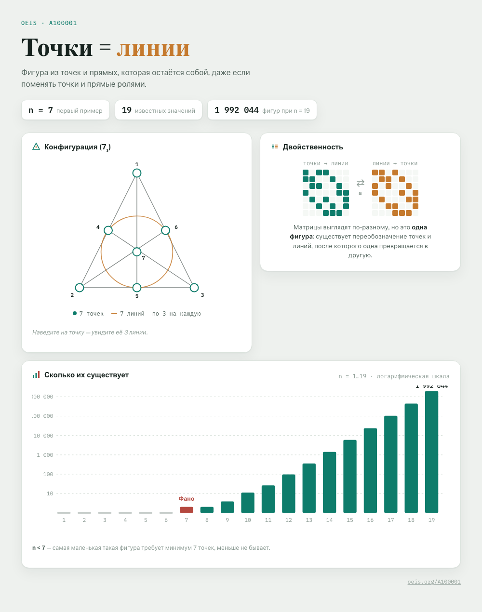
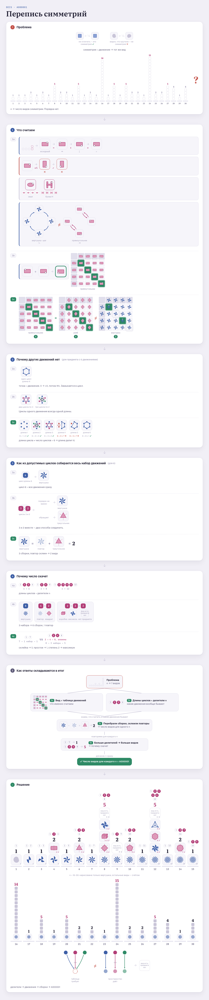

# OEIS, visualized

Interactive, self-contained HTML explainers for entries in the
[On-Line Encyclopedia of Integer Sequences](https://oeis.org/) — each one built to answer a single
question with a picture rather than a paragraph: what is this sequence actually counting, and why
does it behave the way it does.

Each sequence lives in its own directory under [`sequences/`](sequences/) (`sequences/A100001`,
`sequences/A000001`, ...) with a single self-contained `viz.html` — open it directly in a browser,
no build step, no dependencies beyond a Google Fonts stylesheet link.

## Sequences

| # | Sequence | Idea |
|---|---|---|
| [A100001](sequences/A100001) | Self-dual `(n_3)` configurations | Fano plane, incidence matrix vs. its transpose |
| [A000001](sequences/A000001) | Number of groups of order n | movements of an object → Cayley table → why the count jumps |

Each sequence's own `README.md` has the write-up — the framing, why it works, and links to its
device(s) — and links to its RFC-style spec (requirements and acceptance criteria), which lives in
[`memory-bank/specs/tasks/`](memory-bank/specs/tasks/). The format that spec must follow is itself
specified: see [`memory-bank/specs/tasks.md`](memory-bank/specs/tasks.md). Shared write-ups that
don't belong to any single sequence — the diagram devices themselves, each with its own picture —
live in [`memory-bank/`](memory-bank/_terms.md). Where a page went through earlier
structurally-different attempts before landing on its final framing, those are kept in a `drafts/`
subdirectory rather than discarded, since the reasoning for abandoning each attempt is itself part
of the record.

## The page is live; the pictures above are a snapshot of it

`viz.html` is the source of truth, not the PNGs — open it and it's live: hover states, SVG built
at load time from the same numbers the page is explaining, both light and dark themes. GitHub
can't preview an `.html` file inline, though, so every `sequences/A{NNNNNN}/screenshots/*.png`
(embedded above, in each sequence's own README, and per-device in
[`memory-bank/_terms.md`](memory-bank/_terms.md)) is a real, reproducible snapshot taken FROM the
live page by [`memory-bank/visualizations/capture.mjs`](memory-bank/visualizations/capture.mjs)
(Playwright, light theme, one crop per section) — never a hand-made or separately-drawn picture.
Re-run it after editing a page's markup; a stale screenshot next to a changed page is a bug.

Correctness of what a page CLAIMS lives one level up from the picture itself:
[`memory-bank/verify/`](memory-bank/verify/) independently re-checks anything a page embeds as an
algebraic or numeric fact (group tables — latin square, associativity, identity, self-inverse
count) before that check's real output is cited as evidence in the sequence's own spec.

## Repository layout, and what it's copied from

The devices catalog (`memory-bank/_terms.md`), its two meta-specs
(`memory-bank/specs/approaches.md`, `memory-bank/specs/visualizations.md`), the applied per-sequence
specs (`memory-bank/specs/tasks/`), the short auto-loaded rules file
(`.claude/rules/visualization-principles.md`) and the assembly skill
(`.claude/skills/explain-sequence/`) are all adapted from
[Hedgehogues/project-euler](https://github.com/Hedgehogues/project-euler)'s own memory bank — same
RFC discipline, same one-way "sequences point at the dictionary, never the reverse" rule, same
insistence that every `Status: done` names a real, re-run check rather than a claim from memory.
What changed, and why, is stated in each adapted file's own header — most substantially,
[`memory-bank/specs/visualizations.md`](memory-bank/specs/visualizations.md)'s Architecture section,
since this catalog's pages are live and interactive rather than built to a static PNG.
