# OEIS, visualized

Interactive, self-contained HTML explainers for entries in the
[On-Line Encyclopedia of Integer Sequences](https://oeis.org/) — each one built to answer a single
question with a picture rather than a paragraph: what is this sequence actually counting, and why
does it behave the way it does.

Each sequence lives in its own directory under [`sequences/`](sequences/) (`sequences/A100001`,
`sequences/A000001`, ...) with a `solution.mjs` that computes the sequence from its definition and
a `proof.mjs` that re-checks that output independently. The pictures live in the memory bank, at
[`memory-bank/visualizations/A{NNNNNN}/viz.html`](memory-bank/visualizations/) — one self-contained
page each, opened directly in a browser, no build step.

## Build & run

```
node sequences/A{NNNNNN}/solution.mjs [maxN]    # compute the sequence
node sequences/A{NNNNNN}/proof.mjs [maxN]       # re-check what it computed
node memory-bank/visualizations/capture.mjs     # re-capture every screenshot from the live pages
node memory-bank/verify/all.mjs                 # run every check in the repository
```

`verify/all.mjs` is what a spec's `Status: done` is allowed to cite. Each check under
[`memory-bank/verify/`](memory-bank/verify/) exists because the thing it checks was once wrong in a
way nothing noticed — a catalog record describing a widget a redesign had deleted, a page whose
only line of notation a "remove the prose" pass had taken, a QR readable in its source file and
unreadable in the snapshot that actually travels. Every one of them was tested by reintroducing
that exact fault and confirming it fails.

## Sequences

| # | Sequence | Status |
|---|---|---|
| [A100001](sequences/A100001) | Self-dual `(n_3)` configurations | Matches OEIS for `n = 1..13`, witnessed |
| [A000001](sequences/A000001) | Number of groups of order n | Matches OEIS for `n = 1..8`, verified |
| [A000002](sequences/A000002) | Kolakoski sequence | Matches OEIS for `n = 1..107`, self-consistent through `n = 1,000,000` |
| [A000003](sequences/A000003) | Class number of discriminant -4n | Matches OEIS for `n = 1..99`, independently re-derived through `n = 500` |
| [A000005](sequences/A000005) | Number of divisors of n | Matches OEIS for `n = 1..103`, algebra re-checked through `n = 2000` |
| [A000004](sequences/A000004) | The zero sequence | Matches OEIS for `n = 0..33`; thin entry, borrows A000005's page |
| [A000007](sequences/A000007) | Characteristic function of {0} | Matches OEIS for `n = 0..33`; identity property checked to `n = 60`, thin entry |
| [A000012](sequences/A000012) | The all 1's sequence | Matches OEIS for `n = 0..33`; four convolution relations checked to `n = 200`, thin entry |
| [A000027](sequences/A000027) | The positive integers | Matches OEIS for `n = 1..26`; three relations and the bucket argument checked to `n = 200`, thin entry |
| [A000030](sequences/A000030) | Initial digit of n | Matches OEIS for `n = 0..109`; never-settles and Benford-contrast claims independently re-derived |
| [A000018](sequences/A000018) | Positive integers ≤ 2ⁿ of form x²+16y² | Matches OEIS for `n = 0..20`, independently re-derived per value |
| [A000021](sequences/A000021) | Positive integers ≤ 2ⁿ of form x²+12y² | Matches OEIS for `n = 0..18`; thin entry, borrows A000018's page |
| [A000024](sequences/A000024) | Positive integers ≤ 2ⁿ of form x²+10y² | Matches OEIS for `n = 0..18`; thin entry, borrows A000018's page |
| [A000029](sequences/A000029) | Bracelets: necklaces with turning over | Matches OEIS for `n = 0..19`, Burnside-checked |
| [A000011](sequences/A000011) | Necklaces where complements are equivalent | Matches OEIS for `n = 0..19`; thin entry, borrows A000029's page |
| [A000013](sequences/A000013) | Necklaces, colors swapped, no turning over | Matches OEIS for `n = 0..19`; thin entry, borrows A000029's page |
| [A000016](sequences/A000016) | Outputs of a complementing shift register | Matches OEIS for `n = 0..19`; no picture, no catalogued device fits |
| [A000008](sequences/A000008) | Ways of making change for n cents | Matches OEIS for `n = 0..60`, independently enumerated |
| [A000009](sequences/A000009) | Partitions of n into distinct parts | Matches OEIS for `n = 0..55`; Euler's theorem witnessed as an explicit bijection |
| [A000010](sequences/A000010) | Euler's totient function | Matches OEIS for `n = 1..69`; product formula, prime case and multiplicativity independently re-derived |
| [A000020](sequences/A000020) | Primitive polynomials of degree n over GF(2) | Matches OEIS for `n = 2..37` (`n=1` resolved against OEIS's own correction) |
| [A000023](sequences/A000023) | Permutations signed by fixed-point parity | Matches OEIS for `n = 0..12`, two independent formulas agree |
| [A000006](sequences/A000006) | Integer part of √(n-th prime) | Matches OEIS for `n = 1..71`; Legendre's conjecture checked for `k = 1..52` |
| [A000015](sequences/A000015) | Smallest prime power ≥ n | Matches OEIS for `n = 1..72`, run/gap structure independently re-derived |
| [A000026](sequences/A000026) | Mosaic numbers | Matches OEIS for `n = 1..72`; fixed-point claim checked in the direction OEIS actually states |
| [A000028](sequences/A000028) | Numbers with an odd exponent 1-bit sum | Matches OEIS for `n = 1..67`; soundness and completeness both independently checked |
| [A000025](sequences/A000025) | Coefficients of Ramanujan's mock theta function f(q) | Matches OEIS for `n = 0..59`; independently re-derived via partition rank through `n = 75` |
| [A000014](sequences/A000014) | Series-reduced trees with n nodes | Matches OEIS for `n = 0..20`; independent labeled construction agrees through `n = 9` |
| [A000019](sequences/A000019) | Primitive permutation groups of degree n | Matches OEIS for `n = 1..6`; exact (not approximate) enumeration, honest wall at `n = 7` |
| [A000022](sequences/A000022) | Centered hydrocarbons with n atoms | Matches OEIS for `n = 0..19`; independent labeled construction agrees through `n = 9` |

[](memory-bank/visualizations/A100001/viz.html)
[](memory-bank/visualizations/A000001/viz.html)
[](memory-bank/visualizations/A000002/viz.html)
[](memory-bank/visualizations/A000003/viz.html)
[](memory-bank/visualizations/A000005/viz.html)
[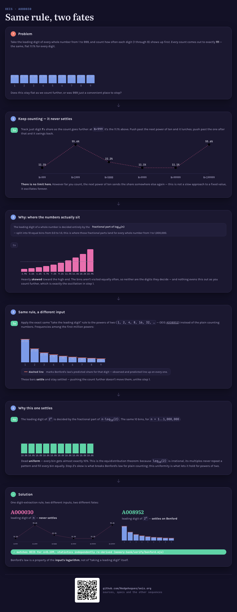](memory-bank/visualizations/A000030/viz.html)
[](memory-bank/visualizations/A000018/viz.html)
[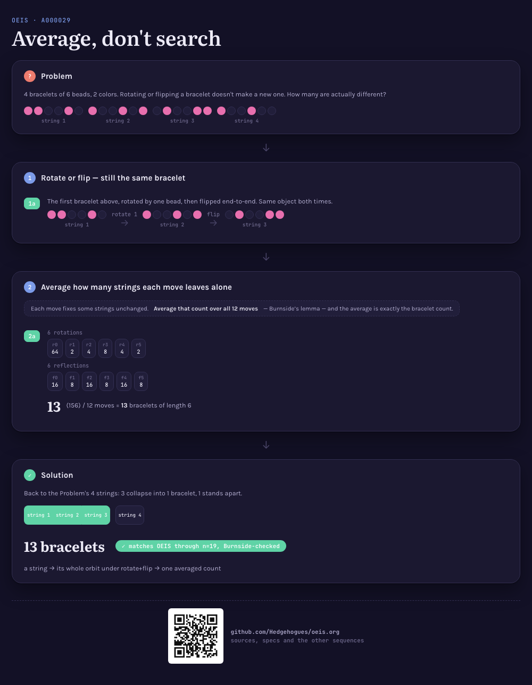](memory-bank/visualizations/A000029/viz.html)
[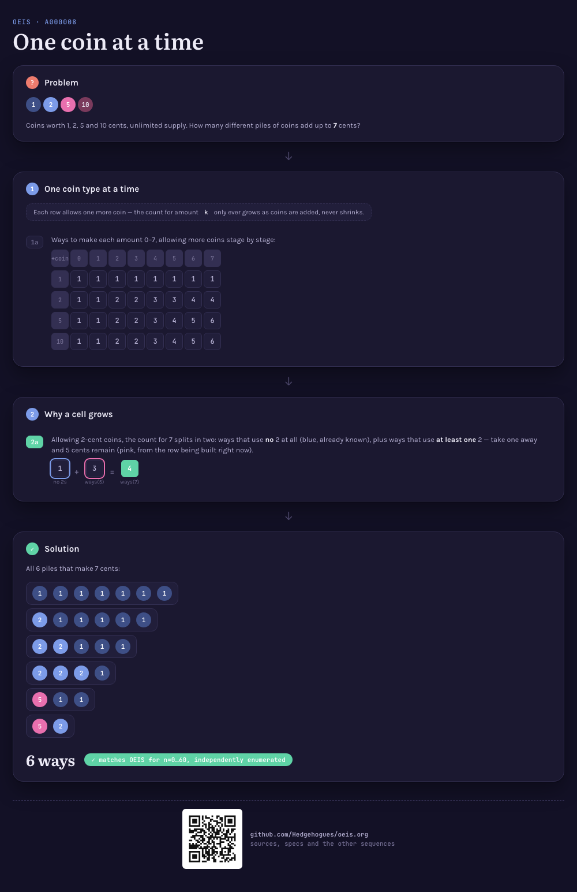](memory-bank/visualizations/A000008/viz.html)
[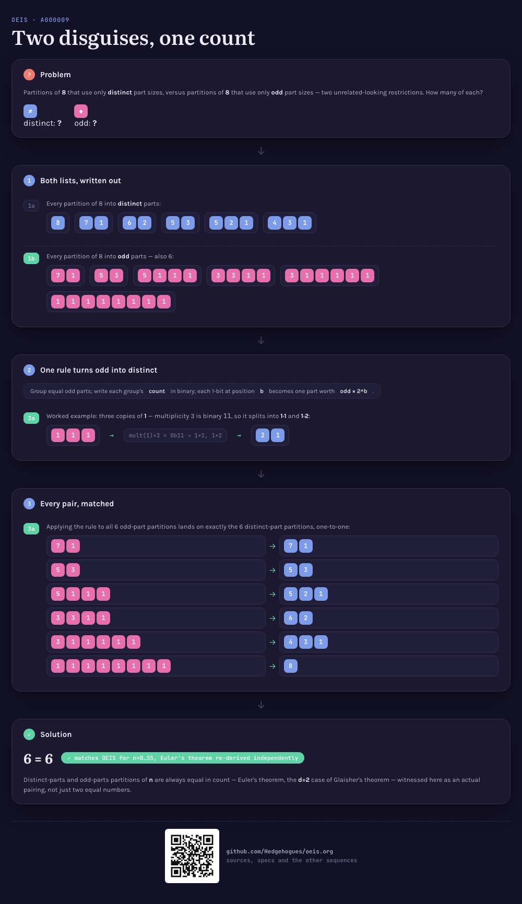](memory-bank/visualizations/A000009/viz.html)
[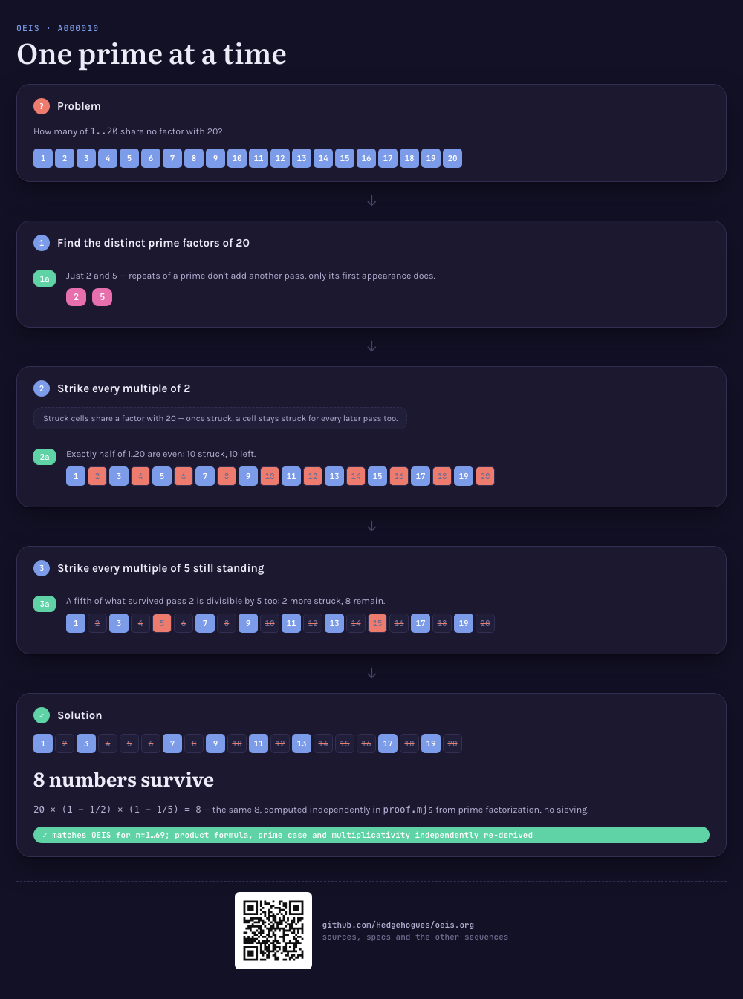](memory-bank/visualizations/A000010/viz.html)
[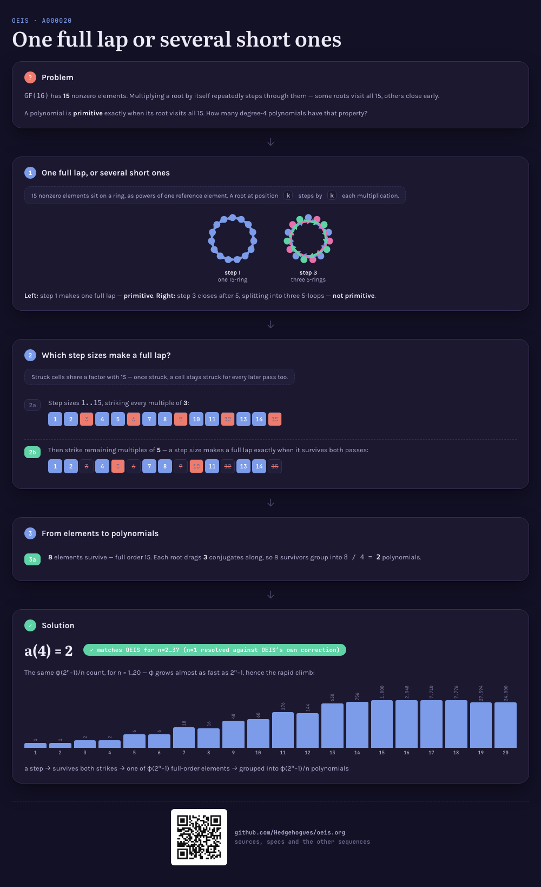](memory-bank/visualizations/A000020/viz.html)
[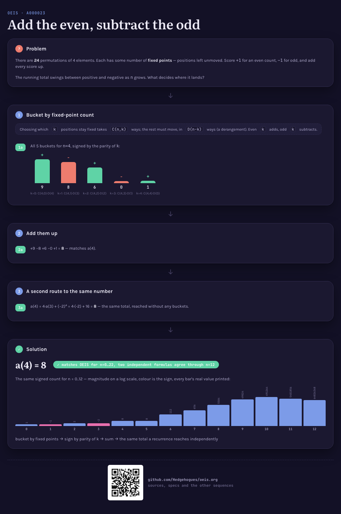](memory-bank/visualizations/A000023/viz.html)
[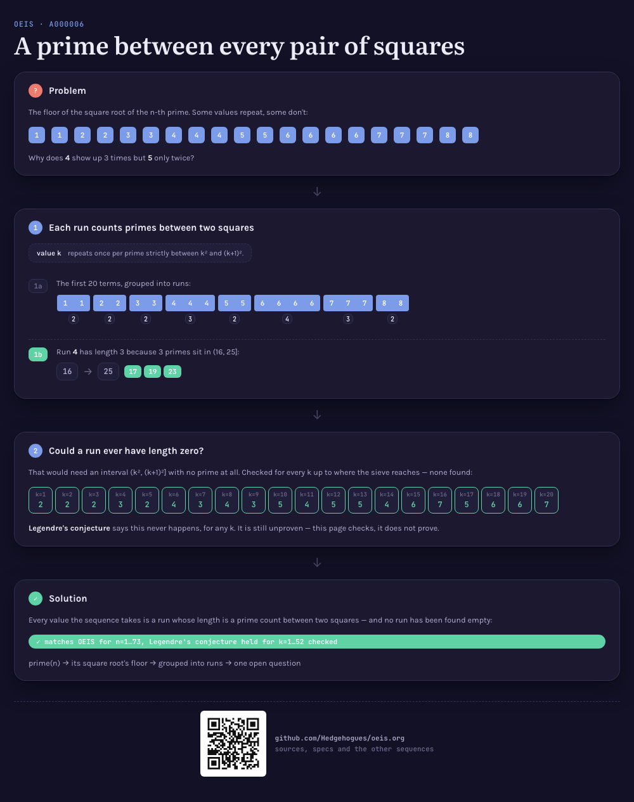](memory-bank/visualizations/A000006/viz.html)
[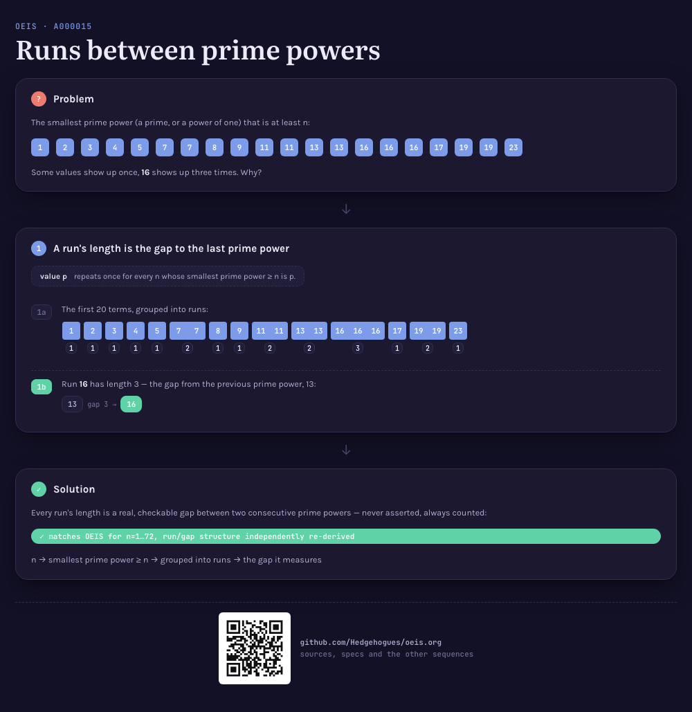](memory-bank/visualizations/A000015/viz.html)
[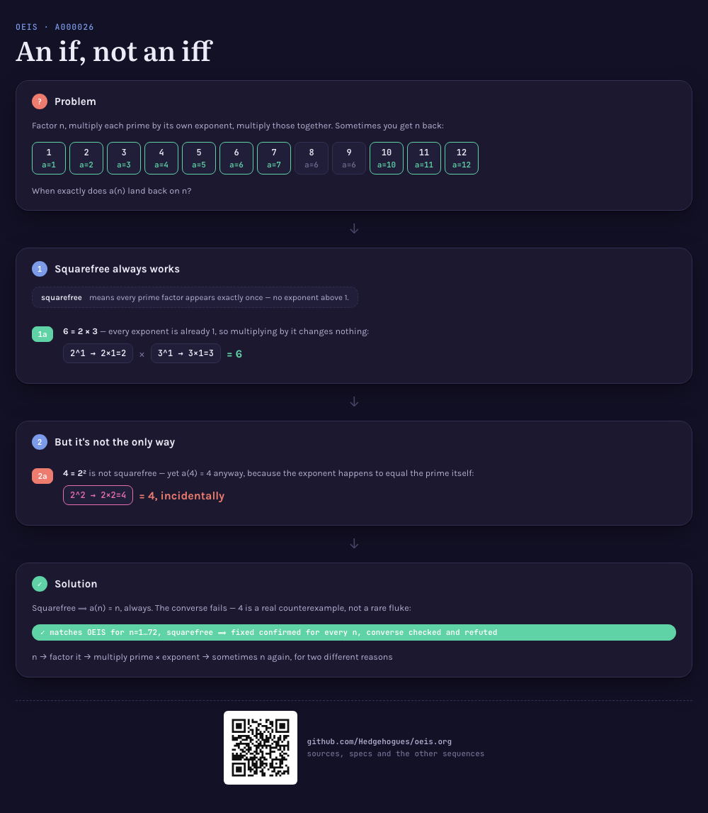](memory-bank/visualizations/A000026/viz.html)
[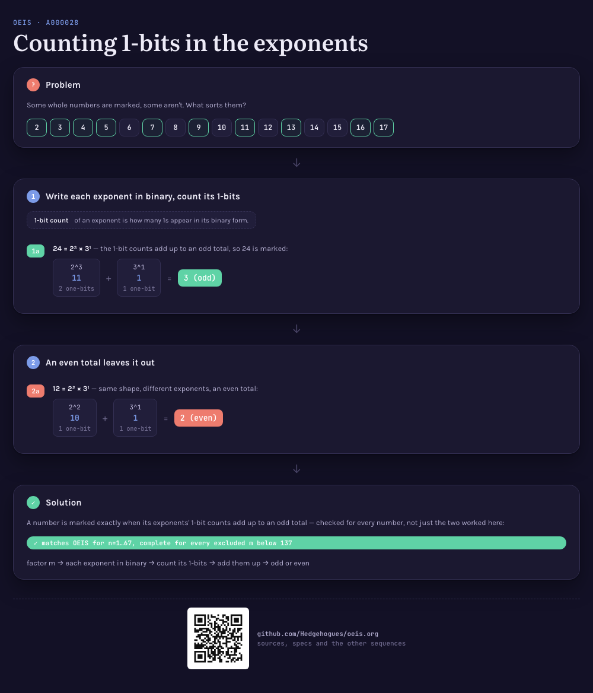](memory-bank/visualizations/A000028/viz.html)
[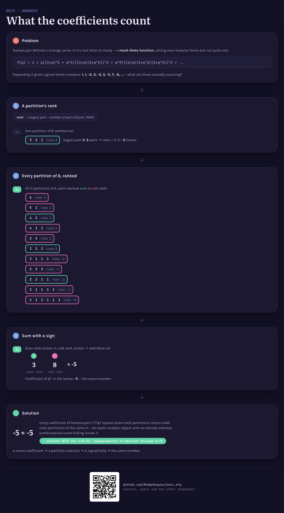](memory-bank/visualizations/A000025/viz.html)
[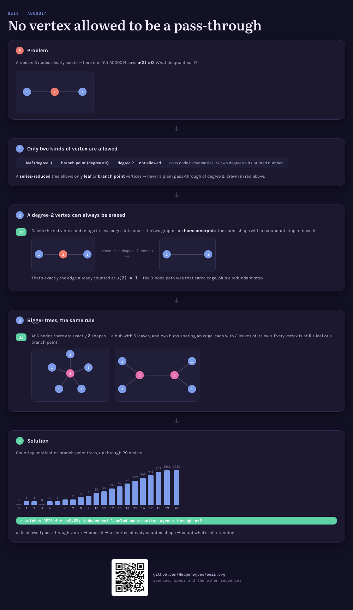](memory-bank/visualizations/A000014/viz.html)
[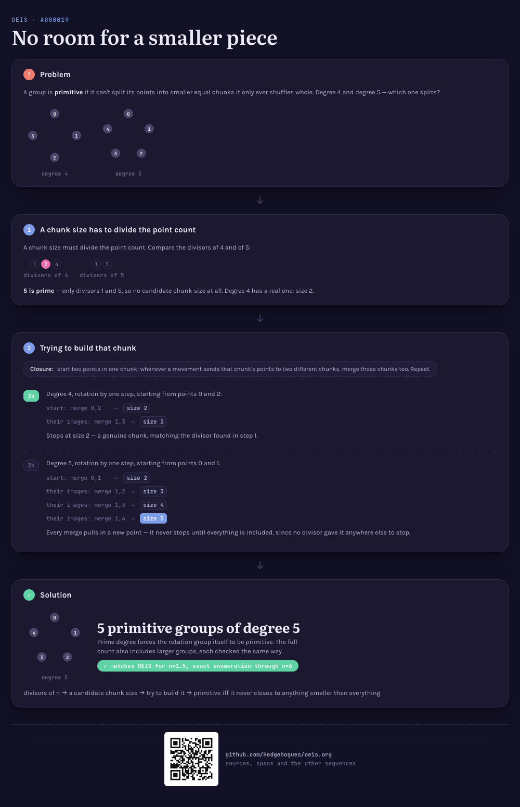](memory-bank/visualizations/A000019/viz.html)
[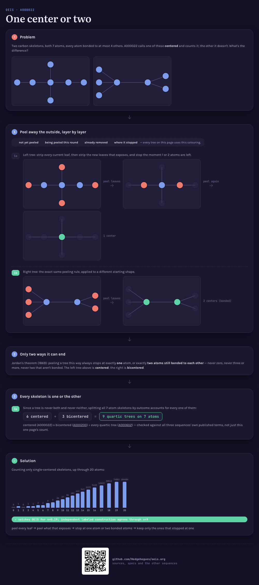](memory-bank/visualizations/A000022/viz.html)

Each sequence's own directory README has the write-up — the approach, why it works, and the
pictures of the ideas it uses — and links to its RFC-style spec (requirements and acceptance
criteria), which lives in [`memory-bank/specs/tasks/`](memory-bank/specs/tasks/). The format that
spec must follow is itself specified: see [`memory-bank/specs/tasks.md`](memory-bank/specs/tasks.md).
Shared write-ups that don't belong to any single sequence — the diagram devices themselves, each
with its own picture — live in [`memory-bank/`](memory-bank/_terms.md).

## Two programs per sequence, and they disagree on purpose

A picture that explains a sequence should be accompanied by code that produces it — and by code
that doesn't take the first one's word for it:

| File | Job | May it consult published terms? |
|---|---|---|
| `solution.mjs` | computes `a(n)` by exactly the procedure the page draws | **no** — a lookup table would make it circular |
| `proof.mjs` | re-derives, re-checks and witnesses what the first one returned | **yes** — that is its entire purpose |

`proof.mjs` never reuses the search that produced the answer. Running one routine twice agrees with
itself for free; a second, deliberately slower routine written straight from the definition can
disagree, and that possibility is what makes agreement mean something. Each pair checks four things
at minimum — every returned object really satisfies the definition, no two are the same object
counted twice, nothing is missing (against an independent construction or an independently
published count), and the totals match OEIS. Where the claim is an existence claim — "this
configuration is isomorphic to its own dual" — the proof produces the relabeling and verifies it
entry by entry rather than reporting a yes.

Both searches are exhaustive, so both hit a wall quickly — A000001 at `n=9`, A100001 past `n=13` —
and each file's header states the measured range instead of hiding it. For A000001 that wall is the
sequence's own subject matter restated as a runtime. A000023's search is `n!` permutations and hits
the same kind of wall — `n=12` in 18.1 s, `n=13` not attempted. A000018 hits a wall of a different
kind: not combinatorial explosion but the size of the sieve array itself — `n=30` (a 1.07 GB byte
array) finishes in seconds, `n=32` (4.3 GB) does not finish within 70 seconds and was stopped.
A000014's wall is the same shape but for a different reason: its own construction avoids labeled
combinatorial explosion entirely (leaf-addition growth of canonical trees, not Prüfer sequences),
so `n=20` finishes in 34.8 s — but the growing POOL of distinct canonical trees itself exhausts a
4 GB heap partway through `n=22`, well before time would have been the limit.
A000019 hits the sharpest wall of any sequence here: enumerating every subgroup of `S_n` (not an
approximation — an earlier draft that closed only pairs of generators happened to give the right
small-`n` answers without being provably complete, and was replaced) reaches `n=6` in 229.5 s
(~3.83 min); `n=7`'s subgroup lattice (`S_7` has 5,040 elements) was not attempted, extrapolated
from the ×9 growth already seen from `n=5` to `n=6` to take many hours.
A000002, A000003, A000005 and A000030 are not
combinatorial searches at all — A000002's construction is linear (ten million terms in under a
tenth of a second), A000003's and A000005's are `O(√n)` per term, A000030's is `O(log₁₀n)` per term
— so their headers state the honest opposite: no wall found, the practical limit is memory or the
size of the search net, not time. A000030's real content isn't its per-term rule at all but a
statistical claim about it (leading-digit frequencies never settle) — that claim gets its own
independent re-derivation in
[`memory-bank/verify/benford.mjs`](memory-bank/verify/benford.mjs), the same role
`verify/group-tables.mjs` plays for A000001's embedded group tables.

## The page is live; the pictures above are a snapshot of it

`viz.html` is the source of truth, not the PNGs — open it and it's live: hover states, SVG built
at load time from the same numbers the page is explaining, both light and dark themes. GitHub
can't preview an `.html` file inline, though, so every
`memory-bank/visualizations/A{NNNNNN}/screenshots/*.png` (embedded above, in each sequence's own
README, and per-device in [`memory-bank/_terms.md`](memory-bank/_terms.md)) is a real, reproducible
snapshot taken FROM the live page by
[`memory-bank/visualizations/capture.mjs`](memory-bank/visualizations/capture.mjs) (Playwright,
dark theme, one crop per device) — never a hand-made or separately-drawn picture. Re-run it after
editing a page's markup; a stale screenshot next to a changed page is a bug.

Correctness of what a page CLAIMS lives one level up from the picture itself:
[`memory-bank/verify/`](memory-bank/verify/) independently re-checks anything a page embeds as an
algebraic, numeric or statistical fact (group tables — latin square, associativity, identity,
self-inverse count; A000030's never-settles and Benford-contrast claims) before that check's real
output is cited as evidence in the sequence's own spec.

## Repository layout, and what it's copied from

The devices catalog (`memory-bank/_terms.md`), its two meta-specs
(`memory-bank/specs/approaches.md`, `memory-bank/specs/visualizations.md`), the applied per-sequence
specs (`memory-bank/specs/tasks/`), the short auto-loaded rules file
(`.claude/rules/visualization-principles.md`) and the two skills
(`.claude/skills/explain-sequence/`, `.claude/skills/document-sequence/`) are all adapted from
[Hedgehogues/project-euler](https://github.com/Hedgehogues/project-euler)'s own memory bank — same
RFC discipline, same one-way "sequences point at the dictionary, never the reverse" rule, same
insistence that every `Status: done` names a real, re-run check rather than a claim from memory,
same directory split (all visual artifacts in the memory bank, a task's own folder holding only its
write-up and its code).

What was compared against what, when, and where it deliberately differs is recorded file by file
in [`memory-bank/upstream.md`](memory-bank/upstream.md), together with the command to redo the
comparison — because "adapted from" was asserted here for a while before anyone actually diffed the
two trees, and two of the files this README cited by name turned out not to exist upstream.

Two things differ, both stated in the adapted files' own headers. Pages here are live and
interactive rather than built to a static PNG, so there is no shared shell and no `build.sh` — see
[`memory-bank/specs/visualizations.md`](memory-bank/specs/visualizations.md)'s Architecture section.
And the independent cross-check is committed as a file rather than described in a Status line:
project-euler records what was checked, this repo also ships `proof.mjs` so anyone can re-run it.
