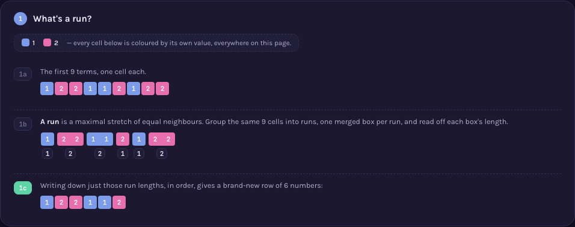
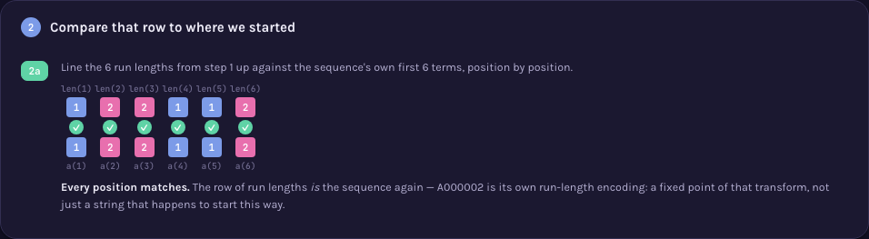
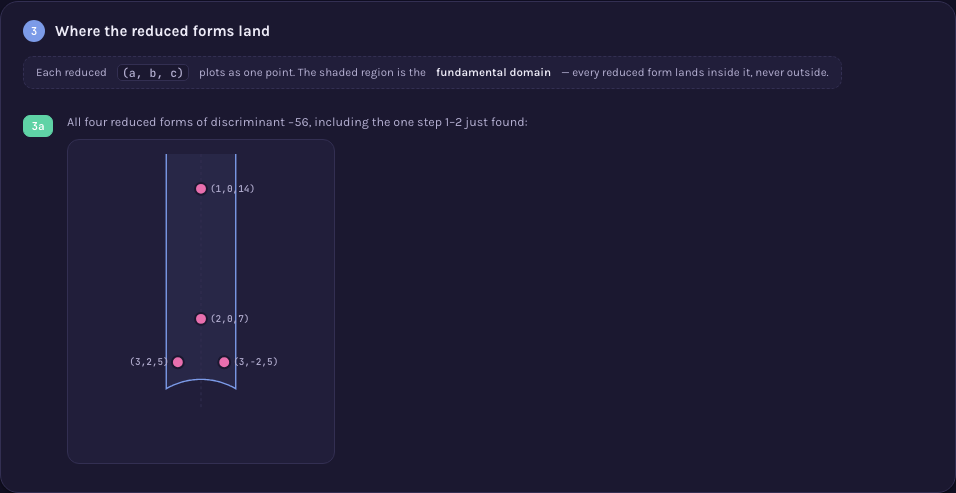
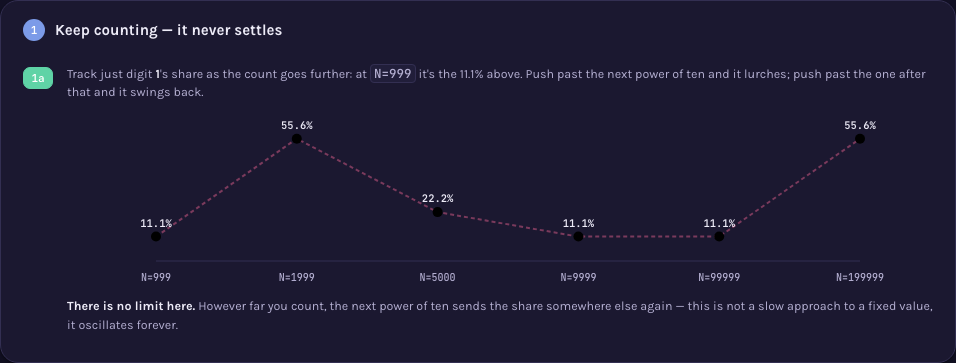
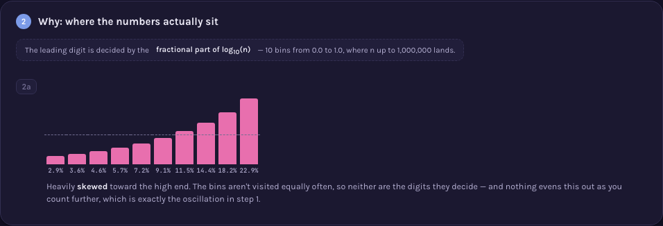
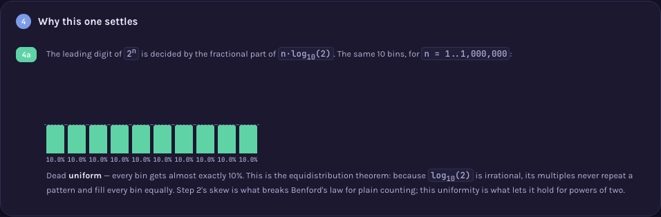
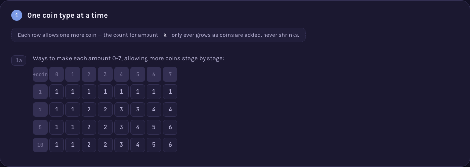
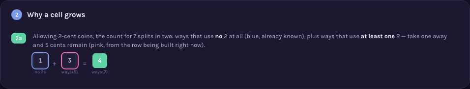
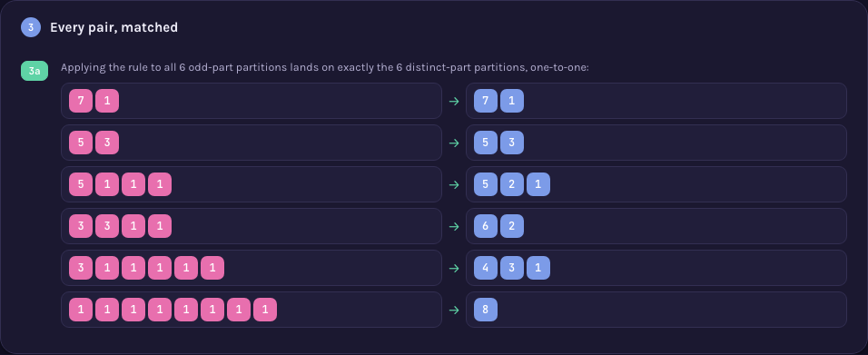

# Ubiquitous Language Index — oeis.org (explaining sequences)

> Canonical dictionary of explanation devices. Format: `## [context::TermName]` · links are plain
> markdown links into this same file, `[context::Name](#anchor)`. One context: `device` — a
> reusable diagram component, distinct from
> [Hedgehogues/project-euler](https://github.com/Hedgehogues/project-euler)'s `method` records in
> one deliberate way: a project-euler `method` is a full Problem→Solution narrative on its own; a
> `device` here is a smaller, reusable BUILDING BLOCK — the Problem→...→Solution narrative lives at
> the page level (`visualizations/A{NNNNNN}/viz.html`, described in that sequence's own `README.md`),
> assembled out of one or more devices. A device therefore has no `Sequence:` field; it has a
> `Reading order:` — how a first-time viewer's eye should move across it — which is a property of
> the component, not of the page.
>
> **One device, one block.** The idea ("what it is, when you recognize it") and its picture ("how
> to draw it") are fields of ONE record: `Essence`/`Recognized by`/`General case`/`Source` describe
> the idea, `Picture`/`Reading order`/`Example` describe the drawing, `Limits` covers both — each
> bullet marking whether the limit belongs to the idea or only to the drawing.
>
> **Not a single mention of a specific sequence lives here** — no OEIS number, no specific numbers
> from any one page. These are the primitives themselves. The link runs ONE way: a sequence's own
> `sequences/A{NNNNNN}/README.md` points at the device it uses by name
> (`[device::Name]` → `_terms.md#devicename`); there is no reverse pointer. A sequence reusing an
> already-described device simply links to the existing block — this file does not change at all.
>
> Unlike project-euler's `visualizations/build.sh`, there is no static-PNG build step here: every
> device is rendered live, in the viewer's own browser, by the page that uses it — see
> `memory-bank/specs/visualizations.md`'s Architecture section for why that's a deliberate
> difference in style, not an omission.

## [device::MarkedAsymmetry]
Class: entity
Standard name: — (no established name found; informally close to a clock's hands or a compass
  needle — a single asymmetric feature added to an otherwise symmetric face so its orientation
  becomes readable)
Essence: Add one small, deliberately asymmetric mark (a dot on one corner, a flag on one blade) to
  an otherwise symmetric shape, so that applying a symmetry to the shape becomes visible — without
  the mark, a symmetric shape transformed by its own symmetry looks unchanged.
Recognized by: the argument needs to show WHERE a movement (rotation, reflection) sends a specific
  point of an object, but the object's own symmetry erases all visual evidence that anything moved
General case: works for any finite symmetry group acting on a 2D shape; the mark must sit at a
  point NOT fixed by any of the movements being compared (a mark on a mirror axis doesn't move
  under that mirror, and looks like a bug rather than a feature)
Picture:  —
  `visualizations/A000001/viz.html`, section 1a/1c (marked rectangle, rhombus, ellipse, "H", pinwheel)
Reading order: the base shape first (undecorated, to register its own symmetry), then the same
  shape with the mark added, then the sequence of transformed copies
Limits:
  - MUST: place the mark off every axis/fixed-point of the movements being shown — an idea-level
    limit, not a drawing one (a mark on a fixed point never moves, regardless of rendering).
  - MUST: render the mark itself large enough and high-contrast enough against the shape's fill to
    read at icon scale — a drawing-level limit, found the hard way (see
    `.claude/rules/visualization-principles.md` #6): enlarging the surrounding icon did not help
    when the mark itself stayed a few low-contrast pixels across.
Source: no canonical citation for the device itself; the underlying idea is a special case of a
  [group action](https://en.wikipedia.org/wiki/Group_theory#Group_actions) made observable by
  breaking symmetry with a marked point (a standard move in the mathematics of symmetry, not
  packaged anywhere as a named "trick").
Example: built inline in `visualizations/A000001/viz.html` (`rectMarked`, `rhombMarked`,
  `ellipseMarked`, `hShapeMarked`, `pinRotated`) — no separate example file; see
  `memory-bank/specs/visualizations.md` for why this catalog keeps devices inline rather than in a
  shared `examples/` directory.
Spec: [approaches](specs/approaches.md) · [visualizations](specs/visualizations.md)

## [device::CayleyTable]
Class: entity
Standard name: Cayley table
Essence: Lay out a finite set of operations as both the row and column headers of a grid; each
  cell shows the single operation you get from doing the row's operation, then the column's.
Recognized by: the argument depends on showing that combining any two of a FIXED, closed set of
  operations always produces a third member of that same set — i.e. that the operations form a
  closed algebraic system, not just a list
General case: any finite group (or, more generally, any set with a closed binary operation) can be
  laid out this way; the table's shape (which cells repeat, which are self-inverse) is itself the
  object of study, independent of which concrete objects realize the group
Picture:  —
  `visualizations/A000001/viz.html`, sections 1b/1c
Reading order: one worked example first (a specific row + a specific column → the highlighted
  result, using the exact math the grid uses), THEN the full grid — never the raw grid first
Limits:
  - MUST: header row and header column carry a visually distinct background from body cells — an
    idea-neutral, pure drawing-level requirement (see principle 3): position alone (top row, left
    column) is not a strong enough signal once the grid is unfamiliar to the viewer.
  - MUST NOT: present the full grid before the one-cell worked example — a reader with no prior
    exposure to Cayley tables has no way to infer "row, then column, then read the cell" from the
    grid alone.
Source: [Wikipedia — Cayley table](https://en.wikipedia.org/wiki/Cayley_table)
Example: built inline in `visualizations/A000001/viz.html` (`cayley()`, plus the `.cy-head`/`.cy-corner`
  CSS classes that give headers their distinct background)
Spec: [approaches](specs/approaches.md) · [visualizations](specs/visualizations.md)

## [device::SelfCancelDiagonal]
Class: entity
Standard name: — (no established name for the diagram; the underlying mathematical fact is a
  standard one — an element that is its own inverse is called an involution)
Essence: Inside a [device::CayleyTable](#devicecayleytable), highlight the diagonal cells where an
  operation combined with itself returns to the identity — turning "how many of these operations
  undo themselves in one repeat" from an asserted number into a directly countable set of
  highlighted cells.
Recognized by: two algebraic structures of the same size need to be compared and shown to differ,
  and the difference is exactly in which elements are self-inverse (involutions) — asserting "4 vs.
  2" as a bare number invites "why", which only the highlighted cells answer
General case: for a group of order n, the count of self-inverse elements (diagonal cells equal to
  the identity) is itself a structural invariant — a Klein four-group has n of them (every non-
  identity element is an involution), a cyclic group of even order n has exactly 2 (identity and
  the unique element of order 2)
Picture:  —
  `visualizations/A000001/viz.html`, section 1c (three tables, `cy-diag`/`cy-self` highlighting) and the
  "grpTwist"/"diagPairs" comparison in section 1a
Reading order: the highlighted diagonal cells first (count them), THEN the summary badge — the
  badge is a confirmation of what's already visible, never the only evidence
Limits:
  - MUST: the count badge sits directly under (or beside) the table it was counted from, with the
    counted cells actually highlighted in that same table — a drawing-level limit; a bare number
    with nothing highlighted nearby is not this device, it is just a claim (principle 8).
  - MUST: if EVERY diagonal cell of a table turns out identical, the corresponding tiles are
    rendered as one merged, gapless shape — otherwise separate tiles holding an identical value
    read as an unexplained inconsistency rather than the intended finding (principle 4; this is
    what [device::MergedResultStrip](#devicemergedresultstrip) is for).
Source: [Wikipedia — Involution (mathematics)](https://en.wikipedia.org/wiki/Involution_(mathematics))
Example: built inline (`diagFP()`, the `.cy-diag`/`.cy-self` CSS classes, `diagPairs()`)
Spec: [approaches](specs/approaches.md) · [visualizations](specs/visualizations.md)

## [device::MergedResultStrip]
Class: entity
Standard name: — (no established name found)
Essence: When a row of individually-computed results turns out to be literally identical across
  every position, render them as one contiguous, gapless shape instead of separate tiles that
  happen to hold the same value — sameness becomes a property of the outline, not something the
  viewer has to verify value-by-value.
Recognized by: a row of small result tiles where all N values coincide reads as broken or
  arbitrary ("why don't these differ") specifically BECAUSE uniform sameness across separately-
  bordered tiles looks like a rendering accident rather than a finding
General case: applies to any small, fixed-length row of computed results where the general
  algorithm is expected to sometimes agree and sometimes disagree across positions (so that
  "merged" is informative precisely because it's not the default look of the row)
Picture:  —
  `visualizations/A000001/viz.html`, section 1a (`#mergeDemo`): rectangle's 4 repeat-twice results
  merged into one bar, contrasted with pinwheel's, which stay four separate tiles
Reading order: compare the two rows side by side first — one merged into a single bar, one staying
  as separate tiles — the shapes themselves are the finding, read before any label
Limits:
  - MUST NOT: merge tiles whose values differ, even by one position — a single mismatch breaks the
    "these are the same" claim entirely; merging must be computed from actual equality of every
    value, never assumed.
Source: no canonical citation; a direct, minimal application of the general principle that visual
  grouping (Gestalt "connectedness"/"common region") communicates categorical sameness faster than
  a value comparison does — not itself packaged as a named technique anywhere found.
Example: built inline (`resultRow()`'s `allSame` branch, `#mergeDemo`) — an earlier version of this
  device (`diagStrip()`) was folded into a since-removed `diagPairs()` widget and briefly had no
  live picture at all; restored as its own dedicated widget once the gap was flagged directly
  (`.claude/rules/visualization-principles.md` #14's own precedent note).
Spec: [approaches](specs/approaches.md) · [visualizations](specs/visualizations.md)

## [device::StateMap]
Class: entity
Standard name: — (no established name for the diagram; the underlying idea is a group action's
  orbit, normally drawn as a cycle diagram/graph in group theory and combinatorics)
Essence: Arrange an object's possible states as points on a ring; draw one movement's effect on
  every state as an arrow. A single movement that visits every state before returning draws as one
  ring of one-directional arrows; a movement made of independent pairs (each undoing the other)
  draws as separate two-way arcs between pairs — the ARROW GEOMETRY is the argument, not a caption
  next to it.
Recognized by: two movements need to be contrasted that have the same COUNT of states but a
  structurally different repeat-behavior (one keeps advancing, one folds back on itself) — a
  contrast that a results-only table cannot show, since it only ever displays where you end up,
  never the shape of getting there
General case: any single generator of a finite cyclic or dihedral-type action can be drawn this
  way; a single generator either has one orbit covering everything (a full ring) or several
  disjoint orbits of the same length (several rings/arcs) — never a mix, by the same divisibility
  fact [device::DivisorChips](#devicedivisorchips) makes explicit elsewhere on the same page
Picture:  —
  `visualizations/A000001/viz.html`, section 1a (pinwheel "cycle" ring vs. rectangle "pairs" arcs)
Reading order: the arrows first (their shape — one ring vs. several two-way arcs), then the small
  icon sitting at each point (which actual state that position represents)
Limits:
  - MUST: place the actual small icon of the movement/state at every point the arrows connect —
    arrows alone, without the movement they act on drawn at each node, answer "what shape" but not
    "of what" (principle 5's labeling requirement, applied to a whole diagram rather than one arrow).
Source: [Wikipedia — Group action](https://en.wikipedia.org/wiki/Group_theory#Group_actions) ·
  [Wikipedia — Cyclic permutation](https://en.wikipedia.org/wiki/Cyclic_permutation)
Example: built inline (`stateMap()`, modes `'cycle'` and `'pairs'`)
Spec: [approaches](specs/approaches.md) · [visualizations](specs/visualizations.md)

## [device::OrbitRing]
Class: entity
Standard name: — (no established name for the diagram; the underlying idea is a group action's
  orbit decomposition, standard in combinatorics)
Essence: Place n points on a ring; from a chosen repeat-step, draw a directed arrow from every
  point to "that point, then one more step" — the resulting arrows split into one or more disjoint
  closed loops (2-cycles as a pair of opposite arcs, longer ones as a single directed ring), and
  every loop the diagram produces is provably the same length.
Recognized by: the argument needs to show WHY a specific repeat-length is or isn't achievable for
  n positions — not by stating "length k divides n" but by actually trying to close a loop of that
  length and showing what happens to the leftover points
General case: for any step size on n points, the arrows partition all n points into disjoint loops
  of one common length (`n / gcd(step, n)`); attempting a length that does not divide n leaves
  points that cannot close into a loop of that length at all — this device is what
  [device::DivisorChips](#devicedivisorchips)'s claim ("possible lengths = divisors of n") looks
  like as an actual, checkable construction rather than a stated number-theory fact
Picture:  —
  `visualizations/A000001/viz.html`, section 2 (2a: one full ring; 2b: two/three shorter rings;
  2c: an attempted non-divisor length, its leftover points marked and left unlooped)
Reading order: the arrows first (do they close into one ring, several equal rings, or fail to
  close at all), then the small icon at each point
Limits:
  - MUST: color-code each disjoint loop distinctly when a step splits the points into more than
    one loop — otherwise multiple simultaneous loops read as one tangled diagram.
  - MUST: an attempted non-divisor length visibly marks which points are left over (a distinct
    color/style), not merely omit them — omission reads as an incomplete drawing, not a finding.
Source: [Wikipedia — Group action](https://en.wikipedia.org/wiki/Group_theory#Group_actions) ·
  [Wikipedia — Cyclic permutation](https://en.wikipedia.org/wiki/Cyclic_permutation)
Example: built inline (`ringPartition()`)
Spec: [approaches](specs/approaches.md) · [visualizations](specs/visualizations.md)

## [device::DivisorChips]
Class: entity
Standard name: — (no established name for the diagram; "divisor" itself is a standard number-
  theory term)
Essence: Show a number's divisors as a row of small pill-shaped chips; mute the two trivial ones
  (1 and the number itself) and highlight the ones strictly between, since an argument about "how
  many options exist" usually depends on the COUNT of non-trivial divisors, not their exact values.
Recognized by: the argument's next step is "there are N possible building blocks" or "there are no
  extra building blocks" — i.e. it depends on divisor COUNT, and a bare written-out factorization
  makes that count something the reader has to compute rather than see
General case: works for any positive integer; a prime shows exactly two muted chips and nothing
  highlighted (the visual signature of "no extra options"); a highly composite number shows many
  highlighted chips (the visual signature of "many options")
Picture:  —
  `visualizations/A000001/viz.html`, sections 4a/4c and the "Solution" catalog shelves
Reading order: the muted end-chips (1 and n) register first as "always present, uninformative",
  then the highlighted middle chips as the actual count that matters
Limits:
  - MUST NOT: highlight 1 or n themselves — doing so defeats the device's purpose, which is
    specifically to separate the two divisors every number has from the ones that vary.
Source: [Wikipedia — Divisor](https://en.wikipedia.org/wiki/Divisor)
Example: built inline (`divisors()`, the `.dv`/`.dv.mid` CSS classes)
Spec: [approaches](specs/approaches.md) · [visualizations](specs/visualizations.md)

## [device::IncidenceMatrixPair]
Class: entity
Standard name: — (no established name for the side-by-side comparison; "incidence matrix" itself
  is standard)
Essence: Draw a combinatorial structure's incidence matrix next to its transpose, exactly as each
  one naturally comes out — deliberately NOT relabeled or reordered to force the two to look
  identical — with a caption stating the true, weaker claim: some relabeling makes them match, not
  that they are already the same matrix.
Recognized by: the property being explained is a duality or self-duality that holds "up to
  relabeling"/"up to isomorphism", and forcing the picture to look symmetric would silently claim a
  stronger, false fact (literal identity) in place of the true one (existence of an isomorphism)
General case: applies to any structure with a natural incidence relation between two finite sets
  (points/lines, vertices/edges) where duality means swapping the two sets' roles
Picture:  —
  `visualizations/A100001/viz.html` (the Fano plane's matrix and its transpose)
Reading order: each matrix on its own first (register that they look different), then the stated
  claim underneath (a relabeling exists) — never the reverse order, which would prime the viewer to
  see sameness that isn't drawn
Limits:
  - MUST NOT: choose a labeling for either matrix specifically because it makes the pair look more
    alike — see [device::MarkedAsymmetry](#devicemarkedasymmetry)'s and this device's shared
    principle in `.claude/rules/visualization-principles.md` #11.
Source: [Wikipedia — Incidence matrix](https://en.wikipedia.org/wiki/Incidence_matrix) ·
  [Wikipedia — Configuration (geometry)](https://en.wikipedia.org/wiki/Configuration_(geometry))
Example: built inline in `visualizations/A100001/viz.html`
Spec: [approaches](specs/approaches.md) · [visualizations](specs/visualizations.md)

## [device::LogGrowthChart]
Class: entity
Standard name: Logarithmic scale (bar/tile chart on one)
Essence: Size bars or tiles by the logarithm of a fast-growing sequence's values, but print each
  bar's actual (linear) value as a number on or beside it — the scale fixes visibility across
  orders of magnitude, the printed number keeps the true magnitude from being hidden by that same
  compression.
Recognized by: the sequence spans several orders of magnitude within one chart, so a linear scale
  would render the small early values as invisible slivers next to the largest one
General case: any monotonically-growing (or wildly-varying) integer sequence charted over a
  contiguous range of its index
Picture:  — also
  `visualizations/A000001/drafts/v1-heatmap.html` and `v2-symmetry-catalog.html` (growth
  staircases for powers of two), `visualizations/A000001/viz.html` (the "Problem"/"Solution" column
  charts), `visualizations/A100001/viz.html` (the self-dual-configuration growth chart)
Reading order: the bar heights first (relative comparison), then the printed numbers (actual
  magnitude) — the two together, never the log-scaled height alone presented as if it were linear
Limits:
  - MUST: print the literal value on every bar/tile — a drawing-level limit found directly: an
    early draft of this chart used a LINEAR scale and rendered values under 20 as invisible next to
    a value in the hundreds; switching to log fixed visibility, but log height by itself would then
    have hidden the true magnitude if the numbers weren't also printed.
Source: [Wikipedia — Logarithmic scale](https://en.wikipedia.org/wiki/Logarithmic_scale)
Example: built inline in each page listed above (`Math.log10`-scaled bar heights, values printed
  as text nodes)
Spec: [approaches](specs/approaches.md) · [visualizations](specs/visualizations.md)

## [device::UnrealizedPlaceholder]
Class: entity
Standard name: — (no established name found)
Essence: A dashed, unfilled box standing in for a case that is algebraically/combinatorially valid
  (it satisfies every internal consistency check) but has no matching real-world realization —
  paired with a small comparison panel showing exactly what the abstract case demands versus what
  the realizable instances can actually deliver, so "no object" reads as a specific, checkable
  mismatch rather than an unexplained gap.
Recognized by: a sequence's count includes at least one abstractly-valid case that cannot be drawn
  as an actual object (a group with no faithful realization as ordinary rotations/reflections of a
  simple shape) — silently omitting it from a catalog would misreport the count; drawing something
  fake in its place would misreport the case itself
General case: any enumeration where the counted objects are defined by an algebraic/logical
  consistency condition that does not, in general, guarantee physical or geometric realizability
Picture:  —
  `visualizations/A000001/viz.html` — the "Solution" catalog's dashed placeholder cells, and the
  "why some types have no object" require-vs-give comparison panel
Reading order: the placeholder itself first (it exists in the count, drawn as absent-but-real),
  then, only on request/nearby, the comparison panel explaining the specific mismatch
Limits:
  - MUST: pair the placeholder with a stated, specific mismatch (what the case requires vs. what's
    actually available) somewhere reachable from it — a placeholder with no explanation reachable
    from it just looks like an unfinished picture, not a deliberate finding.
Source: no canonical citation for the diagram; the underlying mathematical fact (a consistent
  abstract structure without a corresponding realization) doesn't reduce to one named theorem —
  it's checked case-by-case (see `memory-bank/verify/group-tables.mjs` for the sense in which the
  five order-8 tables shown ARE independently checked as internally consistent groups).
Example: built inline (`ghostObj()`, the `ghostWhy` require-vs-give panel)
Spec: [approaches](specs/approaches.md) · [visualizations](specs/visualizations.md)

## [device::MiniRecap]
Class: entity
Standard name: — (no established name found)
Essence: Reuse a small, literally-shrunk copy of an earlier frame (not a redrawn summary, not a
  restated sentence) at the start of a new section, so the new section's starting point is
  anchored to something the viewer already saw rather than re-explained in words.
Recognized by: a new section's motivation is exactly "recall what you just saw" — restating that in
  a sentence would only repeat information the picture already carries
General case: any multi-section explanatory page where a later section's premise is a specific
  earlier picture (or a specific slice of it), not a new fact
Picture:  —
  `visualizations/A000001/viz.html`, section 1a's opening bridge (the first four "Problem"
  columns, redrawn small) and the "How the answers combine into the result" map's per-node thumbnails
Reading order: the shrunk recap first (recognize it as "the thing from before"), then whatever new
  element sits next to it
Limits:
  - MUST: the recap is a literal shrunk redraw of the same data/shape, not a new, differently-
    styled summary icon — otherwise it reads as a new, unrelated element rather than a callback.
Source: no canonical citation; a direct application of visual continuity/consistency in
  information design, not packaged anywhere as a named technique.
Example: built inline (the mini-bars in the 1a bridge IIFE; the `m-*-th` thumbnail nodes in the
  "How the answers combine into the result" assembly map)
Spec: [approaches](specs/approaches.md) · [visualizations](specs/visualizations.md)

## [device::CombinationFork]
Class: entity
Standard name: — (no established name found)
Essence: Show each available building block (or fixed combination of blocks) as a labeled chip,
  draw the one or two distinct results each combination can produce, and merge any result that
  duplicates one already produced by a different combination — so a "how many building blocks"
  question ends at an ACTUAL deduplicated count, not the raw number of attempts.
Recognized by: the argument needs to enumerate every way of combining a small, fixed set of
  building blocks, where at least one combination is expected to reproduce a result some other
  combination already gave — silently listing raw attempts would overcount
General case: applies whenever the count being explained is "how many distinct outcomes", not "how
  many ways to try" — any enumeration with a known, checkable duplicate must visibly merge before a
  final number is stated
Picture:  —
  `visualizations/A000001/viz.html`, section 3 (block "6" alone; blocks "3"+"2" forking into two
  outcomes, one merged as a duplicate) and section 4b (three recipes — "8", "4+2", "2+2+2" —
  forking into six raw outcomes, one merged, five kept)
Reading order: the building-block chips first, then each branch's result, then the merge itself
  (a dimmed/duplicate-styled copy sitting beside the branch that already produced that result),
  and only then the final count
Limits:
  - MUST: a duplicate result is shown as a visually distinct (dimmed, dashed) copy of the SAME
    picture as its original, not merely omitted — an omitted branch reads as an incomplete
    diagram, not a deliberate finding (the same discipline
    [device::OrbitRing](#deviceorbitring)'s Limits state for stranded points).
  - MUST NOT: state a final count without showing at least one duplicate being caught — a page that
    only ever shows distinct results teaches the reader nothing about why deduplication matters.
Source: no canonical citation for the diagram; the underlying idea is a special case of counting by
  equivalence classes rather than by raw case enumeration, standard in combinatorics but not
  packaged anywhere as a named diagram technique.
Example: built inline (`recipe()` in section 4b; the equivalent hand-built fork in section 3)
Spec: [approaches](specs/approaches.md) · [visualizations](specs/visualizations.md)

## [device::RunLengthEncoding]
Class: entity
Standard name: Run-length encoding
Essence: Group a sequence of symbols into its maximal runs of identical neighbours, draw each run
  as one merged, gapless box holding its own repeated cells, and print that box's length — turning
  "how many of these in a row" from something counted by eye into something drawn.
Recognized by: the argument's next step needs to operate on run LENGTHS rather than on the raw
  symbol stream — how many times a value repeats before something else appears, not which values
  appear
General case: applies to any sequence over a finite alphabet; a sequence with no two equal
  neighbours anywhere degenerates to one run of length 1 per position, the visual signature of
  "nothing to encode"
Picture:  —
  `visualizations/A000002/viz.html`, section 1 (1a: individual cells; 1b: the same cells regrouped
  into merged run boxes with printed lengths; 1c: the lengths read out as a fresh row)
Reading order: the individual cells first (1a), then the same cells regrouped into merged run
  boxes (1b) — the box WIDTH is the finding, read before the printed number confirms it — then the
  printed lengths alone (1c)
Limits:
  - MUST: render each run as one merged, gapless box (the same discipline
    [device::MergedResultStrip](#devicemergedresultstrip) states for identical results) rather than
    leaving individual same-valued cells touching but separately bordered — separate borders around
    identical neighbours read as an unexplained inconsistency, not a run.
  - MUST: print the numeric run length on or directly beside its own box — a reader should never
    have to count cells by eye to get a number the picture already computed.
Source: [Wikipedia — Run-length encoding](https://en.wikipedia.org/wiki/Run-length_encoding)
Example: built inline in `visualizations/A000002/viz.html` (`runsOf()`, the
  `.krun`/`.kwrap`/`.klen` CSS classes)
Spec: [approaches](specs/approaches.md) · [visualizations](specs/visualizations.md)

## [device::FixedPointOverlay]
Class: entity
Standard name: — (no established name found for the diagram itself; the underlying idea — a
  sequence equal to a specific transform of itself — is what
  [Wikipedia's Kolakoski sequence article](https://en.wikipedia.org/wiki/Kolakoski_sequence) calls
  a fixed point of run-length encoding, the same sense in which
  [Wikipedia's article on morphic words](https://en.wikipedia.org/wiki/Morphic_word) calls a word
  "a fixed point of the endomorphism f")
Essence: Draw a sequence's own transform (e.g. its run-length encoding) as a second row directly
  beneath the original, one aligned column per position, and mark every column as matching or not
  — so a claim that a sequence reproduces itself under some operation is a directly checkable
  correspondence, not an assertion the reader has to take on faith.
Recognized by: the argument's punchline is "applying operation T to this sequence gives the
  sequence back" — a fixed-point claim over a shared alphabet — and stating the equality in words
  would ask the reader to re-derive T themselves just to check it
General case: applies to any sequence claimed to be a fixed point of ANY transform T over a shared
  alphabet, not only run-length encoding — T could equally be a substitution rule, a shift, or any
  other symbol-to-symbol operation the argument defines
Picture:  —
  `visualizations/A000002/viz.html`, section 2a (the 6 run lengths from section 1 aligned against
  `a(1)..a(6)`, with a match mark in every column)
Reading order: the top row (the transform's output) first, then the match mark, then the bottom
  row (the original) — the match marks ARE the argument, read before the prose sentence that
  restates them
Limits:
  - MUST: mark every column individually (a per-position check), not one summary badge for the
    whole row — a single "matches ✓" claim about N positions is exactly the un-sourced count
    principle 8 exists to rule out.
  - MUST NOT: silently drop a mismatched column — if any position disagreed, that column renders
    with the same visual weight as a match, styled distinctly (✕, the "bad" colour), never omitted.
Source: [Wikipedia — Kolakoski sequence](https://en.wikipedia.org/wiki/Kolakoski_sequence) (states
  the sequence "is the sequence of run lengths in its own run-length encoding") ·
  [Wikipedia — Morphic word](https://en.wikipedia.org/wiki/Morphic_word) for the general
  "fixed point of a transform" framing
Example: built inline in `visualizations/A000002/viz.html` (the section-2a IIFE building
  `.kcol`/`.kmatch` columns)
Spec: [approaches](specs/approaches.md) · [visualizations](specs/visualizations.md)

## [device::FundamentalDomainPlot]
Class: entity
Standard name: Fundamental domain (of the modular group SL(2,Z)/PSL(2,Z) acting on the upper
  half-plane)
Essence: Map each reduced object to a single point τ in the upper half of the complex plane by a
  stated formula, and draw the fixed, standard fundamental-domain region — the classic "keyhole"
  {|Re(τ)| ≤ 1/2, |τ| ≥ 1} — around the plotted points, so that an ALGEBRAIC finiteness claim (a
  bounded search terminates) becomes a GEOMETRIC one that can be checked by eye (every point landed
  inside one fixed shape, none outside it).
Recognized by: the argument needs to show that a finite, algebraically-defined set is also
  bounded in a fixed geometric region, so that "how many are there" has a picture to count from
  rather than only a search that happens to terminate
General case: applies to any construction that assigns a point of the upper half-plane to each
  member of a finite algebraic set closed under the modular group's action (here, reduced binary
  quadratic forms of a fixed discriminant via τ = (-b+i√|D|)/(2a)); a larger defining parameter
  (here, a larger |D|) produces more points, always inside the same fixed region, never outside
Picture: 
  — `visualizations/A000003/viz.html`, section 3a (all reduced forms of one discriminant, plotted
  and labelled) and the Solution section's shrunk reuse of the same drawing
Reading order: the shaded region first (the fixed target shape, stated once via the legend's
  formula), then the dashed centre line at Re(τ)=0 (an orientation reference), then the labelled
  points themselves
Limits:
  - MUST: state the mapping formula once, explicitly, before the plot is shown (principle 1) — a
    dot's POSITION is the entire argument; a viewer who doesn't know the formula sees only "dots in
    a lens shape" with no idea why any one of them sits where it does.
  - MUST: compute the drawing's scale from the actual range of values being plotted, not from a
    fixed aspect ratio guessed in advance — a first version of this device fixed the vertical scale
    independent of how tall the tallest point actually was, and every point but the shortest one
    landed outside the visible canvas entirely, invisible with no error and no visual sign anything
    was missing.
  - MUST: when two points sit close together (here, a conjugate pair (a,b,c)/(a,-b,c) equidistant
    from the centre line), their printed labels extend AWAY from each other (left-of-centre points
    label leftward, right-of-centre rightward) rather than both extending the same direction, which
    ran one label straight into the neighbouring point.
Source: [Wikipedia — Fundamental domain](https://en.wikipedia.org/wiki/Fundamental_domain) and
  [Wikipedia — Modular group](https://en.wikipedia.org/wiki/Modular_group) for the keyhole region
  itself, both showing it as the standard fundamental domain for SL(2,Z)/PSL(2,Z) on the upper
  half-plane. The specific correspondence used here — reduced positive-definite binary quadratic
  forms of discriminant D mapping into this exact region via τ = (-b+i√|D|)/(2a) — is classical but
  not documented under a named diagram on Wikipedia; cited instead to David A. Cox, *Primes of the
  Form x² + ny²: Fermat, Class Field Theory, and Complex Multiplication* (2nd ed., Wiley, 2013),
  chapter 2, which develops reduction theory of forms via exactly this correspondence.
Example: built inline in `visualizations/A000003/viz.html` (`tau()`, `buildPlot()`, the
  `.fd-region`/`.fd-dot`/`.fd-label` CSS classes)
Spec: [approaches](specs/approaches.md) · [visualizations](specs/visualizations.md)

## [device::DivisorPairFan]
Class: entity
Standard name: — (no established name found for the diagram; the operation it computes is
  [Dirichlet convolution](https://en.wikipedia.org/wiki/Dirichlet_convolution), which is standard.
  A different, genuinely named visual exists nearby — the
  [Dirichlet hyperbola method](https://en.wikipedia.org/wiki/Dirichlet_hyperbola_method) plots
  divisor pairs as lattice points under a hyperbola — but that one is a technique for ESTIMATING a
  sum over many n, not for working a single term, so it is not the same device under another name)
Essence: Fan a number out into every pair of factors whose product is that number, draw each pair
  as two visually distinct halves, show the one term each pair contributes, and add the terms up —
  so a formula written as a sum over divisors becomes a finite, countable set of drawn pairs.
Recognized by: the argument's next step is a quantity defined as a sum running over the divisors of
  n, and the reader would otherwise have to reconstruct which terms exist before being able to
  check the total at all
General case: works for any pair of functions being combined over the factorisations of n, not
  only the constant-1 case where every term is 1; a prime fans into exactly two pairs, a highly
  composite number into many, and the fan's own height is the divisor count
Picture:  —
  `visualizations/A000005/viz.html`, section 1a (n = 12 fanned into its six factor pairs, each
  contributing one term, summed underneath)
Reading order: the number itself first, then the column of pairs (its height is already the answer
  when both functions are constant 1), then each pair's contributed term, then the total
Limits:
  - MUST: draw the two members of a pair in visually distinct roles (a colour for the divisor, a
    different one for its cofactor), and state that convention once — an idea-level limit, since
    the pair is ORDERED and a symmetric-looking pair silently claims the two halves are
    interchangeable, which they are not once the two functions being combined differ.
  - MUST: show the per-pair contribution, not only the pair — a drawing-level limit; a fan of bare
    pairs with a total underneath asks the reader to trust an arithmetic step that the picture
    could simply have shown.
Source: [Wikipedia — Dirichlet convolution](https://en.wikipedia.org/wiki/Dirichlet_convolution) ·
  [Encyclopedia of Mathematics — Dirichlet convolution](https://encyclopediaofmath.org/wiki/Dirichlet_convolution)
Example: built inline in `visualizations/A000005/viz.html` (`convolve()`, the
  `.fan`/`.fan-d`/`.fan-co`/`.fan-term` CSS classes)
Spec: [approaches](specs/approaches.md) · [visualizations](specs/visualizations.md)

## [device::NonClosingTable]
Class: entity
Standard name: — (no established name found for the diagram; the property whose FAILURE it shows —
  [closure](https://en.wikipedia.org/wiki/Closure_(mathematics)) — is standard)
Essence: Lay out an operation's results for every pair drawn from a fixed set of objects, exactly
  as a multiplication table would, and mark every cell whose result is NOT one of those objects,
  naming what it landed on instead — so "this set is not closed under this operation" is a count of
  marked cells rather than a claim in a caption.
Recognized by: the argument's point is that combining members of a small, fixed set produces
  something OUTSIDE it, and the escaping results are the interesting objects — the opposite
  situation from the one [device::CayleyTable](#devicecayleytable) serves, which needs the results
  to stay inside
General case: applies to any set with a binary operation defined on a larger ambient domain, where
  closure is expected to fail; a set that turns out to be closed renders with no marked cells at
  all, which is itself the readable answer
Picture:  —
  `visualizations/A000005/viz.html`, section 2a (four constant rows combined pairwise; four of the
  sixteen cells escape, each naming the function it produced)
Reading order: the headers first (what is being combined), then the unmarked cells (results that
  stayed inside), then the marked ones and the names of what they escaped to
Limits:
  - MUST NOT: render this in [device::CayleyTable](#devicecayleytable)'s style — an idea-level
    limit. That device's whole premise is a closed operation whose results are all headers; reusing
    its look here would assert closure the table disproves, which
    `.claude/rules/visualization-principles.md` #2 rules out.
  - MUST: keep adjacent escaping cells visually separate, with a gap and their own inner ring — a
    drawing-level limit, found the hard way: an outline drawn outside each cell bled across the
    gaps and fused four escaping cells into one continuous block, which is this catalog's
    convention for "these are identical" (see
    [device::MergedResultStrip](#devicemergedresultstrip)) and was false — the four cells held
    three different functions.
  - MUST: name what each escaping cell landed on rather than only marking it as outside — a marked
    cell with no name states a negative fact and withholds the positive one the reader wants.
Source: [Wikipedia — Closure (mathematics)](https://en.wikipedia.org/wiki/Closure_(mathematics))
Example: built inline in `visualizations/A000005/viz.html` (the section-2a IIFE, the
  `.nct`/`.nc-cell.escape`/`.nc-cell.stay` CSS classes)
Spec: [approaches](specs/approaches.md) · [visualizations](specs/visualizations.md)

## [device::NonConvergingTrace]
Class: entity
Standard name: — (no established name for this specific diagram; it is a
  [run chart](https://en.wikipedia.org/wiki/Run_chart) — a standard, generically-named "measure
  plotted against an increasing index" chart — deployed here to show the ABSENCE of the
  convergence the [law of large numbers](https://en.wikipedia.org/wiki/Law_of_large_numbers)
  ordinarily promises a running proportion, rather than to show that convergence itself)
Essence: Plot a running statistic (a proportion, a share) at several successive, widening sample
  sizes, connected point to point, with each point's own value printed beside it — so a claim that
  the statistic has NO limit is a directly readable zigzag with no settling amplitude, not an
  assertion about a limit the reader is asked to take on faith.
Recognized by: the argument's punchline is that a quantity computed over a growing range does NOT
  approach a fixed value no matter how far the range extends — the opposite situation from a
  typical convergence plot, where the whole point is a value settling down
General case: applies to any statistic of a growing prefix (of the integers, of a sequence's own
  terms) whose limiting behavior is being demonstrated, whether it converges or — as here —
  provably does not; the diagram is honest in either direction as long as the sampled points are
  not cherry-picked to exaggerate or hide the real behavior
Picture:  —
  `visualizations/A000030/viz.html`, section 1a (digit-1's share of leading digits among `1..N`,
  plotted at six widening `N`) and the Solution section's shrunk reuse of the same drawing
Reading order: the connecting line's own SHAPE first (does it flatten out or keep swinging), then
  each point's printed value, then the axis labels naming which `N` each point is at
Limits:
  - MUST: sample at least one `N` on each side of a value the reader might mistake for a limit (here,
    both a lurch far above and a swing back below 999's flat 11.1%) — a trace sampled only at
    points that happen to agree would understate the oscillation instead of demonstrating it.
  - MUST: print each point's own numeric value beside it, not only its visual height — the same
    discipline [device::LogGrowthChart](#deviceloggrowthchart) states for scale-compressed bars,
    applied here to a statistic rather than a raw magnitude.
Source: [Wikipedia — Run chart](https://en.wikipedia.org/wiki/Run_chart) for the chart type;
  [Wikipedia — Law of large numbers](https://en.wikipedia.org/wiki/Law_of_large_numbers) for the
  convergence concept whose absence this specific instance demonstrates.
Example: built inline in `visualizations/A000030/viz.html` (`buildTrace()`, the
  `.trace-line`/`.trace-pts`/`.trace-val` CSS/SVG classes)
Spec: [approaches](specs/approaches.md) · [visualizations](specs/visualizations.md)

## [device::FractionalPartHistogram]
Class: entity
Standard name: Histogram (of a fractional-part / equidistribution sample)
Essence: Bucket a large sample of fractional parts into equal-width bins and draw each bin's share
  as a bar, with a fixed reference line marking what a perfectly even split would look like — so
  "these values are (or are not) evenly spread" is a shape compared against one drawn line, not a
  table of nine-plus numbers the reader has to scan for a pattern.
Recognized by: the argument depends on whether a sampled quantity is spread evenly across its
  range or piled up in part of it, and that spread is what a downstream claim (which digit leads
  most often, whether a limit exists) is actually decided by
General case: applies to the fractional part of any real-valued function of an index, sampled over
  a large range; by Weyl's [equidistribution theorem](https://en.wikipedia.org/wiki/Equidistribution_theorem),
  `{k·α}` is uniform for irrational `α` and this device renders that flatness directly, while a
  skewed input (here, `{log10(n)}`) renders as visibly uneven bars against the same reference line
Picture:  and
   —
  `visualizations/A000030/viz.html`, sections 2a (skewed) and 4a (uniform) — the SAME device, same
  bin count, same reference line, applied to two different inputs so the contrast is a shape
  comparison rather than two unrelated charts
Reading order: the dashed reference line first (what "even" looks like, stated once), then the bar
  heights against it, then each bar's own printed percentage
Limits:
  - MUST: compute the bar-height scale from the actual data being plotted (or a stated, shared
    ceiling used consistently across every reuse), never a fixed pixel-per-percent guessed without
    checking the real range — a first version scaled every device's instance independently and the
    skewed case's tallest bar (22.9%) overflowed its own container upward, painting directly on top
    of the card's legend text above it with no error and no visible sign anything was wrong (the
    same class of fault [device::FundamentalDomainPlot](#devicefundamentaldomainplot)'s Limits
    record for a fixed aspect ratio guessed independently of the plotted range).
  - MUST: use the SAME scale and SAME reference-line position across every reuse of the device on
    one page — a device reused specifically to contrast "skewed" against "uniform" makes a false
    visual claim if the two instances are independently rescaled to each look equally full.
Source: [Wikipedia — Histogram](https://en.wikipedia.org/wiki/Histogram) for the chart type;
  [Wikipedia — Equidistribution theorem](https://en.wikipedia.org/wiki/Equidistribution_theorem)
  for the specific mathematical fact the uniform case demonstrates.
Example: built inline in `visualizations/A000030/viz.html` (`decileBars()`, the shared
  `DECBAR_MAXPCT`/`DECBAR_PXPERPCT` scale constants, the `.decbar`/`.refline` CSS classes)
Spec: [approaches](specs/approaches.md) · [visualizations](specs/visualizations.md)

## [device::RepresentationGrid]
Class: entity
Standard name: — (no established name found for the diagram; the underlying idea — an integer
  represented by a fixed two-variable form — is standard number theory, see
  [Wikipedia — Quadratic form](https://en.wikipedia.org/wiki/Quadratic_form))
Essence: Lay out small integer inputs `(x, y)` as a 2D grid, compute each cell's output under a
  fixed formula, and visually link any two or more cells that land on the identical output — so
  "how many distinct outputs are there" reads as a count of merged groups rather than a count of
  grid cells, which would silently overcount whenever two different inputs hit the same value.
Recognized by: the argument's count is of DISTINCT outputs of a function sampled over a bounded
  grid of inputs, and at least one collision (two different inputs producing the same output) is
  expected and matters to the count — silently counting grid cells instead would overcount
General case: applies to any two-parameter integer-valued function sampled over a bounded grid of
  non-negative integer inputs wherever input collisions are possible, not only to a specific
  quadratic form; the device's whole point is showing at least one real collision, not merely
  presenting the grid
Picture:  —
  `visualizations/A000018/viz.html`, section 1a (the 5×5 grid of `x²+16y²` for `x,y=0..4`, with the
  two cells landing on 16 linked)
Reading order: the grid's raw values first (one per cell), then the linked pair sharing a value,
  then the caption stating the count of DISTINCT values is what the argument actually needs
Limits:
  - MUST: the linked/merged cells in the drawn example MUST be a real, checked collision — never a
    illustrative pair chosen because it looks plausible; the same discipline
    [device::CombinationFork](#devicecombinationfork)'s Limits state for its own duplicate branch.
  - MUST NOT: state a final distinct-value count anywhere on the page without this device (or an
    equivalent worked example) first showing at least one real collision being caught — a count
    with no shown collision teaches nothing about why deduplication is the actual work being done.
Source: no canonical citation for the diagram itself;
  [Wikipedia — Quadratic form](https://en.wikipedia.org/wiki/Quadratic_form) for the underlying
  concept of a form's representation of an integer.
Example: built inline in `visualizations/A000018/viz.html` (`buildGrid()`, the
  `.rg-cell`/`.rg-link` CSS/SVG classes)
Spec: [approaches](specs/approaches.md) · [visualizations](specs/visualizations.md)

## [device::BurnsideFixedPointTable]
Class: entity
Standard name: Burnside's lemma (also called the Cauchy–Frobenius lemma, or the orbit-counting
  theorem)
Essence: List every element of a finite group acting on a set as its own small chip, print how
  many points EACH element fixes beside it, and show the arithmetic mean of those printed numbers
  — the mean itself equals the number of orbits, so "how many distinct objects" becomes a plain
  average over a printed table instead of a claim about a search.
Recognized by: the argument needs to count orbits of a group action and the group is small enough
  to write out every one of its elements individually, each with a countable fixed-point set
General case: applies to any finite group acting on a finite set — a single generator's cyclic
  group, a dihedral group, or a dihedral group extended by an extra generator (e.g. color
  complementation) all lay out the same way, one chip per element, regardless of which specific
  group is being averaged over
Picture:  —
  `visualizations/A000029/viz.html`, section 2a (the dihedral group's 12 elements for n=6, each
  chip's own fixed-string count, averaging to the page's own bracelet count)
Reading order: the group's elements first (grouped by kind — rotations, then reflections), then
  each chip's own printed fixed-point count, then the single averaged number at the end
Limits:
  - MUST: compute every chip's fixed-point count from that element's own explicit action (here, a
    permutation's cycle decomposition), never from a formula copied in without checking it against
    the group actually being drawn — a formula that's right for one group's parity is often wrong
    for another's.
  - MUST NOT: omit any group element from the table to save space — the average is only meaningful,
    and only checkable by the reader, over the WHOLE group; a partial average is a different,
    smaller number that happens to look similar.
Source: [Wikipedia — Burnside's lemma](https://en.wikipedia.org/wiki/Burnside%27s_lemma) ·
  [Wikipedia — Necklace (combinatorics)](https://en.wikipedia.org/wiki/Necklace_(combinatorics))
  for the specific counting problem this page applies it to.
Example: built inline in `visualizations/A000029/viz.html` (the section-2 IIFE building
  `.bf-chip`/`.bf-row` elements from `cyclesOfPerm()`)
Spec: [approaches](specs/approaches.md) · [visualizations](specs/visualizations.md)

## [device::IncrementalTally]
Class: entity
Standard name: — (no established name for the diagram; the underlying computation is the standard
  dynamic-programming recurrence for a restricted counting problem — see
  [Wikipedia — Change-making problem](https://en.wikipedia.org/wiki/Change-making_problem) and
  [Wikipedia — Dynamic programming](https://en.wikipedia.org/wiki/Dynamic_programming))
Essence: Build a count up one generator at a time (one coin denomination, one allowed part size),
  rendering each stage as its own row of a growing table — so "why does the count jump here"
  answers itself as "this generator was just switched on," rather than the reader trusting a single
  final row.
Recognized by: the argument's count is defined by a RESTRICTED generating set (only these coin
  values, only these part sizes) that grows one member at a time, and the count for a fixed target
  never decreases as the generating set grows — the interesting question is exactly how much each
  new generator adds, not just the final total
General case: applies to any counting problem computed by the standard unbounded- or bounded-
  knapsack recurrence (coin change, restricted partitions, subset-sum variants) — one row per stage
  of the generating set, one column per target value
Picture:  and
   —
  `visualizations/A000008/viz.html`, sections 1a (the full staged table) and 2a (one cell's two
  source cells highlighted and summed)
Reading order: the table's rows top to bottom first (each stage strictly grows on the one before),
  then, on the specific cell being explained, its two highlighted source cells (a same-stage cell
  and a prior-stage cell) before the printed sum
Limits:
  - MUST: highlight a grown cell's actual TWO source cells (the prior stage's own value at that
    target, and the current stage's value at target-minus-generator) rather than only printing the
    new total — a total with no visible source is exactly the un-sourced count principle 8 rules
    out.
  - MUST: keep every stage's full row visible (not only the row being explained) — a table showing
    only the final row hides the very growth the device exists to make legible.
Source: [Wikipedia — Change-making problem](https://en.wikipedia.org/wiki/Change-making_problem) ·
  [Wikipedia — Dynamic programming](https://en.wikipedia.org/wiki/Dynamic_programming)
Example: built inline in `visualizations/A000008/viz.html` (`waysStaged()`, the `.stage`/`.cell`
  CSS classes, the section-2a IIFE highlighting `.src1`/`.src2`)
Spec: [approaches](specs/approaches.md) · [visualizations](specs/visualizations.md)

## [device::PartitionBijectionMatch]
Class: entity
Standard name: — (no established name for the diagram; the underlying mathematical fact this
  device witnesses — for Euler's theorem specifically — is a special case of
  [Wikipedia's Glaisher's theorem](https://en.wikipedia.org/wiki/Glaisher%27s_theorem))
Essence: List every member of one enumeration (partitions of `n` satisfying restriction A) in one
  column, every member of a second enumeration (restriction B) in a second column, and draw one
  arrow per pair connecting each restriction-A member to the specific restriction-B member an
  EXPLICIT, stated rule sends it to — so "these two counts are equal" becomes a visible one-to-one
  pairing of actual objects, not a coincidence between two numbers.
Recognized by: the argument's punchline is that two DIFFERENTLY-restricted enumerations of the same
  size-`n` object turn out to have the same count, and the reason is a concrete rule matching
  members one to one — not two independently-computed totals that merely happen to agree
General case: applies to any bijective-proof claim between two finite enumerations of the same
  object (partitions, tilings, sequences) where an explicit rule (not merely an existence argument)
  produces the pairing — the rule itself must be stated once, near the diagram, or the arrows carry
  no more information than an unlabeled line
Picture:  —
  `visualizations/A000009/viz.html`, section 3a (all 6 odd-parts partitions of 8, arrows to their
  matching distinct-parts partitions)
Reading order: one full column first (register what's being enumerated), then the second column,
  then the arrows row by row — never the arrows before either column has been seen once on its own
Limits:
  - MUST: state the matching RULE once, explicitly, before or beside the diagram (principle 1) — an
    arrow with no stated rule behind it is exactly the unlabeled-connector fault principle 5 rules
    out, applied to a pairing instead of a single transform step.
  - MUST: show every member of both enumerations paired, not a representative sample — a partial
    diagram claiming a full bijection while only showing some pairs cannot actually witness
    "one-to-one", only "some correspondence exists".
Source: [Wikipedia — Glaisher's theorem](https://en.wikipedia.org/wiki/Glaisher%27s_theorem)
  (states plainly: "When d=2 this becomes the special case known as Euler's theorem, that the
  number of partitions of n into distinct parts is equal to the number of partitions of n into odd
  parts") · [Wikipedia — Partition (number theory)](https://en.wikipedia.org/wiki/Partition_(number_theory))
Example: built inline in `visualizations/A000009/viz.html` (`oddToDistinct()`, the section-3a IIFE
  building `.prow`/`.arrow` pairs)
Spec: [approaches](specs/approaches.md) · [visualizations](specs/visualizations.md)

## [device::TotientSieveStrip]
Class: entity
Standard name: — (no established name for the diagram; Wikipedia's own article on Euler's totient
  function describes the identical process in prose — "half of the twenty integers from 1 to 20
  are divisible by 2, leaving ten; a fifth of those are divisible by 5, leaving eight" — without
  ever drawing it)
Essence: Show every integer `1..n` as one cell in a strip; for each DISTINCT prime factor of `n`,
  in turn, strike every still-standing cell that is a multiple of it, captioning the fraction just
  removed and the count left standing — so the product formula's each `(1 − 1/p)` factor is a
  visible pass over the strip, not a term in a formula taken on faith.
Recognized by: the argument needs to show WHY multiplying by `(1 − 1/p)` for each distinct prime
  factor gives the count of integers coprime to `n`, rather than only stating the formula and
  checking it computes the right number
General case: applies to any `n`; a prime `n` shows exactly one pass striking every cell but the
  last, the visual signature of `phi(p) = p − 1`; a highly composite `n` needs one pass per distinct
  prime factor regardless of how many times that prime divides `n`, since repeated factors change
  no further cell's fate once the first pass for that prime has run
Picture:  —
  `visualizations/A000010/viz.html`, sections 2a/3a (striking multiples of 2, then 5, from 1..20)
  and the Solution section's final strip
Reading order: the legend defining "struck" first, then the strip's own cells left to right,
  registering which are freshly struck THIS pass versus already gone from an earlier one, then the
  caption's stated fraction and running count
Limits:
  - MUST: strike only cells not already struck by an earlier pass, and render an earlier pass's
    strikes in a visually DIFFERENT, quieter style than the current pass's fresh strikes — a
    reader needs to see which fraction belongs to THIS prime, not a cumulative blur of every prime
    struck so far.
  - MUST: state the "struck = shares a factor with n" convention once, explicitly, before the
    first pass (principle 1) — an unexplained color change between panels reads as a rendering
    glitch, not a finding.
Source: [Wikipedia — Euler's totient function](https://en.wikipedia.org/wiki/Euler%27s_totient_function)
  (states the product formula and, in prose, the exact worked example — `n=20`, primes 2 and 5 —
  this device draws)
Example: built inline in `visualizations/A000010/viz.html` (`strip()`, the `.cell`/`.struck`/
  `.strikenow` CSS classes)
Spec: [approaches](specs/approaches.md) · [visualizations](specs/visualizations.md)
