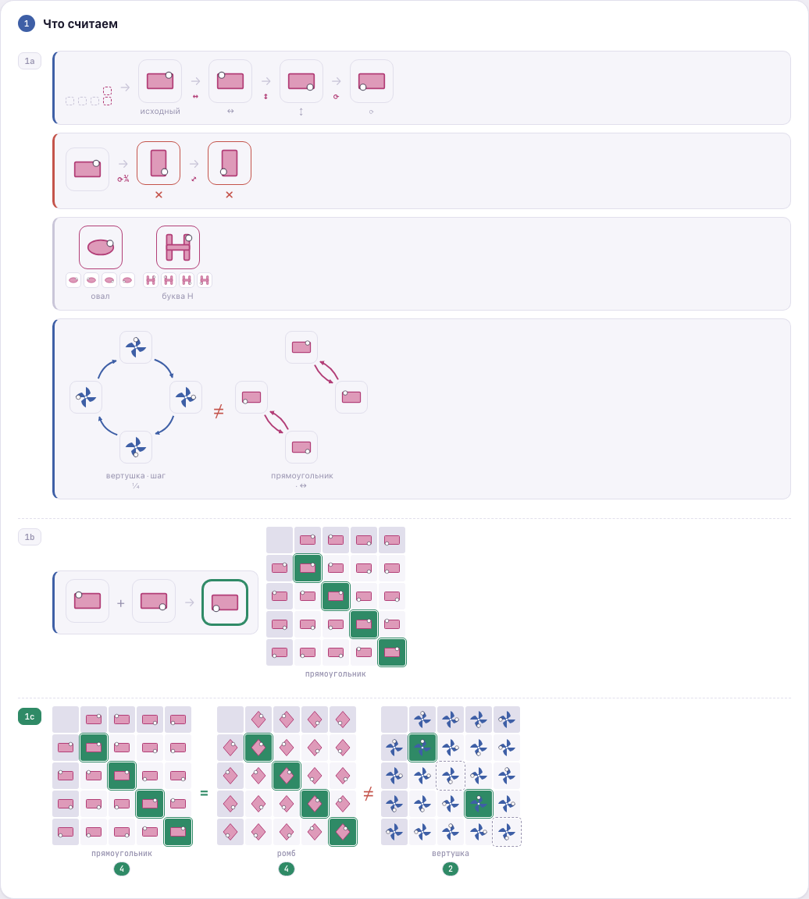
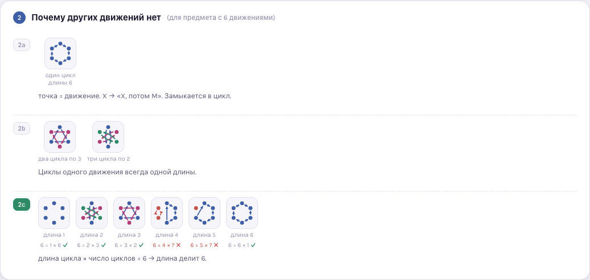
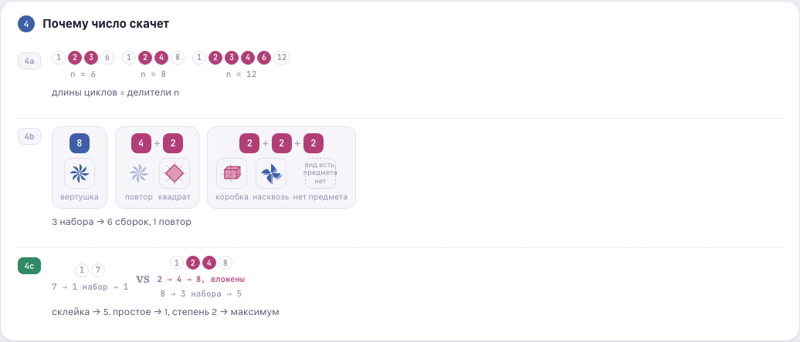
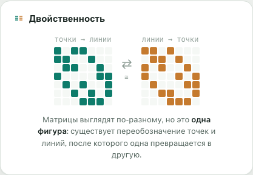
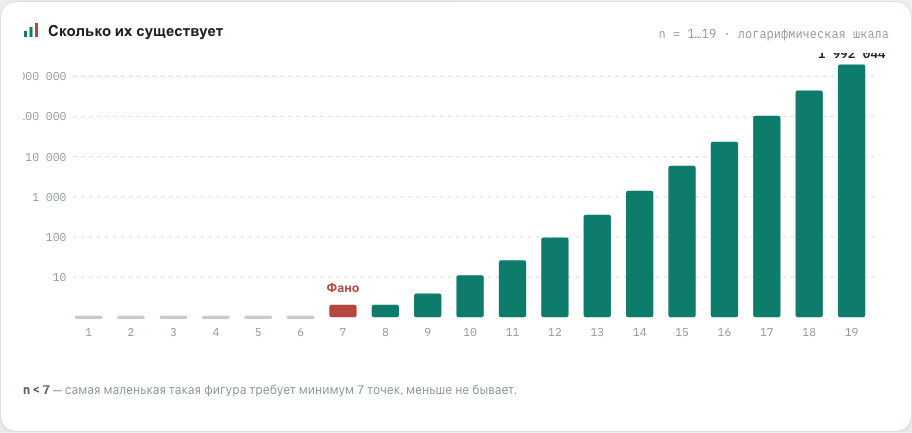
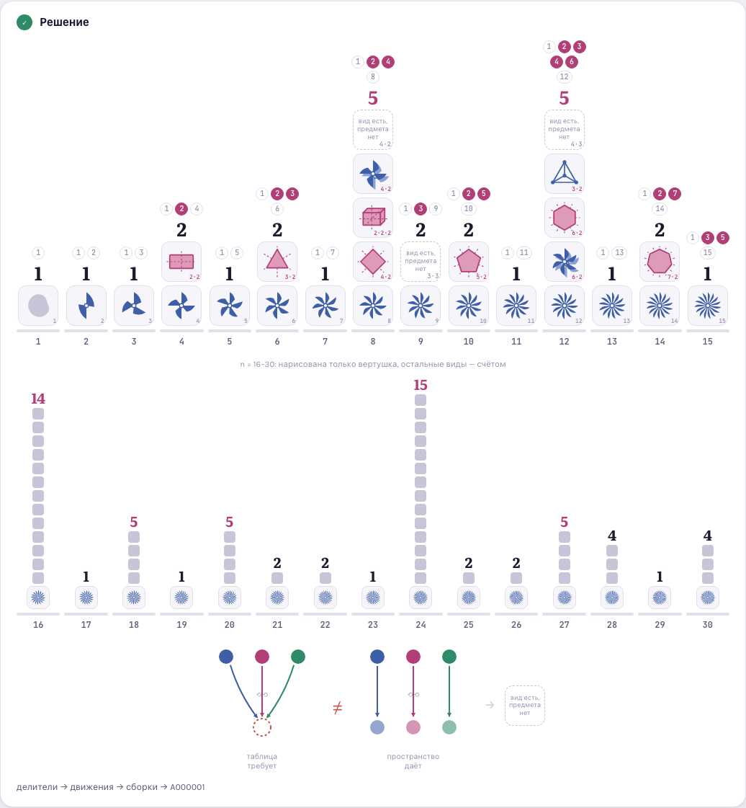
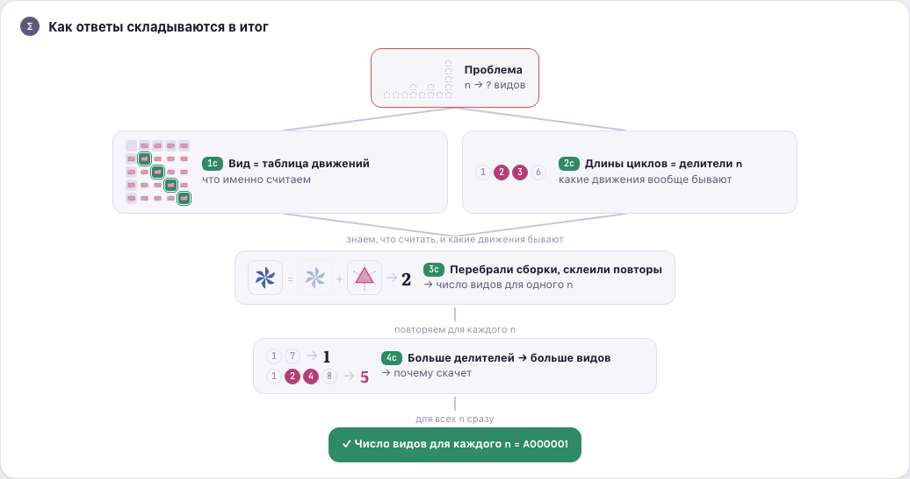
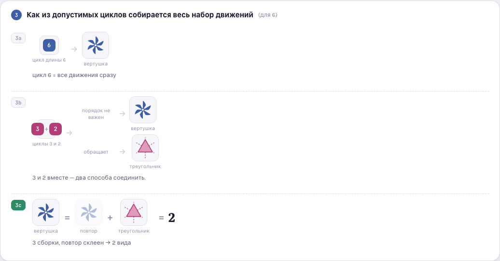

# Ubiquitous Language Index — oeis.org (explaining sequences)

> Canonical dictionary of explanation devices. Format: `## [context::TermName]` · links are plain
> markdown links into this same file, `[context::Name](#anchor)`. One context: `device` — a
> reusable diagram component, distinct from
> [Hedgehogues/project-euler](https://github.com/Hedgehogues/project-euler)'s `method` records in
> one deliberate way: a project-euler `method` is a full Problem→Solution narrative on its own; a
> `device` here is a smaller, reusable BUILDING BLOCK — the Problem→...→Solution narrative lives at
> the page level (`sequences/A{NNNNNN}/viz.html`, described in that sequence's own `README.md`),
> assembled out of one or more devices. A device therefore has no `Sequence:` field; it has a
> `Reading order:` — how a first-time viewer's eye should move across it — which is a property of
> the component, not of the page.
>
> **One device, one block.** The idea ("what it is, when you recognize it") and its picture ("how
> to draw it") are fields of ONE record: `Essence`/`Recognized by`/`General case`/`Source` describe
> the idea, `Picture`/`Reading order`/`Example` describe the drawing, `Limits` covers both — each
> bullet marking whether the limit belongs to the idea or only to the drawing.
>
> **Not a single mention of a specific sequence lives here** — no OEIS number, no specific numbers
> from any one page. These are the primitives themselves. The link runs ONE way: a sequence's own
> `sequences/A{NNNNNN}/README.md` points at the device it uses by name
> (`[device::Name]` → `_terms.md#devicename`); there is no reverse pointer. A sequence reusing an
> already-described device simply links to the existing block — this file does not change at all.
>
> Unlike project-euler's `visualizations/build.sh`, there is no static-PNG build step here: every
> device is rendered live, in the viewer's own browser, by the page that uses it — see
> `memory-bank/specs/visualizations.md`'s Architecture section for why that's a deliberate
> difference in style, not an omission.

## [device::MarkedAsymmetry]
Class: entity
Standard name: — (no established name found; informally close to a clock's hands or a compass
  needle — a single asymmetric feature added to an otherwise symmetric face so its orientation
  becomes readable)
Essence: Add one small, deliberately asymmetric mark (a dot on one corner, a flag on one blade) to
  an otherwise symmetric shape, so that applying a symmetry to the shape becomes visible — without
  the mark, a symmetric shape transformed by its own symmetry looks unchanged.
Recognized by: the argument needs to show WHERE a movement (rotation, reflection) sends a specific
  point of an object, but the object's own symmetry erases all visual evidence that anything moved
General case: works for any finite symmetry group acting on a 2D shape; the mark must sit at a
  point NOT fixed by any of the movements being compared (a mark on a mirror axis doesn't move
  under that mirror, and looks like a bug rather than a feature)
Picture:  —
  `sequences/A000001/viz.html`, section 1a/1c (marked rectangle, rhombus, ellipse, "H", pinwheel)
Reading order: the base shape first (undecorated, to register its own symmetry), then the same
  shape with the mark added, then the sequence of transformed copies
Limits:
  - MUST: place the mark off every axis/fixed-point of the movements being shown — an idea-level
    limit, not a drawing one (a mark on a fixed point never moves, regardless of rendering).
  - MUST: render the mark itself large enough and high-contrast enough against the shape's fill to
    read at icon scale — a drawing-level limit, found the hard way (see
    `.claude/rules/visualization-principles.md` #6): enlarging the surrounding icon did not help
    when the mark itself stayed a few low-contrast pixels across.
Source: no canonical citation for the device itself; the underlying idea is a special case of a
  [group action](https://en.wikipedia.org/wiki/Group_theory#Group_actions) made observable by
  breaking symmetry with a marked point (a standard move in the mathematics of symmetry, not
  packaged anywhere as a named "trick").
Example: built inline in `sequences/A000001/viz.html` (`rectMarked`, `rhombMarked`,
  `ellipseMarked`, `hShapeMarked`, `pinRotated`) — no separate example file; see
  `memory-bank/specs/visualizations.md` for why this catalog keeps devices inline rather than in a
  shared `examples/` directory.
Spec: [approaches](specs/approaches.md) · [visualizations](specs/visualizations.md)

## [device::CayleyTable]
Class: entity
Standard name: Cayley table
Essence: Lay out a finite set of operations as both the row and column headers of a grid; each
  cell shows the single operation you get from doing the row's operation, then the column's.
Recognized by: the argument depends on showing that combining any two of a FIXED, closed set of
  operations always produces a third member of that same set — i.e. that the operations form a
  closed algebraic system, not just a list
General case: any finite group (or, more generally, any set with a closed binary operation) can be
  laid out this way; the table's shape (which cells repeat, which are self-inverse) is itself the
  object of study, independent of which concrete objects realize the group
Picture:  —
  `sequences/A000001/viz.html`, sections 1b/1c
Reading order: one worked example first (a specific row + a specific column → the highlighted
  result, using the exact math the grid uses), THEN the full grid — never the raw grid first
Limits:
  - MUST: header row and header column carry a visually distinct background from body cells — an
    idea-neutral, pure drawing-level requirement (see principle 3): position alone (top row, left
    column) is not a strong enough signal once the grid is unfamiliar to the viewer.
  - MUST NOT: present the full grid before the one-cell worked example — a reader with no prior
    exposure to Cayley tables has no way to infer "row, then column, then read the cell" from the
    grid alone.
Source: [Wikipedia — Cayley table](https://en.wikipedia.org/wiki/Cayley_table)
Example: built inline in `sequences/A000001/viz.html` (`cayley()`, plus the `.cy-head`/`.cy-corner`
  CSS classes that give headers their distinct background)
Spec: [approaches](specs/approaches.md) · [visualizations](specs/visualizations.md)

## [device::SelfCancelDiagonal]
Class: entity
Standard name: — (no established name for the diagram; the underlying mathematical fact is a
  standard one — an element that is its own inverse is called an involution)
Essence: Inside a [device::CayleyTable](#devicecayleytable), highlight the diagonal cells where an
  operation combined with itself returns to the identity — turning "how many of these operations
  undo themselves in one repeat" from an asserted number into a directly countable set of
  highlighted cells.
Recognized by: two algebraic structures of the same size need to be compared and shown to differ,
  and the difference is exactly in which elements are self-inverse (involutions) — asserting "4 vs.
  2" as a bare number invites "why", which only the highlighted cells answer
General case: for a group of order n, the count of self-inverse elements (diagonal cells equal to
  the identity) is itself a structural invariant — a Klein four-group has n of them (every non-
  identity element is an involution), a cyclic group of even order n has exactly 2 (identity and
  the unique element of order 2)
Picture:  —
  `sequences/A000001/viz.html`, section 1c (three tables, `cy-diag`/`cy-self` highlighting) and the
  "grpTwist"/"diagPairs" comparison in section 1a
Reading order: the highlighted diagonal cells first (count them), THEN the summary badge — the
  badge is a confirmation of what's already visible, never the only evidence
Limits:
  - MUST: the count badge sits directly under (or beside) the table it was counted from, with the
    counted cells actually highlighted in that same table — a drawing-level limit; a bare number
    with nothing highlighted nearby is not this device, it is just a claim (principle 8).
  - MUST: if EVERY diagonal cell of a table turns out identical, the corresponding tiles are
    rendered as one merged, gapless shape — otherwise separate tiles holding an identical value
    read as an unexplained inconsistency rather than the intended finding (principle 4; this is
    what [device::MergedResultStrip](#devicemergedresultstrip) is for).
Source: [Wikipedia — Involution (mathematics)](https://en.wikipedia.org/wiki/Involution_(mathematics))
Example: built inline (`diagFP()`, the `.cy-diag`/`.cy-self` CSS classes, `diagPairs()`)
Spec: [approaches](specs/approaches.md) · [visualizations](specs/visualizations.md)

## [device::MergedResultStrip]
Class: entity
Standard name: — (no established name found)
Essence: When a row of individually-computed results turns out to be literally identical across
  every position, render them as one contiguous, gapless shape instead of separate tiles that
  happen to hold the same value — sameness becomes a property of the outline, not something the
  viewer has to verify value-by-value.
Recognized by: a row of small result tiles where all N values coincide reads as broken or
  arbitrary ("why don't these differ") specifically BECAUSE uniform sameness across separately-
  bordered tiles looks like a rendering accident rather than a finding
General case: applies to any small, fixed-length row of computed results where the general
  algorithm is expected to sometimes agree and sometimes disagree across positions (so that
  "merged" is informative precisely because it's not the default look of the row)
Picture:  —
  `sequences/A000001/viz.html`, section 1a (the rectangle side of the pinwheel-vs-rectangle
  comparison)
Reading order: compare the two rows side by side first — one merged into a single bar, one staying
  as separate tiles — the shapes themselves are the finding, read before any label
Limits:
  - MUST NOT: merge tiles whose values differ, even by one position — a single mismatch breaks the
    "these are the same" claim entirely; merging must be computed from actual equality of every
    value, never assumed.
Source: no canonical citation; a direct, minimal application of the general principle that visual
  grouping (Gestalt "connectedness"/"common region") communicates categorical sameness faster than
  a value comparison does — not itself packaged as a named technique anywhere found.
Example: built inline (`diagStrip()`'s `allSame` branch, later folded into `diagPairs()`)
Spec: [approaches](specs/approaches.md) · [visualizations](specs/visualizations.md)

## [device::StateMap]
Class: entity
Standard name: — (no established name for the diagram; the underlying idea is a group action's
  orbit, normally drawn as a cycle diagram/graph in group theory and combinatorics)
Essence: Arrange an object's possible states as points on a ring; draw one movement's effect on
  every state as an arrow. A single movement that visits every state before returning draws as one
  ring of one-directional arrows; a movement made of independent pairs (each undoing the other)
  draws as separate two-way arcs between pairs — the ARROW GEOMETRY is the argument, not a caption
  next to it.
Recognized by: two movements need to be contrasted that have the same COUNT of states but a
  structurally different repeat-behavior (one keeps advancing, one folds back on itself) — a
  contrast that a results-only table cannot show, since it only ever displays where you end up,
  never the shape of getting there
General case: any single generator of a finite cyclic or dihedral-type action can be drawn this
  way; a single generator either has one orbit covering everything (a full ring) or several
  disjoint orbits of the same length (several rings/arcs) — never a mix, by the same divisibility
  fact [device::DivisorChips](#devicedivisorchips) makes explicit elsewhere on the same page
Picture:  —
  `sequences/A000001/viz.html`, section 1a (pinwheel "cycle" ring vs. rectangle "pairs" arcs)
Reading order: the arrows first (their shape — one ring vs. several two-way arcs), then the small
  icon sitting at each point (which actual state that position represents)
Limits:
  - MUST: place the actual small icon of the movement/state at every point the arrows connect —
    arrows alone, without the movement they act on drawn at each node, answer "what shape" but not
    "of what" (principle 5's labeling requirement, applied to a whole diagram rather than one arrow).
Source: [Wikipedia — Group action](https://en.wikipedia.org/wiki/Group_theory#Group_actions) ·
  [Wikipedia — Cyclic permutation](https://en.wikipedia.org/wiki/Cyclic_permutation)
Example: built inline (`stateMap()`, modes `'cycle'` and `'pairs'`)
Spec: [approaches](specs/approaches.md) · [visualizations](specs/visualizations.md)

## [device::OrbitRing]
Class: entity
Standard name: — (no established name for the diagram; the underlying idea is a group action's
  orbit decomposition, standard in combinatorics)
Essence: Place n points on a ring; from a chosen repeat-step, draw a directed arrow from every
  point to "that point, then one more step" — the resulting arrows split into one or more disjoint
  closed loops (2-cycles as a pair of opposite arcs, longer ones as a single directed ring), and
  every loop the diagram produces is provably the same length.
Recognized by: the argument needs to show WHY a specific repeat-length is or isn't achievable for
  n positions — not by stating "length k divides n" but by actually trying to close a loop of that
  length and showing what happens to the leftover points
General case: for any step size on n points, the arrows partition all n points into disjoint loops
  of one common length (`n / gcd(step, n)`); attempting a length that does not divide n leaves
  points that cannot close into a loop of that length at all — this device is what
  [device::DivisorChips](#devicedivisorchips)'s claim ("possible lengths = divisors of n") looks
  like as an actual, checkable construction rather than a stated number-theory fact
Picture:  —
  `sequences/A000001/viz.html`, section 2 (2a: one full ring; 2b: two/three shorter rings;
  2c: an attempted non-divisor length, its leftover points marked and left unlooped)
Reading order: the arrows first (do they close into one ring, several equal rings, or fail to
  close at all), then the small icon at each point
Limits:
  - MUST: color-code each disjoint loop distinctly when a step splits the points into more than
    one loop — otherwise multiple simultaneous loops read as one tangled diagram.
  - MUST: an attempted non-divisor length visibly marks which points are left over (a distinct
    color/style), not merely omit them — omission reads as an incomplete drawing, not a finding.
Source: [Wikipedia — Group action](https://en.wikipedia.org/wiki/Group_theory#Group_actions) ·
  [Wikipedia — Cyclic permutation](https://en.wikipedia.org/wiki/Cyclic_permutation)
Example: built inline (`ringPartition()`)
Spec: [approaches](specs/approaches.md) · [visualizations](specs/visualizations.md)

## [device::DivisorChips]
Class: entity
Standard name: — (no established name for the diagram; "divisor" itself is a standard number-
  theory term)
Essence: Show a number's divisors as a row of small pill-shaped chips; mute the two trivial ones
  (1 and the number itself) and highlight the ones strictly between, since an argument about "how
  many options exist" usually depends on the COUNT of non-trivial divisors, not their exact values.
Recognized by: the argument's next step is "there are N possible building blocks" or "there are no
  extra building blocks" — i.e. it depends on divisor COUNT, and a bare written-out factorization
  makes that count something the reader has to compute rather than see
General case: works for any positive integer; a prime shows exactly two muted chips and nothing
  highlighted (the visual signature of "no extra options"); a highly composite number shows many
  highlighted chips (the visual signature of "many options")
Picture:  —
  `sequences/A000001/viz.html`, sections 4a/4c and the "Решение" catalog shelves
Reading order: the muted end-chips (1 and n) register first as "always present, uninformative",
  then the highlighted middle chips as the actual count that matters
Limits:
  - MUST NOT: highlight 1 or n themselves — doing so defeats the device's purpose, which is
    specifically to separate the two divisors every number has from the ones that vary.
Source: [Wikipedia — Divisor](https://en.wikipedia.org/wiki/Divisor)
Example: built inline (`divisors()`, the `.dv`/`.dv.mid` CSS classes)
Spec: [approaches](specs/approaches.md) · [visualizations](specs/visualizations.md)

## [device::IncidenceMatrixPair]
Class: entity
Standard name: — (no established name for the side-by-side comparison; "incidence matrix" itself
  is standard)
Essence: Draw a combinatorial structure's incidence matrix next to its transpose, exactly as each
  one naturally comes out — deliberately NOT relabeled or reordered to force the two to look
  identical — with a caption stating the true, weaker claim: some relabeling makes them match, not
  that they are already the same matrix.
Recognized by: the property being explained is a duality or self-duality that holds "up to
  relabeling"/"up to isomorphism", and forcing the picture to look symmetric would silently claim a
  stronger, false fact (literal identity) in place of the true one (existence of an isomorphism)
General case: applies to any structure with a natural incidence relation between two finite sets
  (points/lines, vertices/edges) where duality means swapping the two sets' roles
Picture:  —
  `sequences/A100001/viz.html` (the Fano plane's matrix and its transpose)
Reading order: each matrix on its own first (register that they look different), then the stated
  claim underneath (a relabeling exists) — never the reverse order, which would prime the viewer to
  see sameness that isn't drawn
Limits:
  - MUST NOT: choose a labeling for either matrix specifically because it makes the pair look more
    alike — see [device::MarkedAsymmetry](#devicemarkedasymmetry)'s and this device's shared
    principle in `.claude/rules/visualization-principles.md` #11.
Source: [Wikipedia — Incidence matrix](https://en.wikipedia.org/wiki/Incidence_matrix) ·
  [Wikipedia — Configuration (geometry)](https://en.wikipedia.org/wiki/Configuration_(geometry))
Example: built inline in `sequences/A100001/viz.html`
Spec: [approaches](specs/approaches.md) · [visualizations](specs/visualizations.md)

## [device::LogGrowthChart]
Class: entity
Standard name: Logarithmic scale (bar/tile chart on one)
Essence: Size bars or tiles by the logarithm of a fast-growing sequence's values, but print each
  bar's actual (linear) value as a number on or beside it — the scale fixes visibility across
  orders of magnitude, the printed number keeps the true magnitude from being hidden by that same
  compression.
Recognized by: the sequence spans several orders of magnitude within one chart, so a linear scale
  would render the small early values as invisible slivers next to the largest one
General case: any monotonically-growing (or wildly-varying) integer sequence charted over a
  contiguous range of its index
Picture:  — also
  `sequences/A000001/drafts/v1-heatmap.html` and `v2-symmetry-catalog.html` (growth
  staircases for powers of two), `sequences/A000001/viz.html` (the "Проблема"/"Решение" column
  charts), `sequences/A100001/viz.html` (the self-dual-configuration growth chart)
Reading order: the bar heights first (relative comparison), then the printed numbers (actual
  magnitude) — the two together, never the log-scaled height alone presented as if it were linear
Limits:
  - MUST: print the literal value on every bar/tile — a drawing-level limit found directly: an
    early draft of this chart used a LINEAR scale and rendered values under 20 as invisible next to
    a value in the hundreds; switching to log fixed visibility, but log height by itself would then
    have hidden the true magnitude if the numbers weren't also printed.
Source: [Wikipedia — Logarithmic scale](https://en.wikipedia.org/wiki/Logarithmic_scale)
Example: built inline in each page listed above (`Math.log10`-scaled bar heights, values printed
  as text nodes)
Spec: [approaches](specs/approaches.md) · [visualizations](specs/visualizations.md)

## [device::UnrealizedPlaceholder]
Class: entity
Standard name: — (no established name found)
Essence: A dashed, unfilled box standing in for a case that is algebraically/combinatorially valid
  (it satisfies every internal consistency check) but has no matching real-world realization —
  paired with a small comparison panel showing exactly what the abstract case demands versus what
  the realizable instances can actually deliver, so "no object" reads as a specific, checkable
  mismatch rather than an unexplained gap.
Recognized by: a sequence's count includes at least one abstractly-valid case that cannot be drawn
  as an actual object (a group with no faithful realization as ordinary rotations/reflections of a
  simple shape) — silently omitting it from a catalog would misreport the count; drawing something
  fake in its place would misreport the case itself
General case: any enumeration where the counted objects are defined by an algebraic/logical
  consistency condition that does not, in general, guarantee physical or geometric realizability
Picture:  —
  `sequences/A000001/viz.html` — the "Решение" catalog's dashed placeholder cells, and the
  "почему у некоторых видов нет предмета" require-vs-give comparison panel
Reading order: the placeholder itself first (it exists in the count, drawn as absent-but-real),
  then, only on request/nearby, the comparison panel explaining the specific mismatch
Limits:
  - MUST: pair the placeholder with a stated, specific mismatch (what the case requires vs. what's
    actually available) somewhere reachable from it — a placeholder with no explanation reachable
    from it just looks like an unfinished picture, not a deliberate finding.
Source: no canonical citation for the diagram; the underlying mathematical fact (a consistent
  abstract structure without a corresponding realization) doesn't reduce to one named theorem —
  it's checked case-by-case (see `memory-bank/verify/group-tables.mjs` for the sense in which the
  five order-8 tables shown ARE independently checked as internally consistent groups).
Example: built inline (`ghostObj()`, the `ghostWhy` require-vs-give panel)
Spec: [approaches](specs/approaches.md) · [visualizations](specs/visualizations.md)

## [device::MiniRecap]
Class: entity
Standard name: — (no established name found)
Essence: Reuse a small, literally-shrunk copy of an earlier frame (not a redrawn summary, not a
  restated sentence) at the start of a new section, so the new section's starting point is
  anchored to something the viewer already saw rather than re-explained in words.
Recognized by: a new section's motivation is exactly "recall what you just saw" — restating that in
  a sentence would only repeat information the picture already carries
General case: any multi-section explanatory page where a later section's premise is a specific
  earlier picture (or a specific slice of it), not a new fact
Picture:  —
  `sequences/A000001/viz.html`, section 1a's opening bridge (the first four "Проблема"
  columns, redrawn small) and the "Как ответы складываются в итог" map's per-node thumbnails
Reading order: the shrunk recap first (recognize it as "the thing from before"), then whatever new
  element sits next to it
Limits:
  - MUST: the recap is a literal shrunk redraw of the same data/shape, not a new, differently-
    styled summary icon — otherwise it reads as a new, unrelated element rather than a callback.
Source: no canonical citation; a direct application of visual continuity/consistency in
  information design, not packaged anywhere as a named technique.
Example: built inline (the mini-bars in the 1a bridge IIFE; the `m-*-th` thumbnail nodes in the
  "Как ответы складываются в итог" assembly map)
Spec: [approaches](specs/approaches.md) · [visualizations](specs/visualizations.md)

## [device::CombinationFork]
Class: entity
Standard name: — (no established name found)
Essence: Show each available building block (or fixed combination of blocks) as a labeled chip,
  draw the one or two distinct results each combination can produce, and merge any result that
  duplicates one already produced by a different combination — so a "how many building blocks"
  question ends at an ACTUAL deduplicated count, not the raw number of attempts.
Recognized by: the argument needs to enumerate every way of combining a small, fixed set of
  building blocks, where at least one combination is expected to reproduce a result some other
  combination already gave — silently listing raw attempts would overcount
General case: applies whenever the count being explained is "how many distinct outcomes", not "how
  many ways to try" — any enumeration with a known, checkable duplicate must visibly merge before a
  final number is stated
Picture:  —
  `sequences/A000001/viz.html`, section 3 (block "6" alone; blocks "3"+"2" forking into two
  outcomes, one merged as a duplicate) and section 4b (three recipes — "8", "4+2", "2+2+2" —
  forking into six raw outcomes, one merged, five kept)
Reading order: the building-block chips first, then each branch's result, then the merge itself
  (a dimmed/duplicate-styled copy sitting beside the branch that already produced that result),
  and only then the final count
Limits:
  - MUST: a duplicate result is shown as a visually distinct (dimmed, dashed) copy of the SAME
    picture as its original, not merely omitted — an omitted branch reads as an incomplete
    diagram, not a deliberate finding (the same discipline
    [device::OrbitRing](#deviceorbitring)'s Limits state for stranded points).
  - MUST NOT: state a final count without showing at least one duplicate being caught — a page that
    only ever shows distinct results teaches the reader nothing about why deduplication matters.
Source: no canonical citation for the diagram; the underlying idea is a special case of counting by
  equivalence classes rather than by raw case enumeration, standard in combinatorics but not
  packaged anywhere as a named diagram technique.
Example: built inline (`recipe()` in section 4b; the equivalent hand-built fork in section 3)
Spec: [approaches](specs/approaches.md) · [visualizations](specs/visualizations.md)
