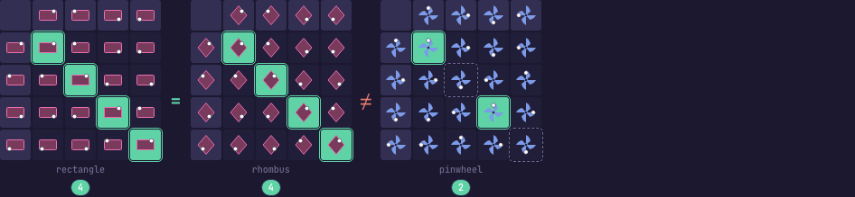
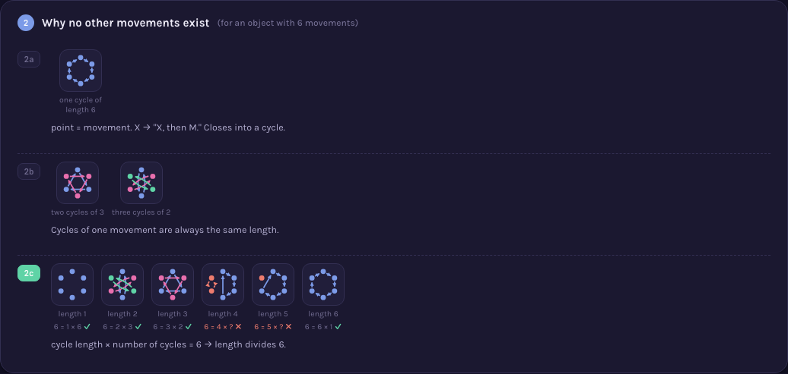
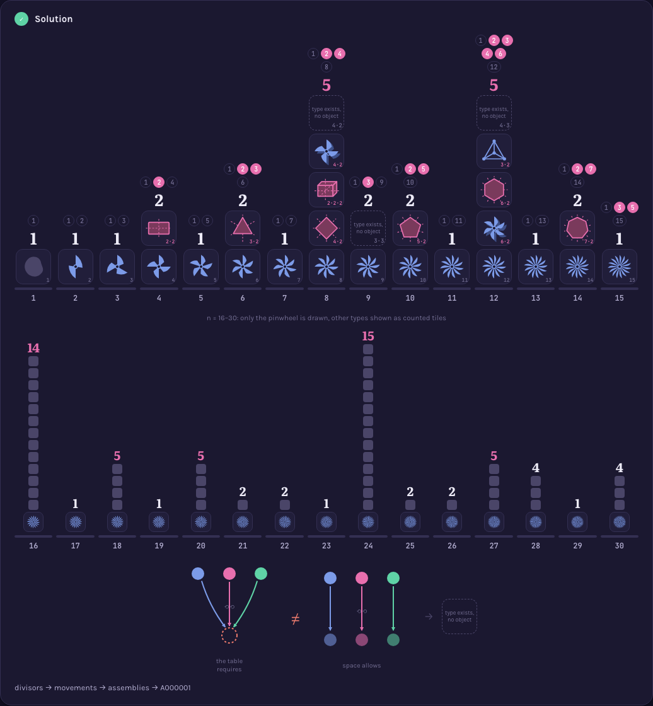

# A000001 — Number of groups of order n

`a(n)` counts the distinct symmetry types of an object with exactly `n` self-matching movements —
1 for every prime, 2 for most products of two primes, 5 at `n=8`, and 51 at `n=32` with `a(31)=1`
immediately before it.

## Approach

Fill an `n×n` multiplication table by backtracking, then merge the tables that differ only by
renaming the elements:

- Element 0 is the identity without loss of generality — any group has one, and naming it 0 costs
  nothing. That fixes row 0 and column 0.
- The remaining cells are filled under two constraints checked at every step: a value may not
  repeat within a row or within a column (Latin square), and every triple whose both sides are
  already determined must associate.
- Each completed table is tested against the representatives found so far and kept only if no
  relabelling of `1..n-1` turns it into one of them.

Status: **reproduces OEIS exactly** for `n = 1..8` — `1, 1, 1, 2, 1, 2, 1, 5`. Verified
independently by [`proof.mjs`](proof.mjs), run live 2026-09-01: every returned table revalidated as
a group (Latin square, full associativity, identity, inverses), no two isomorphic under a
from-scratch permutation search that shares nothing with the one used to produce them, and every
table matched to a group built by a named construction — `C8`, `C4×C2`, `C2×C2×C2`, `D8`, `Q8` at
order 8, each hitting exactly one table and each table hitting exactly one construction. The search
is exhaustive, so it stops early: `n=8` takes about 8 s, `n=9` does not finish in four minutes —
which is this sequence's own point restated as a runtime.

Full requirements and acceptance criteria (including the independent group-table verification):
[spec.md](../../memory-bank/specs/tasks/A000001.md).

## The ideas behind it

Eleven catalogued devices, each recognizable in other sequences on its own (full write-ups:
[`memory-bank/_terms.md`](../../memory-bank/_terms.md)):

| | |
|---|---|
| **Marked asymmetry** — a small off-axis mark, so applying a movement to a symmetric shape becomes visible instead of looking like nothing happened. [`[device::MarkedAsymmetry]`](../../memory-bank/_terms.md#devicemarkedasymmetry) [](../../memory-bank/visualizations/A000001/viz.html) | **Cayley table** — every pair of movements combined, laid out as a row×column grid, with one worked example shown before the full grid. [`[device::CayleyTable]`](../../memory-bank/_terms.md#devicecayleytable) [](../../memory-bank/visualizations/A000001/viz.html) |
| **Self-cancel diagonal** — the cells where a movement undoes itself, highlighted inside the same table the count is read from, not asserted as a bare number. [`[device::SelfCancelDiagonal]`](../../memory-bank/_terms.md#deviceselfcanceldiagonal) [](../../memory-bank/visualizations/A000001/viz.html) | **State map** — one movement's effect drawn on a ring of states: the pinwheel walks one long loop where the rectangle's fold back in pairs. [`[device::StateMap]`](../../memory-bank/_terms.md#devicestatemap) [](../../memory-bank/visualizations/A000001/viz.html) |
| **Merged result strip** — results that are literally identical become one continuous bar instead of four tiles that happen to match. [`[device::MergedResultStrip]`](../../memory-bank/_terms.md#devicemergedresultstrip) [](../../memory-bank/visualizations/A000001/viz.html) | **Orbit ring** — every repeat-length from 1 to `n` tried directly on a ring of points: the ones that divide `n` close into equal loops, the rest leave points stranded. [`[device::OrbitRing]`](../../memory-bank/_terms.md#deviceorbitring) [](../../memory-bank/visualizations/A000001/viz.html) |
| **Combination fork** — the eligible building blocks forked into every combination, with the one that just duplicates an earlier result dimmed rather than silently dropped. [`[device::CombinationFork]`](../../memory-bank/_terms.md#devicecombinationfork) [](../../memory-bank/visualizations/A000001/viz.html) | **Divisor chips** — a number's divisors as a row of chips with the two trivial ones muted, so "how many spare building blocks" is a count you see rather than one you're told. [`[device::DivisorChips]`](../../memory-bank/_terms.md#devicedivisorchips) [](../../memory-bank/visualizations/A000001/viz.html) |
| **Mini-recap** — each earlier frame shrunk in place, so the closing map is literally the same pictures rather than a redrawn summary of them. [`[device::MiniRecap]`](../../memory-bank/_terms.md#deviceminirecap) [](../../memory-bank/visualizations/A000001/viz.html) | **Unrealized placeholder** — a dashed, empty cell for the order-8 type that is algebraically valid but has no object, paired with what the table demands versus what a rotation can deliver. [`[device::UnrealizedPlaceholder]`](../../memory-bank/_terms.md#deviceunrealizedplaceholder) [](../../memory-bank/visualizations/A000001/viz.html) |
| **Log growth chart** — tiles sized by logarithm with the literal value printed on each, so `a(16)=14` and `a(31)=1` stay readable in one picture. [`[device::LogGrowthChart]`](../../memory-bank/_terms.md#deviceloggrowthchart) [](../../memory-bank/visualizations/A000001/viz.html) | |

## Build & run

```
node sequences/A000001/solution.mjs 8     # compute a(1..8) from the definition
node sequences/A000001/proof.mjs 8        # re-check that output independently
node memory-bank/verify/group-tables.mjs  # re-check the tables the page itself draws
```

## The page these pictures come from

[](../../memory-bank/visualizations/A000001/viz.html)

The page runs Problem → (1: what a symmetry type even is) → (2: which movements can exist) →
(3: how they combine for `n=6`) → (4: why the count jumps for larger `n`) → Solution, each step's
answer feeding the next. It opens on the object itself, never on the sequence's data.

**[Open it live →](../../memory-bank/visualizations/A000001/viz.html)** — hover states, both
themes, every diagram built at load time from the numbers being explained.

### Drafts

Two structurally different earlier versions are kept in
`memory-bank/visualizations/A000001/drafts/` rather than discarded, since each answers a slightly
different question and the reason for abandoning it is itself informative:

- [`v1-heatmap.html`](../../memory-bank/visualizations/A000001/drafts/v1-heatmap.html) — a straight
  infographic: a heatmap of `a(n)` for `n=1..64`, the 5 groups of order 8 as labeled icons,
  primes-vs-powers-of-2 growth bars. Correct, but purely descriptive — it shows *what* the sequence
  does, not *why*.
- [`v2-symmetry-catalog.html`](../../memory-bank/visualizations/A000001/drafts/v2-symmetry-catalog.html)
  — a first attempt at proof intuition: Lagrange's theorem for the prime case, Sylow theory (gear
  diagrams) for `n=p·q`, an honest "no short proof" panel for prime powers. Sound, but leans on
  named theorems the reader has to already trust — superseded by the current page, which derives
  the same facts from one picture-native rule instead.

Source: [oeis.org/A000001](https://oeis.org/A000001)
