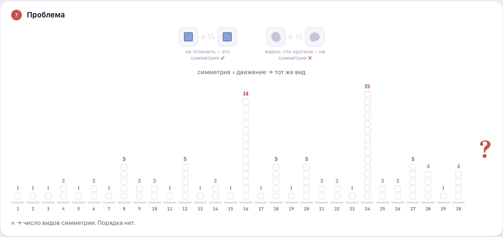
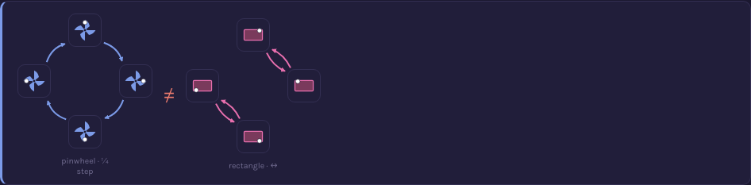
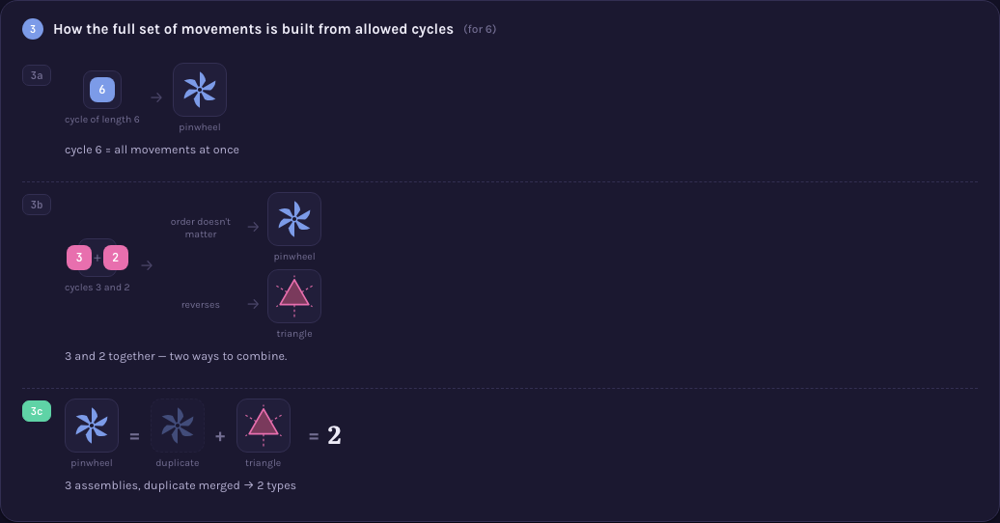

# A000001 — Number of groups of order n


`a(n)` counts the number of non-isomorphic groups of order `n` — 1 for every prime, 1 or 2 for a
product of two primes, an explosion for powers of two (`a(1024) = 49 487 365 422`), and a jump
from `a(31)=1` to `a(32)=51` with nothing in between hinting why. The page opens on exactly that
puzzle: thirty columns, heights all over the place, no visible rule.



## The idea behind it

The final version reframes the whole sequence without group-theory vocabulary: `a(n)` is the
number of distinct **symmetry types** of an object with exactly `n` self-matching movements
(rotations and flips). Eleven catalogued devices carry the argument (full write-ups:
[`memory-bank/_terms.md`](../../memory-bank/_terms.md)):

**1 · What counts.** A rectangle, ellipse, "H" and pinwheel each carry a small off-axis mark
([marked asymmetry](../../memory-bank/_terms.md#devicemarkedasymmetry)), so applying a movement to
a symmetric shape becomes visible instead of looking unchanged.


Their 4 movements are laid out as a row×column grid
([Cayley table](../../memory-bank/_terms.md#devicecayleytable)), one worked example shown before
the full grid.


Which of them undo themselves in one repeat is highlighted directly in the table
([self-cancel diagonal](../../memory-bank/_terms.md#deviceselfcanceldiagonal)) rather than asserted
as a bare count.


The same test run on a whole extra object (a pinwheel, on the same ring of states as
[state map](../../memory-bank/_terms.md#devicestatemap)) shows it fails where the rectangle's
family succeeds: the pinwheel's movements walk one long ring, the rectangle's fold back in pairs.



Repeat each movement twice and the same split shows up in the results themselves — the rectangle's
four outcomes are all the identity, so they
[merge into one bar](../../memory-bank/_terms.md#devicemergedresultstrip); the pinwheel's alternate,
so they stay four separate tiles.


**2 · Which movements exist.** Every possible repeat-length from 1 to `n` is tried directly on a
ring of points ([orbit ring](../../memory-bank/_terms.md#deviceorbitring)): lengths that divide `n`
close into equal loops, the one that doesn't leaves visibly stranded points.


**3 · How they combine.** The two eligible building blocks for `n=6` are shown as labeled chips,
forked into their two possible combinations, with the combination that just duplicates an existing
result shown dimmed rather than silently dropped
([combination fork](../../memory-bank/_terms.md#devicecombinationfork)) — the final count is what's
left after that merge, not the raw number of attempts.



**4 · Why the count jumps.** A number's divisors as a row of chips
([divisor chips](../../memory-bank/_terms.md#devicedivisorchips)), the two trivial ones muted, so
"how many extra building blocks" is a count you see, not one you're told; the same
[combination fork](../../memory-bank/_terms.md#devicecombinationfork) from step 3 runs again on
`n=8`'s three recipes, six raw outcomes merging down to five.


It opens with the object itself before ever showing the sequence, works through *why* the count
for `n=6` is 2 (which cycle lengths are even possible, how they combine, why one combination
repeats), and generalizes to *why* it jumps around for any `n` (more divisors → more building
blocks → more combinations; primes have none to spare). A closing map ties the four sub-questions'
answers together using
[mini-recap](../../memory-bank/_terms.md#deviceminirecap) thumbnails of each earlier picture:


The catalog at the end draws every symmetry type for `n=1..15` as an actual shape (rectangle,
triangle, tetrahedron, ...) and switches to a
[log growth chart](../../memory-bank/_terms.md#deviceloggrowthchart) of counted tiles for
`n=16..30`:


It closes with an
[unrealized placeholder](../../memory-bank/_terms.md#deviceunrealizedplaceholder) for the one
order-8 type with no realizable object at all — paired with a panel naming exactly what the table
demands versus what an actual rotation in space can deliver, not just an unexplained gap:


**[Open the visualization →](viz.html)**

## Computing it, and checking the computation

Two files, deliberately not one:

| | |
|---|---|
| [`solution.mjs`](solution.mjs) | Computes `a(n)` by the procedure the page draws — fix the identity, fill the multiplication table by backtracking under the Latin-square and associativity constraints, merge tables that differ only by relabelling. No table of known answers anywhere in it. |
| [`proof.mjs`](proof.mjs) | Refuses to trust that output: revalidates every table as a group, re-tests distinctness with its own unpruned permutation search, matches each table against a group built by a named construction, and only then compares to OEIS. |

```
$ node sequences/A000001/solution.mjs 8
a(1) = 1   (0 ms)  …  a(7) = 1   (33 ms)  ·  a(8) = 5   (7696 ms)
1, 1, 1, 2, 1, 2, 1, 5

$ node sequences/A000001/proof.mjs 8
ok    a(8) = 5  · matched 5 known group(s): C8, C4×C2, C2×C2×C2, D8, Q8
All checks passed for n = 1..8: sound, distinct, complete, and equal to OEIS A000001.
```

The search stops early: `n = 8` takes about 8 seconds, `n = 9` does not finish in four minutes.
That wall is the sequence's own point restated as a runtime — looking at
every possible multiplication table stops working almost immediately, which is exactly why the
published values come from classification theory instead.

Full requirements and acceptance criteria (including the independent group-table verification):
[spec.md](../../memory-bank/specs/tasks/A000001.md).

### Drafts

This page went through two structurally different earlier versions before landing on the
movement/symmetry framing above — kept here rather than discarded, since each answers a slightly
different question and the reasoning for abandoning each is itself informative:

- [`drafts/v1-heatmap.html`](drafts/v1-heatmap.html) — a straight infographic: a heatmap of
  `a(n)` for `n=1..64`, the 5 groups of order 8 as labeled icons, primes-vs-powers-of-2 growth
  bars. Correct, but purely descriptive — it shows *what* the sequence does, not *why*.
- [`drafts/v2-symmetry-catalog.html`](drafts/v2-symmetry-catalog.html) — a first attempt at
  proof intuition: Lagrange's theorem for the prime case, Sylow theory (gear diagrams) for
  `n=p·q`, an honest "no short proof" panel for prime powers. Sound, but leans on named theorems
  and notation the reader has to already trust — superseded by `viz.html`'s version, which derives
  the same facts (divisors ⇒ possible cycle lengths ⇒ combinations) from a single picture-native
  rule instead.

Source: [oeis.org/A000001](https://oeis.org/A000001)
