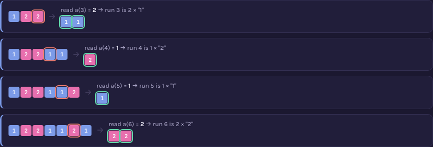

# A000002 — Kolakoski sequence

An infinite sequence of only `1`s and `2`s, starting `a(1) = 1`, with one defining property: reading
off the lengths of its own maximal runs, in order, reproduces the very same sequence. It is a fixed
point of run-length encoding — not a string that merely happens to start that way, but one where the
self-reference is exact at every position ever computed.

## Approach

`solution.mjs` builds the sequence left to right by the same self-reference the page draws:

- `a(1) = 1` is given; the run it starts is forced to length 1, so term 1 is written and nothing
  else. Run 2's colour is then forced to flip to "2" regardless of its eventual length, which pins
  term 2 (and so `a(2)`) to 2 without any assumption — a derivation, not a lookup, spelled out in
  the file's own header comment.
- From term 3 onward, the length of the next run to write is always a term the sequence already
  wrote earlier: read it, append that many copies of the alternated symbol, move the read pointer
  forward by one run, repeat.
- No table of published terms is consulted anywhere in the file.

Status: **reproduces OEIS exactly** for `a(1)..a(107)` and stays self-consistent — its own
run-length reading matches its own leading terms — through `a(1,000,000)`. Verified live by
[`proof.mjs`](proof.mjs) (2026-09-01): soundness (every term is 1 or 2, `a(1)=1`), an independent,
from-scratch run-length scan (no read pointer, no self-reference in the checking code) confirming
666,672 complete runs of `a(1..1,000,000)` all have lengths equal to the corresponding terms, and
agreement with OEIS's own `%S`/`%T`/`%U` line for A000002 fetched live from
`oeis.org/search?q=id:A000002&fmt=text`. Measured: `node sequences/A000002/solution.mjs 10000000`
computes ten million terms in 89 ms; `node sequences/A000002/proof.mjs 1000000` runs its full
three-way check in well under a second. There is no combinatorial wall the way A000001's group
count or A100001's configuration count have one — the construction is linear, and the practical
limit is memory, not time.

Full requirements and acceptance criteria:
[spec.md](../../memory-bank/specs/tasks/A000002.md).

## The ideas behind it

Three devices, two new to the catalog and one reused as-is (full write-ups:
[`memory-bank/_terms.md`](../../memory-bank/_terms.md)):

| Device | Essence |
|---|---|
| [`[device::RunLengthEncoding]`](../../memory-bank/_terms.md#devicerunlengthencoding) | Group a sequence into its maximal runs, draw each as one merged box, print the length. |
| [`[device::FixedPointOverlay]`](../../memory-bank/_terms.md#devicefixedpointoverlay) | Align a sequence's own transform under the original, one column per position, mark every match. |
| [`[device::MiniRecap]`](../../memory-bank/_terms.md#deviceminirecap) | Reuse a literal shrunk copy of the prefix already built, with the read position highlighted, at the start of each new construction step. |

[](../../memory-bank/visualizations/A000002/viz.html)
[](../../memory-bank/visualizations/A000002/viz.html)

`RunLengthEncoding` and `FixedPointOverlay` are new: the first groups the first 9 terms into 6 runs
and prints each run's length; the second lines those 6 lengths up against the sequence's own first
6 terms and marks every position — the self-reference becomes something checked column by column,
not asserted. `MiniRecap` needed no change to `_terms.md` at all — the bootstrap section reuses the
already-catalogued device exactly as described, shrinking the growing prefix and highlighting the
one cell being read at each step:

[](../../memory-bank/visualizations/A000002/viz.html)

## Build & run

```
node sequences/A000002/solution.mjs 1000    # compute a(1..1000) from the definition
node sequences/A000002/proof.mjs 1000000    # re-check that output independently, up to a(1,000,000)
```

## The page these pictures come from

[](../../memory-bank/visualizations/A000002/viz.html)

The page runs Problem (a strip of 1s and 2s, no visible rule) → 1 (what a run is, worked on the
first 9 terms) → 2 (the 6 run lengths from step 1, checked position-by-position against the
sequence's own first 6 terms) → 3 (building the next four runs by reading the sequence's own
already-written terms, reusing a shrunk copy of the prefix at each step) → Solution (90 generated
terms, a verified-match badge citing `proof.mjs`'s real run, and the empirical density of 1s among
the terms generated for the page — offered honestly as evidence, not as a proof of the sequence's
own open density conjecture).

**[Open it live →](../../memory-bank/visualizations/A000002/viz.html)** — hover-free but fully
computed at load time: every cell, run box, overlay and construction frame comes from the same
`kolakoski()` function in the page's own script, both themes, the same visual system as
A000001 and A100001.

Source: [oeis.org/A000002](https://oeis.org/A000002)
