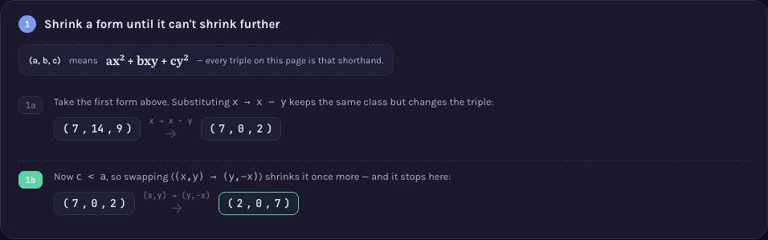

# A000003 — class number of discriminant -4n

`a(n)` counts the classes of primitive positive definite binary quadratic forms `ax² + bxy + cy²`
of discriminant `D = -4n` — equivalently, the class number of the quadratic order of discriminant
`-4n`. Two forms count as the same class when an integer change of variables of determinant 1 turns
one into the other; `a(1)=1, a(2)=1, a(3)=1, a(4)=1, a(5)=2, …` up through `a(99)=4`.

## Approach

`solution.mjs` enumerates every **reduced** form of discriminant `D = -4n` directly — classical
Lagrange–Gauss reduction theory guarantees each class has exactly one reduced representative
(`-a < b ≤ a ≤ c`, with `b ≥ 0` when `a = c`), and the reduced condition bounds `a ≤ √(|D|/3)`,
which is what turns "count the classes" into a finite, direct search:

- For `a = 1 .. ⌊√(|D|/3)⌋`, for `b = -a+1 .. a`, compute `c = (b²-D)/(4a)`.
- Keep the triple only if `c` is a positive integer, `c ≥ a`, `gcd(a,b,c) = 1` (primitivity), and
  not the one remaining duplicate (`a = c` with `b < 0`).
- No table of published class numbers is consulted anywhere in the file.

Status: **reproduces OEIS exactly** for `a(1)..a(99)`. Verified live by [`proof.mjs`](proof.mjs)
(2026-09-02): every returned form re-checked for soundness (right discriminant, primitive, actually
reduced); an independent Gauss reduction — a from-scratch algorithm that walks an arbitrary form
down to its canonical representative, sharing no code with the direct search — applied to a net of
raw forms 3× wider than the direct search's own bound, recovering exactly the same set of classes
for every `n = 1..500` (nothing missed, no duplicate class); and agreement with OEIS's own
`%S`/`%T`/`%U` line for A000003 fetched live from `oeis.org/search?q=id:A000003&fmt=text`. Measured:
`node sequences/A000003/solution.mjs` computing every `a(1)..a(n)` up to `n=1,000` in 6 ms,
`n=10,000` in 166 ms, `n=100,000` in 14.3 s; `node sequences/A000003/proof.mjs 500` runs its full
three-way check in well under a second. No combinatorial wall the way A000001's group count or
A100001's configuration count have one — the per-`n` cost is `O(√n)`, and the total for a full
prefix grows only like `n^1.5`.

Full requirements and acceptance criteria:
[spec.md](../../memory-bank/specs/tasks/A000003.md).

## The ideas behind it

Two devices, one new to the catalog and one reused as-is (full write-ups:
[`memory-bank/_terms.md`](../../memory-bank/_terms.md)):

**Fundamental domain plot** — each reduced form maps to one point `τ = (-b+i√|D|)/(2a)` in the
upper half-plane; the classical fundamental domain of the modular group is drawn around them, and
counting classes becomes counting dots inside one fixed shape.
[`[device::FundamentalDomainPlot]`](../../memory-bank/_terms.md#devicefundamentaldomainplot)

[](../../memory-bank/visualizations/A000003/viz.html)

**Mini-recap** — the classical reduction algorithm, shown as a 2-step chain: each step reuses the
previous triple and labels the exact substitution applied, until the triple can't shrink any
further. [`[device::MiniRecap]`](../../memory-bank/_terms.md#deviceminirecap)

[](../../memory-bank/visualizations/A000003/viz.html)

## Build & run

```
node sequences/A000003/solution.mjs 1000    # compute a(1..1000) from the definition
node sequences/A000003/proof.mjs 500        # re-check that output independently, up to a(500)
```

## The page these pictures come from

[](../../memory-bank/visualizations/A000003/viz.html)

The page runs Problem (three disguised forms of discriminant -56, no visible rule) → 1 (shrinking
one of them, step by labelled step, via the classical reduction moves) → 2 (the reduced-form
condition, checked against where step 1 landed) → 3 (all four reduced forms of discriminant -56
plotted as points in the fundamental domain) → Solution (the same plot, reused small, with the
count and a verified-match badge citing `proof.mjs`'s real run).

**[Open it live →](../../memory-bank/visualizations/A000003/viz.html)** — every triple, every
substitution, every plotted point comes from the same functions in the page's own script, computed
at load time, both themes, the same visual system as A000001, A100001 and A000002.

Source: [oeis.org/A000003](https://oeis.org/A000003)
