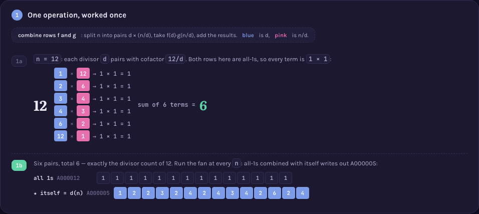
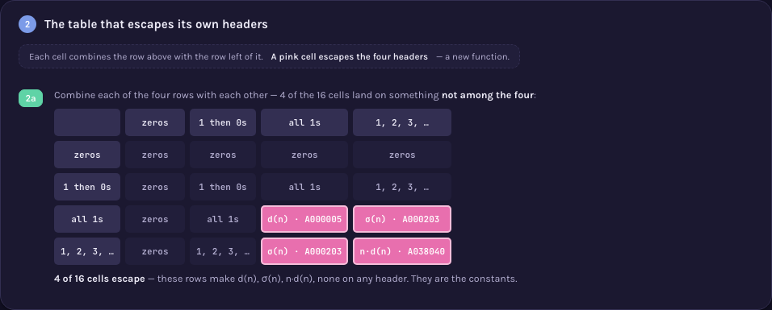
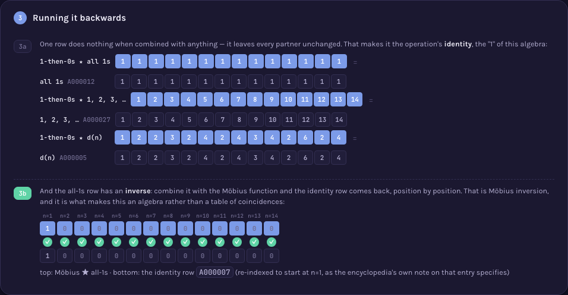

# A000005 — d(n), the number of divisors of n

`a(n)` counts the divisors of `n`: `1, 2, 2, 3, 2, 4, 2, 4, 3, 4, 2, 6, …`. This page also carries a
second job — it is where four sequences whose own values are trivial (`A000004` all zeros,
`A000007` a 1 then zeros, `A000012` all ones, `A000027` the natural numbers) turn out to be the
constants of an operation whose products are the interesting functions, `d(n)` among them.

## Approach

`solution.mjs` computes `a(n)` by the procedure the page draws:

- Dirichlet convolution combines two arithmetic functions by splitting `n` into every pair
  `d × (n/d)` and summing `f(d)·g(n/d)` over those pairs.
- With both functions the constant 1, every term equals 1, so the sum counts the divisor pairs of
  `n` — which is `d(n)`. Divisors are found by trial division up to `√n`, each hit contributing the
  pair `(k, n/k)`.
- The same convolution machinery is exported because the page's later frames run it on the identity
  function, the Möbius function and Euler's totient; each of those is defined here from its own
  definition, never read off a table.

Status: **reproduces OEIS exactly** for `a(1)..a(103)`. Verified live by [`proof.mjs`](proof.mjs)
(2026-09-02), which checks four things with routines that share no code with the search that
produced the answer: soundness (`d(n)` recomputed from the prime factorisation as the product of
each exponent plus one — a different algorithm entirely — agreeing for every `n = 1..2000`); the ten
algebraic relations the page draws, each against an independently computed target, plus
commutativity and associativity on every triple of the cast; the page's central claim that the
table of four constants does **not** close, confirmed as 4 of 16 cells landing outside; and
agreement with OEIS's own `%S`/`%T`/`%U` line fetched live from
`oeis.org/search?q=id:A000005&fmt=text`. Real output of `node sequences/A000005/proof.mjs 2000`,
measured at 38 ms: `All checks passed for n = 1..2000: sound, the drawn algebra holds, the table
provably does not close, and the terms equal OEIS A000005.` The implementation itself measures
`a(1..1,000)` in 3 ms, `a(1..100,000)` in 35 ms and `a(1..1,000,000)` in 923 ms — `O(√n)` per term,
with no combinatorial wall of the kind A000001's or A100001's searches hit.

Full requirements and acceptance criteria:
[spec.md](../../memory-bank/specs/tasks/A000005.md).

## The ideas behind it

Five devices, two new to the catalog and three reused unchanged (full write-ups:
[`memory-bank/_terms.md`](../../memory-bank/_terms.md)):

| Device | Essence |
|---|---|
| [`[device::DivisorPairFan]`](../../memory-bank/_terms.md#devicedivisorpairfan) | Fan `n` out into every pair of factors whose product is `n`, show each pair's contributed term, add them up. |
| [`[device::NonClosingTable]`](../../memory-bank/_terms.md#devicenonclosingtable) | Tabulate an operation over a fixed set and mark every cell that lands outside it, naming what it landed on. |
| [`[device::FixedPointOverlay]`](../../memory-bank/_terms.md#devicefixedpointoverlay) | Align a transform's output against its target, one column per position, marking every match. |
| [`[device::MiniRecap]`](../../memory-bank/_terms.md#deviceminirecap) | Bring the opening frame's own rows back, redrawn small, at the close. |
| [`[device::DivisorChips]`](../../memory-bank/_terms.md#devicedivisorchips) | Divisors of `n` as a row of chips, the trivial `1` and `n` muted, the rest highlighted — here, the labels over the Solution's fraction buckets. |

[](../../memory-bank/visualizations/A000005/viz.html)
[](../../memory-bank/visualizations/A000005/viz.html)

`DivisorPairFan` and `NonClosingTable` are new. The second one exists because the obvious
match — [`[device::CayleyTable]`](../../memory-bank/_terms.md#devicecayleytable) — is the wrong
device here and would have made a false claim: a Cayley table's whole premise is a *closed*
operation whose every result is one of the headers, and this table's point is that four of its
sixteen cells escape. Drawing it in that style would have asserted the closure the picture
disproves.

[](../../memory-bank/visualizations/A000005/viz.html)

`FixedPointOverlay` needed no change to `_terms.md` — its General case already covers any transform,
so the Möbius inversion frame (all-ones combined with the Möbius function, checked column by column
against the identity row) is a plain reuse.

## Build & run

```
node sequences/A000005/solution.mjs 103    # compute a(1..103) from the definition
node sequences/A000005/proof.mjs 2000      # re-check it independently, up to a(2000)
```

## The page these pictures come from

[](../../memory-bank/visualizations/A000005/viz.html)

The page runs Problem (four sequences whose values are exhausted by their own definitions) → 1 (one
operation, worked once on `n = 12`, producing `d(12) = 6`) → 2 (the same operation tabulated over
all four rows, four cells escaping onto `d(n)`, `σ(n)` and `n·d(n)`) → 3 (which row is the identity,
and that the all-ones row has an inverse — the Möbius function) → Solution (the natural-number row
rebuilt out of the others, drawn as the twelve fractions `k/12` bucketing by denominator into groups
of sizes `φ(d)`).

**[Open it live →](../../memory-bank/visualizations/A000005/viz.html)** — every row, every table
cell and every bucket is computed at load time by the page's own script, both themes, the same
visual system as the other four sequences.

Source: [oeis.org/A000005](https://oeis.org/A000005)
