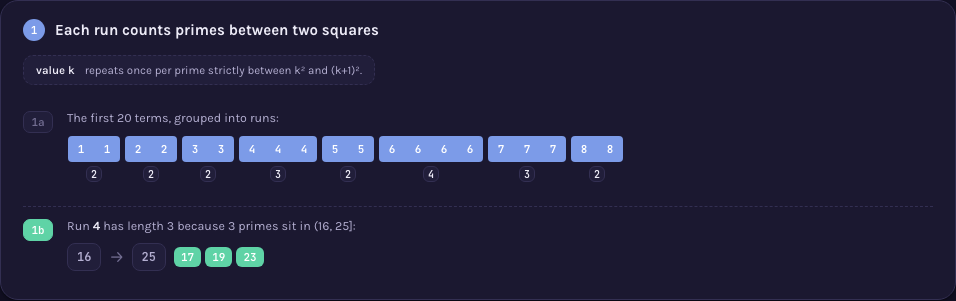

# A000006 — integer part of the square root of the n-th prime

`a(n) = ⌊√prime(n)⌋`. The per-term rule is one line, but the sequence is monotone non-decreasing,
so it breaks into runs of a repeated value `k` — and the length of that run is exactly the number of
primes strictly between `k²` and `(k+1)²`. Whether that length can ever be **zero** is Legendre's
conjecture: unproven since 1808, and still open today.

## Approach

`solution.mjs` sieves primes up to a generous bound and takes `⌊√prime(n)⌋` directly — nothing
statistical, just the definition. The page's real content is one level up, the same way A000030's
page checks a claim about A000030's values rather than only computing them:

- Grouping the sequence into runs of equal value, run `k`'s length equals the count of primes in
  `(k², (k+1)²]` — a directly checkable restatement of the definition, not an assumption.
- Whether every such interval holds at least one prime (Legendre's conjecture) is checked for every
  `k` the sieve reaches, and reported honestly as evidence, not proof.

Status: **reproduces OEIS exactly** for `a(1)..a(71)`. Verified live by [`proof.mjs`](proof.mjs)
(2026-09-02): every term re-derived by an independent construction — trial-division primality
(sharing no code with `solution.mjs`'s sieve) counting primes directly inside each interval
`(k², (k+1)²]` and rebuilding the sequence by repeating `k` that many times — which reproduced
`a(1)..a(400)` exactly and, in doing so, independently confirmed Legendre's conjecture holds for
every `k = 1..52` in that range (no interval came up empty), matching OEIS's own `%S`/`%T`/`%U` line
fetched from `oeis.org/search?q=id:A000006&fmt=text`. Measured: `node sequences/A000006/solution.mjs`
computes `a(1..100000)` in 11 ms. No combinatorial wall — the sieve's memory is the only real limit.

Full requirements and acceptance criteria:
[spec.md](../../memory-bank/specs/tasks/A000006.md).

## The ideas behind it

One device, reused unchanged (full write-up:
[`memory-bank/_terms.md`](../../memory-bank/_terms.md)):

**Run-length encoding** — the sequence's own runs are exactly the answer to "how many primes sit
between these two squares", grouped and counted rather than
asserted. [`[device::RunLengthEncoding]`](../../memory-bank/_terms.md#devicerunlengthencoding)

[](../../memory-bank/visualizations/A000006/viz.html)

No new device was needed: a monotone sequence's repeated values are literally its run-length
structure, the same device A000002's page introduced for a different reason (there, the sequence
IS its own run-length reading; here, a run's length happens to equal a prime count).

## Build & run

```
node sequences/A000006/solution.mjs 1000    # compute a(1..1000) from the definition
node sequences/A000006/proof.mjs 400        # re-check that output, plus Legendre's conjecture over the range checked
```

## The page these pictures come from

[](../../memory-bank/visualizations/A000006/viz.html)

The page runs Problem (the first 20 terms, some values repeating more than others) → 1 (grouping
into runs, and the worked example: run `4` has length 3 because 17, 19 and 23 sit in `(16, 25]`) →
2 (could a run ever be empty? checked for `k = 1..20`, none found) → Solution (every run's length
is a prime count between two squares, and Legendre's conjecture — that this never comes up empty —
remains open, stated plainly rather than implied solved).

**[Open it live →](../../memory-bank/visualizations/A000006/viz.html)** — every run, every prime
count comes from the same functions in the page's own script, computed at load time, both themes,
the same visual system as every other sequence here.

Source: [oeis.org/A000006](https://oeis.org/A000006)
