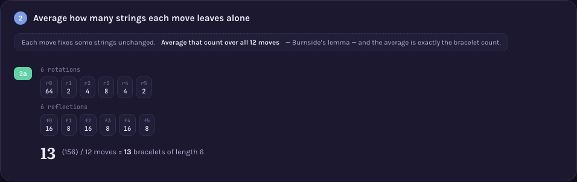

# A000013 — necklaces, colors may be swapped, no turning over

`a(n)` counts binary necklaces of `n` beads up to rotation AND colour-complement — but NOT
reflection. Two strings are the same necklace here exactly when one reaches the other by rotating
and/or swapping every bead's colour; flipping the string end-to-end is not one of the allowed
moves. `a(0)=1, a(1)=1, a(2)=2, a(3)=2, a(4)=4, a(5)=4, a(6)=8, a(7)=10, …`.

This entry is deliberately thin. The mechanism — Burnside's lemma, averaging fixed-string counts
over a symmetry group — lives on [`A000029`'s page](../A000029), drawn there for
rotation+reflection. Here the same technique applies to a DIFFERENT group of the same size
(rotation+complement, `2n` elements, no reflections at all).

## Approach

`solution.mjs` flood-fills every string's orbit under rotation and complement only — no reflection
generator, unlike A000029 and A000011. No table of published terms is consulted.

Status: **matches OEIS exactly** for `a(0)..a(19)`, the published `%S`/`%T`/`%U` line fetched live
2026-09-02 from `oeis.org/search?q=id:A000013&fmt=text`. Verified by [`proof.mjs`](proof.mjs), run
live: every orbit independently checked closed under both moves and partitioning the full state
space, the count re-derived by Burnside's lemma over `{rotation, rotation+complement}` — a
complemented rotation's fixed-string count is `2^cycles` only if every cycle of that rotation has
even length, `0` otherwise — agreeing with the direct search for every `n=0..19`.

Full requirements and acceptance criteria:
[spec.md](../../memory-bank/specs/tasks/A000013.md).

## The ideas behind it

None of its own — the explanation is
[`[device::BurnsideFixedPointTable]`](../../memory-bank/_terms.md#deviceburnsidefixedpointtable),
drawn on A000029's page for the rotation+reflection group; the same averaging argument applies
here with reflection replaced by complement.

[](../../memory-bank/visualizations/A000029/viz.html)

## Build & run

```
node sequences/A000013/solution.mjs 19    # compute a(0..19) from the definition
node sequences/A000013/proof.mjs 19       # re-check that output via Burnside's lemma
```

## The page these pictures come from

[](../../memory-bank/visualizations/A000029/viz.html)

`A000029`'s page walks through Burnside's lemma for rotation+reflection; the same averaging
argument, over rotation+complement instead, gives this sequence.

**[Open it live →](../../memory-bank/visualizations/A000029/viz.html)**

Source: [oeis.org/A000013](https://oeis.org/A000013)
