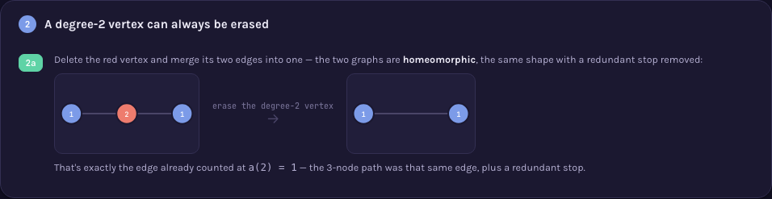
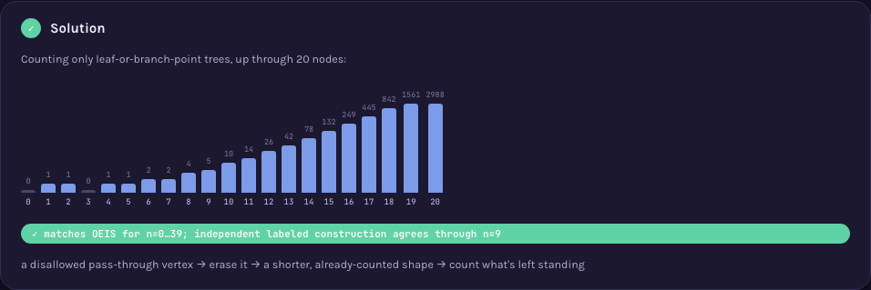

# A000014 — series-reduced trees with n nodes

`a(n)` counts unlabeled trees on `n` nodes where no vertex has degree exactly 2 — every vertex is
either a leaf (degree 1), an isolated single node (degree 0, only possible at `n=1`), or a branch
point (degree 3 or more). These are also called homeomorphically irreducible or "topological"
trees. `a(3) = 0`: the only tree on 3 nodes is a 3-vertex path, and its middle vertex has degree 2 —
disqualified. The page's central claim is exactly why: a degree-2 vertex can always be erased,
merging its two edges into one, without changing the tree's shape in any way that matters — so a
tree that fails the rule was never a genuinely new shape, just an already-counted one with a
redundant stop on it.

## Approach

`solution.mjs` computes `a(n)` by growing every unlabeled tree one node at a time — every tree with
`k+1` nodes has a leaf, and removing it leaves a `k`-node tree, so attaching a new leaf to every
vertex of every already-found `k`-node tree (then deduplicating by canonical form) reaches every
`(k+1)`-node tree with no relabelling and no combinatorial explosion in labeled representations.
The degree-2 filter is applied only once, to the final `n`-node trees, exactly as the definition
requires — an intermediate scaffold tree on the way to `n` is allowed to pass through non-reduced
shapes.

Status: **reproduces OEIS exactly** for `a(0)..a(20)`. Verified live by [`proof.mjs`](proof.mjs)
(2026-09-02) two ways: an independent construction sharing no code with the growth method —
decoding every one of the `n^(n-2)` Prüfer sequences into a labeled tree, filtering and
canonicalizing with its own from-scratch centering + AHU routine — agrees with the fast method for
every `n=0..9` (the labeled construction is exponential, so it stops there; measured, not
estimated); and direct agreement against OEIS's own `%S`/`%T`/`%U` line for A000014, fetched live
from `oeis.org/search?q=id:A000014&fmt=text`, checked for `n=0..20`. Measured wall for the growth
method itself: `n=15` well under a second, `n=18` in 4.2 s, `n=20` in 34.8 s. `n=22` does not
finish — not from time but from memory (a 4 GB heap exhausted mid-level); the header states this
plainly rather than guessing a range.

Full requirements and acceptance criteria:
[spec.md](../../memory-bank/specs/tasks/A000014.md).

## The ideas behind it

Two devices, one new to the catalog and one reused as-is (full write-ups:
[`memory-bank/_terms.md`](../../memory-bank/_terms.md)):

**Degree-two collapse** — a small graph with every vertex labelled by its own degree, the
disqualifying degree-2 vertex highlighted, then the same graph redrawn with that vertex erased and
its two edges merged — the reduction is a literal before/after picture, not an asserted
equivalence. [`[device::DegreeTwoCollapse]`](../../memory-bank/_terms.md#devicedegreetwocollapse)

[](../../memory-bank/visualizations/A000014/viz.html)

**Log growth chart** — `a(0)..a(20)` as log-scaled bars with every literal value printed, so the
jump from single digits to thousands stays
readable. [`[device::LogGrowthChart]`](../../memory-bank/_terms.md#deviceloggrowthchart)

[](../../memory-bank/visualizations/A000014/viz.html)

## Build & run

```
node sequences/A000014/solution.mjs 20     # compute a(0..20) from the definition
node sequences/A000014/proof.mjs 9 20      # re-check: independent construction to n=9, OEIS agreement to n=20
```

## The page these pictures come from

[](../../memory-bank/visualizations/A000014/viz.html)

The page runs Problem (a 3-node tree that clearly exists, yet `a(3)=0`) → 1 (the only two allowed
kinds of vertex: leaf and branch point) → 2 (erasing the disqualifying vertex, landing exactly on
the already-counted 2-node edge) → 3 (the two 6-node shapes — a 5-leaf hub, and two hubs sharing an
edge — showing the same leaf-or-branch-point rule at a slightly richer scale) → Solution (the
verified growth chart through `n=20`).

**[Open it live →](../../memory-bank/visualizations/A000014/viz.html)** — every tree, every degree
label, every bar is computed at load time from the same functions the page's own script defines,
both themes, the same visual system as every other sequence here.

Source: [oeis.org/A000014](https://oeis.org/A000014)
