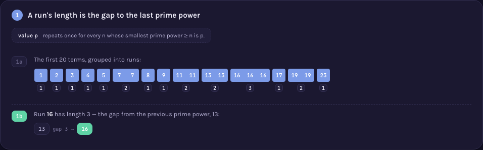

# A000015 — smallest prime power ≥ n

`a(n)` is the smallest prime power (a prime, or a power of a single prime) that is at least `n`,
with this entry's own convention that `1` counts as a prime power (`a(1) = 1`). Like A000006, the
sequence is non-decreasing, so it breaks into runs of a repeated value — and a run's length is
exactly the gap since the previous prime power.

## Approach

`solution.mjs` scans upward from `n` testing each candidate for being a prime power — the direct
definition, no table of published terms.

Status: **reproduces OEIS exactly** for `a(1)..a(72)`. Verified live by [`proof.mjs`](proof.mjs)
(2026-09-02): every term re-derived by a from-scratch sieve that marks every `p^k` up to a bound
(sharing no code with `solution.mjs`'s per-candidate trial division), which reproduced
`a(1)..a(1000)` exactly; separately, the sequence's own run/gap structure was checked directly —
every run's length equals the gap since the previous prime power, confirmed for every prime power
up to `a(1000)`'s value; and agreement with OEIS's own `%S`/`%T`/`%U` line fetched from
`oeis.org/search?q=id:A000015&fmt=text`. Measured: `node sequences/A000015/solution.mjs` computes
`a(1..100000)` in 33 ms. No combinatorial wall — prime powers are dense enough that the upward scan
rarely goes far.

Full requirements and acceptance criteria:
[spec.md](../../memory-bank/specs/tasks/A000015.md).

## The ideas behind it

One device, reused unchanged (full write-up:
[`memory-bank/_terms.md`](../../memory-bank/_terms.md)):

**Run-length encoding** — the same device A000006's page uses for prime gaps between squares,
reused here for gaps between consecutive prime
powers. [`[device::RunLengthEncoding]`](../../memory-bank/_terms.md#devicerunlengthencoding)

[](../../memory-bank/visualizations/A000015/viz.html)

No new device, and no new claim beyond the checkable one: a run's length is a real, countable gap
between two specific prime powers, not a coincidence. An earlier draft of this page looked for a
sharper story — "prime powers are much denser than primes, so their gaps stay small" — but checking
it numerically (max gap up to 100,000 among prime powers versus among primes alone) found the two
identical at that range: prime squares and cubes are too sparse below 100,000 to visibly close any
gap. That claim was dropped rather than kept on the strength of intuition alone.

## Build & run

```
node sequences/A000015/solution.mjs 1000    # compute a(1..1000) from the definition
node sequences/A000015/proof.mjs 1000       # re-check that output, plus the run/gap structure
```

## The page these pictures come from

[](../../memory-bank/visualizations/A000015/viz.html)

The page runs Problem (the first 20 terms, `16` repeating three times) → 1 (grouping into runs, and
the worked example: run `16`'s length of 3 is the gap since the previous prime power, `13`) →
Solution (every run's length is a checkable gap between two prime powers).

**[Open it live →](../../memory-bank/visualizations/A000015/viz.html)** — every run and every gap
comes from the same functions in the page's own script, computed at load time, both themes, the
same visual system as every other sequence here.

Source: [oeis.org/A000015](https://oeis.org/A000015)
