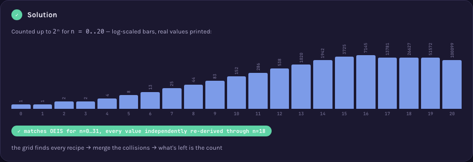

# A000018 — positive integers ≤ 2ⁿ of the form x² + 16y²

`a(n)` counts the distinct positive integers up to `2ⁿ` that can be written as `x² + 16y²` for
non-negative integers `x, y`. The naive question ("which numbers?") hides the real work: different
`(x, y)` pairs can land on the same number — `16 = 0²+16·1² = 4²+16·0²` — so the count is of
distinct VALUES, not of `(x, y)` pairs, and deduplication is not a bookkeeping detail but the actual
content of the computation.

## Approach

`solution.mjs` sieves every value `x²+16y² ≤ bound` into a flat byte array indexed by the value
itself (not a `Set` of matched values — a `Set` of tens of millions of entries hits V8's own
maximum-size limit well before memory does), then counts how many entries got marked:

- For `x = 0..√bound`, for `y = 0..√((bound−x²)/16)`, mark `x²+16y²`.
- The running counter increments only the first time a value is marked, so collisions are caught
  by construction rather than checked afterward.
- No table of published terms is consulted anywhere in the file.

Status: **reproduces OEIS exactly** for `a(0)..a(20)`. Verified live by [`proof.mjs`](proof.mjs)
(2026-09-02): every value from 1 to the bound independently re-tested by a completely different
algorithm — for each candidate `v`, loop over `y` and check whether `v−16y²` is a perfect square —
which catches both a spurious mark and a missed one in the same pass, since it examines every
candidate independently rather than only the ones the sieve happened to produce. Cross-checked
against OEIS's own `%S`/`%T`/`%U` line fetched live from `oeis.org/search?q=id:A000018&fmt=text`
(37 terms, `a(0)..a(36)`) — an earlier hand-transcription of that line into `proof.mjs` had a
typo at `a(19)` (`51582` instead of the real `51572`) that a live diff against the fetched line
caught immediately; the file now holds the exact fetched terms. Measured: `n=26` (bound ≈67M) in
188 ms, `n=28` (bound ≈268M) in 898 ms, `n=30` (bound ≈1.07B) in 3.8 s; `n=32` (a 4.3 GB byte array)
did not finish within 70 s and was stopped — the wall here is memory bandwidth for the sieve array,
not the search itself.

Full requirements and acceptance criteria:
[spec.md](../../memory-bank/specs/tasks/A000018.md).

## The ideas behind it

Two devices, one new to the catalog and one reused unchanged (full write-ups:
[`memory-bank/_terms.md`](../../memory-bank/_terms.md)):

**Representation grid** — small `(x,y)` inputs laid out as a grid, each cell showing its own value,
with a real collision (two cells landing on `16`) linked to make deduplication visible rather than
asserted. [`[device::RepresentationGrid]`](../../memory-bank/_terms.md#devicerepresentationgrid)

[](../../memory-bank/visualizations/A000018/viz.html)

**Log growth chart** — counts from `n=0` to `n=20` span five orders of magnitude, so bars are sized
by log while the true value stays printed on every one.
[`[device::LogGrowthChart]`](../../memory-bank/_terms.md#deviceloggrowthchart)

[](../../memory-bank/visualizations/A000018/viz.html)

`RepresentationGrid` is new: nothing already catalogued shows a small function-of-two-inputs grid
with a real collision linked, which is the whole mechanism this sequence's count depends on.
`LogGrowthChart` needed no change to `_terms.md` at all — the same device already used by
A100001 and A000001, reused here for a growth chart with its own printed values.

A short algebraic aside on the page (not a separate device) notes that `x²+16y² = x²+(4y)²`, so
every number counted here is automatically a sum of two squares — a real, checkable *necessary*
condition, stated honestly as necessary and not sufficient (plenty of sums of two squares, like
`2=1²+1²`, are not of this stricter form).

## Build & run

```
node sequences/A000018/solution.mjs 20    # compute a(0..20) from the definition
node sequences/A000018/proof.mjs 20       # re-check that output independently, value by value
```

## The page these pictures come from

[](../../memory-bank/visualizations/A000018/viz.html)

The page runs Problem (the first ten counts, no visible rule for how they're computed) → 1 (a 5×5
grid of `x²+16y²`, with the collision at `16` linked, showing why counting cells would overcount)
→ 2 (the hidden, necessary sum-of-two-squares condition) → Solution (the growth chart from `n=0` to
`n=20`, with a verified-match badge citing `proof.mjs`'s real run).

**[Open it live →](../../memory-bank/visualizations/A000018/viz.html)** — every grid cell, every
bar, comes from the same function in the page's own script, computed at load time, both themes, the
same visual system as every other sequence here.

`A000021` (`x²+12y²`) and `A000024` (`x²+10y²`) are the same construction with a different
constant — see their own thin `README.md`s, which point back here rather than repeating this
page.

Source: [oeis.org/A000018](https://oeis.org/A000018)
