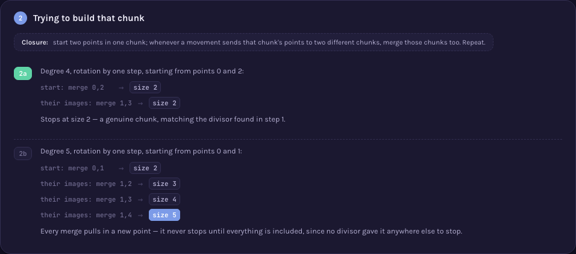

# A000019 — primitive permutation groups of degree n

`a(n)` counts the primitive permutation groups of degree `n`, up to conjugacy in `S_n` — groups
acting on `n` points that are transitive and admit no nontrivial way to split those points into
smaller, equal-sized chunks the group only ever shuffles as whole chunks (a "block system").
`a(1)=1, a(2)=1, a(3)=2, a(4)=2, a(5)=5, a(6)=4, …`

## Approach

`solution.mjs` enumerates **every** subgroup of `S_n` — not an approximation over a bounded number
of generators, but the exact "one-step extension" closure: start from the trivial group, and
repeatedly extend every subgroup found so far by one more element not already in it, closing under
multiplication, until nothing new appears. Every subgroup is reachable this way, so the list is
complete by construction. From that list:

- keep the transitive ones with no nontrivial block (the minimal block containing any pair of
  points, built by the classical union-find closure, is either a singleton, the whole set, or —
  for an imprimitive group — something properly in between);
- merge subgroups that are conjugate in `S_n` (the same group acting on relabelled points).

No table of published primitive-group counts is consulted anywhere in the file.

Status: **reproduces OEIS exactly** for `a(1)..a(6)`. Verified live by [`proof.mjs`](proof.mjs)
(2026-09-02): the enumeration's completeness is checked against `OEIS A005432` ("number of
subgroups of `S_n`") — a published sequence about a *different* question that has nothing to do
with primitivity, so if the subgroup search had missed anything, the totals (1, 2, 6, 30, 156, 1455
for `n=1..6`) would already disagree, and they don't; every returned class is independently
re-confirmed primitive by a different theorem (a point stabilizer is a *maximal* subgroup, not "no
block" — Dixon & Mortimer, *Permutation Groups*, Thm. 1.10); no two returned classes are conjugate,
checked by a freshly written conjugacy test; and the final counts match OEIS's own published terms.
Measured: `n<=5` in well under a second, `n=6` in 229.5 s (~3.83 min) — `n=7` (`S_7` has 5,040
elements) was not attempted; extrapolating the growth from `n=5` to `n=6` (156 → 1,455 subgroups,
roughly ×9), it is expected to take many hours with this exact method, and no faster-but-still-exact
method is implemented here. This wall — not an earlier draft's shortcut of closing only pairs of
generators, which happened to give the right small-`n` answers by luck without being provably
complete — is the honest one: a prior version of this file used that shortcut and was replaced once
the risk was recognized, per this project's discipline that a method must be correct at whatever
range it claims, not merely lucky.

Full requirements and acceptance criteria:
[spec.md](../../memory-bank/specs/tasks/A000019.md).

## The ideas behind it

Two devices, one new to the catalog and one reused as-is (full write-ups:
[`memory-bank/_terms.md`](../../memory-bank/_terms.md)):

**Divisor chips** — a block's size has to divide the point count; degree 5 is prime, so its only
divisors are 1 and 5, leaving no candidate size at
all. [`[device::DivisorChips]`](../../memory-bank/_terms.md#devicedivisorchips)

[](../../memory-bank/visualizations/A000019/viz.html)

**Block closure trace** — starting from a candidate pair of points, every merge the group's action
forces is listed step by step until the process stabilizes; degree 4 stops at a genuine chunk of
size 2, degree 5 is dragged all the way to
everything. [`[device::BlockClosureTrace]`](../../memory-bank/_terms.md#deviceblockclosuretrace)

[](../../memory-bank/visualizations/A000019/viz.html)

## Build & run

```
node sequences/A000019/solution.mjs 6    # compute a(1..6) from the definition (n=6 takes ~4 min)
node sequences/A000019/proof.mjs 6       # re-check that output independently, same real wall
```

## The page these pictures come from

[](../../memory-bank/visualizations/A000019/viz.html)

The page runs Problem (two rotation groups, degree 4 and degree 5, asking which one can be split)
→ 1 (a block size must divide the point count; degree 5's primality leaves no candidate) → 2 (the
closure algorithm actually run: degree 4 stops at size 2, degree 5 grows step by step — 2, 3, 4, 5
— all the way to everything) → Solution (the count for degree 5, with an honest note that
primality only explains why the rotation group itself is primitive — the full count of 5 also
includes larger groups on the same 5 points, each separately confirmed to have no block of its
own).

**[Open it live →](../../memory-bank/visualizations/A000019/viz.html)** — every divisor, every
merge step, comes from the same functions in the page's own script, computed at load time, both
themes, the same visual system as every other sequence here.

Source: [oeis.org/A000019](https://oeis.org/A000019)
