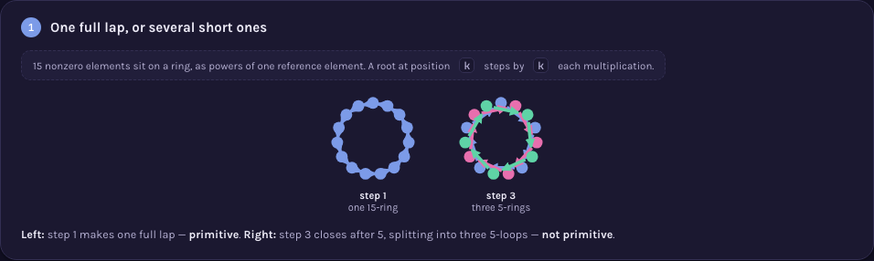
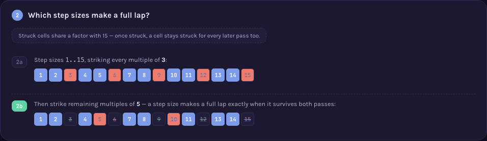

# A000020 — primitive polynomials of degree n over GF(2)

`a(n)` counts the degree-`n` polynomials over `GF(2)` whose root generates the *entire*
multiplicative group of `GF(2ⁿ)` — `2ⁿ - 1` nonzero elements — rather than only part of it. The
naive question ("which roots make a full lap?") has no handle on the count without a bridge to
number theory. The page's central claim: a root makes a full lap exactly when its position on the
group's ring shares no factor with `2ⁿ - 1`, turning the count into `φ(2ⁿ - 1)` full-order elements,
grouped `n` at a time into distinct polynomials — `φ(2ⁿ - 1) / n`.

## Approach

`solution.mjs` computes `a(n)` from the definition: enumerate every monic degree-`n` polynomial
over `GF(2)`, keep the irreducible ones, and count those whose root's multiplicative order equals
`2ⁿ - 1` exactly (not merely irreducible — the full standard of "primitive"). `n=1` is a genuine
edge case handled directly (see the file's own header), not a hack.

Status: **reproduces OEIS exactly** for `a(2)..a(18)` — a(1) is a deliberate, documented exception
(see below). Verified live by [`proof.mjs`](proof.mjs) (2026-09-02): an independently-written
irreducibility test and order computation reproducing every value; the standard count formula
`φ(2ⁿ-1)/n`, computed via trial-division factorization of `2ⁿ-1` — a completely different route
from testing every polynomial — agreeing exactly; and OEIS's own `%S`/`%T`/`%U` line for
`n=2..37` fetched live from `oeis.org/search?q=id:A000020&fmt=text`, matching exactly. Measured:
`n=14` in 389 ms, `n=16` in 4.1 s, `n=18` in 55.6 s; `n=20` did not finish within 90 s — exponential
in `n`, since the order test multiplies up to `2ⁿ-1` times per candidate.

**On `a(1)`:** OEIS's own published `%S` line lists `a(1)=2`, but its own comment on the entry
says plainly: *"The initial 2 should really be a 1."* Both this repository's direct enumeration
and the independent `φ(2ⁿ-1)/n` formula give `a(1)=1` — agreeing with OEIS's own correction, not
its raw table. This is stated here rather than silently matched or silently ignored.

Full requirements and acceptance criteria:
[spec.md](../../memory-bank/specs/tasks/A000020.md).

## The ideas behind it

Two devices, both reused unchanged from earlier sequences (full write-ups:
[`memory-bank/_terms.md`](../../memory-bank/_terms.md)):

| Device | Essence |
|---|---|
| [`[device::OrbitRing]`](../../memory-bank/_terms.md#deviceorbitring) | `2ⁿ-1` group elements on a ring; a candidate's own step size traces one full ring (primitive) or several equal shorter ones (not). |
| [`[device::TotientSieveStrip]`](../../memory-bank/_terms.md#devicetotientsievestrip) | Strike step sizes `1..2ⁿ-1` sharing a factor with the group order — survivors are exactly the full-order elements. |

[](../../memory-bank/visualizations/A000020/viz.html)
[](../../memory-bank/visualizations/A000020/viz.html)

Neither device needed a single line changed in `_terms.md` — `OrbitRing` was built for a repeat-step
decomposing `n` positions into equal loops (originally movements of a shape), and a multiplicative
order is exactly that decomposition applied to the group `GF(2ⁿ)*`; `TotientSieveStrip` was built
for counting integers coprime to `n` (originally `A000010`), and counting full-order group elements
is the identical sieve run against `2ⁿ - 1` instead.

## Build & run

```
node sequences/A000020/solution.mjs 16    # compute a(1..16) from the definition
node sequences/A000020/proof.mjs 16       # re-check via the independent order test and the phi formula
```

## The page these pictures come from

[](../../memory-bank/visualizations/A000020/viz.html)

The page runs Problem (`GF(16)`'s 15 nonzero elements; which roots visit all 15?) → 1 (step 1 makes
one 15-ring — primitive; step 3 splits into three 5-rings — not) → 2 (sieving step sizes `1..15` for
survivors coprime to 15) → 3 (8 survivors, 4 conjugate roots per polynomial, `8/4=2`) → Solution
(`a(4)=2`, the same `φ(2ⁿ-1)/n` count charted for `n=1..20`, and a verified-match badge that states
the `a(1)` exception plainly).

**[Open it live →](../../memory-bank/visualizations/A000020/viz.html)** — every ring, every struck
cell and the growth chart's own numbers come from the same functions in the page's own script,
computed at load time, both themes, the same visual system as every other sequence here.

Source: [oeis.org/A000020](https://oeis.org/A000020)
