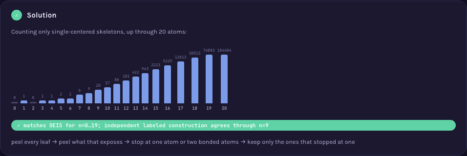
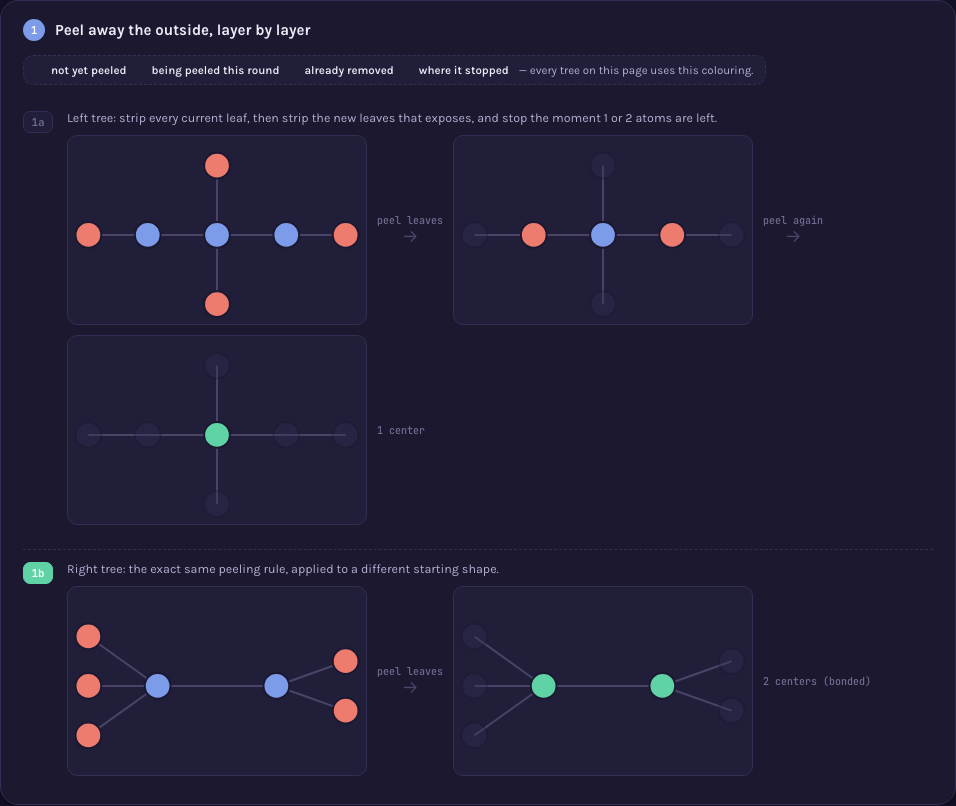

# A000022 — centered hydrocarbons with n atoms

`a(n)` counts unlabeled trees on `n` nodes with every vertex of degree at most 4 (a carbon
skeleton — Cayley's 1875 alkane-counting problem, "quartic trees") that have exactly one **center**
in the sense of Jordan's theorem (1869): repeatedly stripping every current layer of leaves always
ends at either one vertex or two adjacent vertices, never anything else. The centered ones are this
sequence; the bicentered ones are [A000200](https://oeis.org/A000200); together they account for
every quartic tree, [A000602](https://oeis.org/A000602). The page's central claim is that dichotomy
made visible: two skeletons of the same size, same degree bound, peeled by the identical rule, land
on genuinely different outcomes — one center or two — and that outcome, not the tree's size, is what
this sequence actually counts.

## Approach

`solution.mjs` reuses [A000014](../A000014)'s tree-growth machinery (unlabeled trees built one leaf
at a time, deduplicated by canonical AHU form) with two changes: the degree cap (≤4) is enforced
while growing, since a vertex's degree only ever increases on the way to `n` nodes, so pruning early
is both correct and faster; and the final filter keeps single-center trees instead of A000014's
no-degree-2 condition.

Status: **reproduces OEIS exactly** for `a(0)..a(19)`. Verified live by [`proof.mjs`](proof.mjs)
(2026-09-02) three ways: an independent construction sharing no code with the growth method —
decoding every one of the `n^(n-2)` Prüfer sequences into a labeled tree, filtering to max degree ≤4
and exactly one center with its own from-scratch centering + AHU routine — agrees with the fast
method for `n=0..9` (7 s at `n=9` on this machine; the labeled construction is exponential, so it
stops there); the identity `A000022(n) + A000200(n) = A000602(n)` checked for `n=1..18` against all
three sequences' own published terms (not derived from anything in this file); and direct agreement
against OEIS's own `%S`/`%T`/`%U` line for A000022, fetched live from
`oeis.org/search?q=id:A000022&fmt=text`. Measured wall for the growth method itself, on this
machine: `n=19` in under 6 s, `n=20` in 16.0 s (matching OEIS's `a(20)=184484`), `n=21` in 3 min 7 s
total wall for the whole `0..21` run (matching OEIS's `a(21)=458561`) — quartic trees grow
noticeably faster than A000014's series-reduced ones (184,484 of them at `n=20` versus A000014's
2,988), and `n=22` was not attempted given that rate.

Full requirements and acceptance criteria:
[spec.md](../../memory-bank/specs/tasks/A000022.md).

## The ideas behind it

Zero new devices — both catalogued devices are reused exactly as written for A000014 (full
write-ups: [`memory-bank/_terms.md`](../../memory-bank/_terms.md)):

**Log growth chart** — `a(0)..a(20)` as log-scaled bars with every literal value printed.
[`[device::LogGrowthChart]`](../../memory-bank/_terms.md#deviceloggrowthchart)

[](../../memory-bank/visualizations/A000022/viz.html)

The peeling animation itself reuses [`[device::MiniRecap]`](../../memory-bank/_terms.md#deviceminirecap)'s
own discipline — each frame is a literal redraw of the previous tree, shrunk to nothing but a colour
change, never a new drawing — run twice in parallel on two different starting shapes so the same
rule visibly produces two different endings:

[](../../memory-bank/visualizations/A000022/viz.html)

## Build & run

```
node sequences/A000022/solution.mjs 20     # compute a(0..20) from the definition
node sequences/A000022/proof.mjs 9 16      # re-check: independent construction to n=9, identity + OEIS agreement to n=16
```

## The page these pictures come from

[](../../memory-bank/visualizations/A000022/viz.html)

The page runs Problem (two same-size quartic trees, no visible rule for telling them apart) → 1 (the
identical peeling rule run on both, real intermediate states shown, not asserted) → 2 (Jordan's
theorem: it always stops at one vertex or two adjacent ones) → 3 (the identity — centered plus
bicentered accounts for every quartic tree of that size, checked against real published counts) →
Solution (the verified growth chart through `n=20`).

**[Open it live →](../../memory-bank/visualizations/A000022/viz.html)** — both trees are the actual
output of `allQuarticTrees(7)`, not hand-drawn guesses; every peeling frame is computed at load time
from the same rule `centers()` implements, both themes, the same visual system as every other
sequence here.

Source: [oeis.org/A000022](https://oeis.org/A000022)
