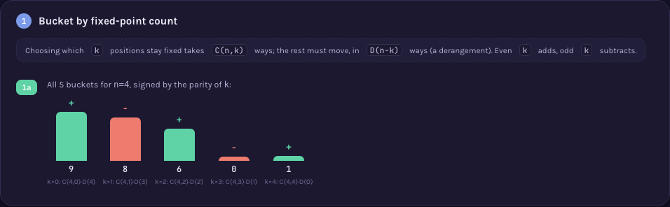

# A000023 — permutations signed by fixed-point parity

`a(n)` is the number of permutations of `{1,...,n}` with an even number of fixed points, minus the
number with an odd number of fixed points: `1, -1, 2, -2, 8, 8, 112, …`. The naive question ("just
count and subtract") gives no handle on why the running total lands where it does. The page's
central claim: bucketing permutations by their exact fixed-point count `k` turns the whole count
into a single inclusion–exclusion sum — `C(n,k)` ways to choose which points stay fixed, times
`D(n-k)` derangements of the rest, signed by the parity of `k` — with a second, independent route
(a simple linear recurrence) landing on the identical number.

## Approach

`solution.mjs` computes `a(n)` by the plain definition: generate every permutation of `n` elements,
count its fixed points, and add `+1` or `-1` by parity. No recurrence, no formula — the exhaustive
search itself.

Status: **reproduces OEIS exactly** for `a(0)..a(12)` — the practical wall of the brute-force
search all three checks share. Verified live by [`proof.mjs`](proof.mjs) (2026-09-02), run at
`n=12` (20.2 s), with two structurally independent routes to the same numbers: the **bucket sum**
`sum_k (-1)^k · C(n,k) · D(n-k)` (derangement counts from their own recurrence, no permutations
generated at all), and the **linear recurrence** `a(n) = n·a(n-1) + (-2)^n` (which falls out of the
exponential generating function `e^(-2x)/(1-x)` for this exact signed count — a fact OEIS's own
comment on A000023 states independently); both agree with the brute-force search and with OEIS's
published `%S`/`%T`/`%U` line fetched live from `oeis.org/search?q=id:A000023&fmt=text` (which
lists terms through `n=22`, embedded in full in `proof.mjs`, though only `n=0..12` is exercised by
a live brute-force run — the practical wall, not a guess). Measured: `n=9` in 16 ms, `n=10` in
141 ms, `n=11` in 1.5 s, `n=12` in 18.1 s; `n=13` was not attempted.

Full requirements and acceptance criteria:
[spec.md](../../memory-bank/specs/tasks/A000023.md).

## The ideas behind it

One device, new to the catalog (full write-up:
[`memory-bank/_terms.md`](../../memory-bank/_terms.md)):

**Signed bucket sum** — partition the count by fixed-point number `k`, show each bucket's own raw
size, sign it by the parity of `k`, and add them up — an inclusion–exclusion identity as a row of
signed bars that actually sums to the answer, not a formula taken on faith.
[`[device::SignedBucketSum]`](../../memory-bank/_terms.md#devicesignedbucketsum)

[](../../memory-bank/visualizations/A000023/viz.html)

## Build & run

```
node sequences/A000023/solution.mjs 10    # compute a(0..10) from the definition
node sequences/A000023/proof.mjs 10       # re-check via the bucket sum and the recurrence
```

## The page these pictures come from

[](../../memory-bank/visualizations/A000023/viz.html)

The page runs Problem (24 permutations of 4 elements, scored `+1`/`-1` by fixed-point parity) → 1
(all 5 fixed-point-count buckets for `n=4`, each a `C(4,k)·D(4-k)` count, signed) → 2 (the signed
buckets summed to `8`) → 3 (the identical `8` reached again by the recurrence, no buckets involved)
→ Solution (the same signed count charted for `n=0..12`, magnitude on a log scale, colour carrying
the sign, and a verified-match badge).

**[Open it live →](../../memory-bank/visualizations/A000023/viz.html)** — every bucket, every sum
and the recurrence's own numbers come from the same functions in the page's own script, computed
at load time, both themes, the same visual system as every other sequence here.

Source: [oeis.org/A000023](https://oeis.org/A000023)
