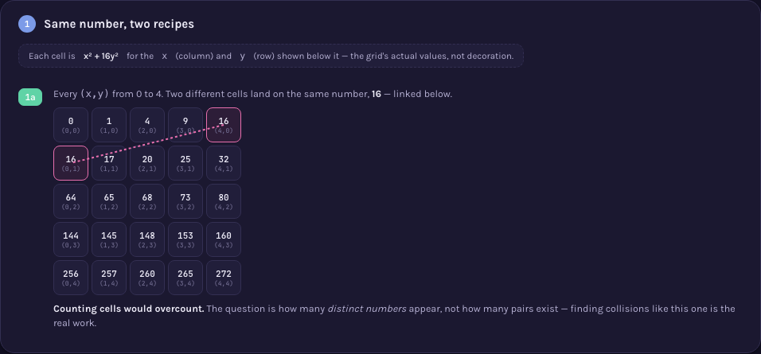
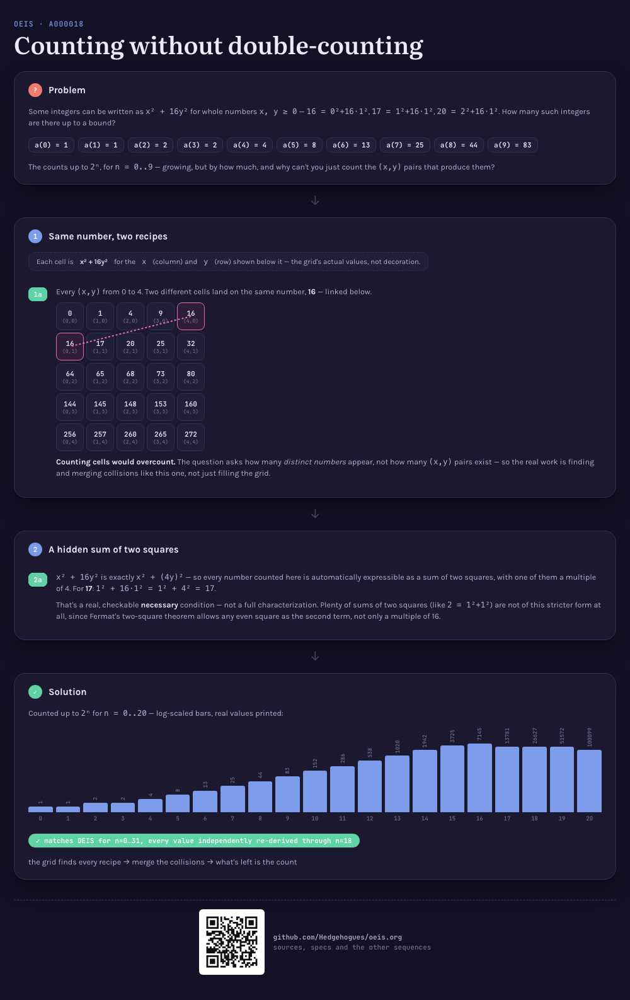

# A000024 — positive integers ≤ 2ⁿ of the form x² + 10y²

`a(n)` counts the distinct positive integers up to `2ⁿ` expressible as `x²+10y²` for non-negative
integers `x, y`. Exactly the same construction as [`A000018`](../A000018) (`x²+16y²`) with a
different constant.

This entry is deliberately thin. Its picture lives on
[`A000018`'s page](../../memory-bank/visualizations/A000018/viz.html), where the representation
grid, the collision at a repeated value, and the reason counting `(x,y)` pairs overcounts are all
explained once, for the family, rather than redrawn here with `10` in place of `16`.

## Approach

`solution.mjs` sieves every value `x²+10y² ≤ bound` into a flat byte array and counts first-time
marks — the identical method A000018 uses, with `16` replaced by `10`. No table of published terms
is consulted.

Status: **matches OEIS exactly** for `a(0)..a(18)`, the published `%S`/`%T`/`%U` line fetched live
2026-09-02 from `oeis.org/search?q=id:A000024&fmt=text` (37 terms, offset 0). Verified by
[`proof.mjs`](proof.mjs), run live: every value from 1 to the bound independently re-tested by a
per-candidate perfect-square check (`v−10y²` a perfect square for some `y`), sharing no code with
the sieve, agreeing on every value through `n=18`, and matching OEIS term for term.

Full requirements and acceptance criteria:
[spec.md](../../memory-bank/specs/tasks/A000024.md).

## The ideas behind it

None of its own — the explanation is
[`[device::RepresentationGrid]`](../../memory-bank/_terms.md#devicerepresentationgrid) and
[`[device::LogGrowthChart]`](../../memory-bank/_terms.md#deviceloggrowthchart), both drawn on
A000018's page for the `x²+16y²` case; the mechanism (collisions between `(x,y)` pairs, why
deduplication is the real work) is identical here with `10` in place of `16`.

[](../../memory-bank/visualizations/A000018/viz.html)

## Build & run

```
node sequences/A000024/solution.mjs 18    # compute a(0..18) from the definition
node sequences/A000024/proof.mjs 18       # re-check that output independently, value by value
```

## The page these pictures come from

[](../../memory-bank/visualizations/A000018/viz.html)

`A000018`'s page walks through exactly this construction for `x²+16y²` — the same grid mechanism,
the same collision-merging argument, the same growth chart — and applies unchanged to `x²+10y²`.

**[Open it live →](../../memory-bank/visualizations/A000018/viz.html)**

Source: [oeis.org/A000024](https://oeis.org/A000024)
