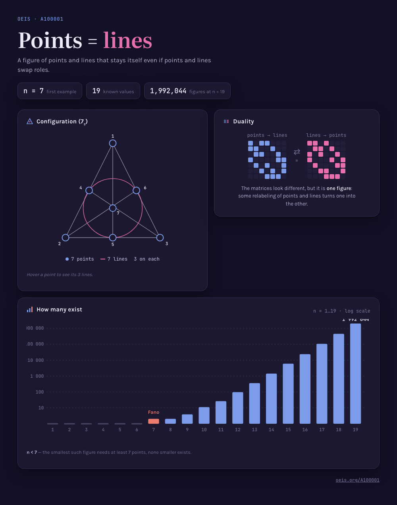
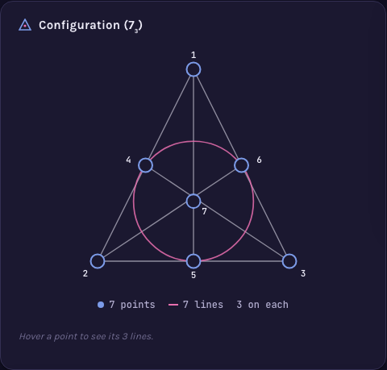
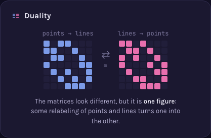
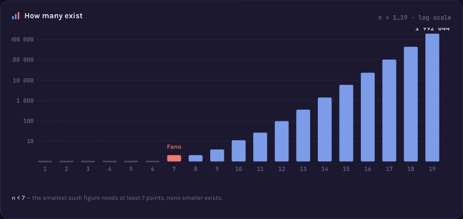

# A100001 — Number of self-dual combinatorial configurations of type (n_3)



A configuration `(n_3)` is `n` points and `n` lines, each point on exactly 3 lines, each line
holding exactly 3 points. Swapping the roles of points and lines gives the *dual* configuration;
one is **self-dual** if it's isomorphic to its own dual. `a(n)` counts how many self-dual
configurations exist at each size — 0 until `n=7`, then 1, 1, 3, 10, 25, 95, ... up to 1 992 044
at `n=19`.

## The idea behind it

The picture opens with the smallest and only famous case: the **Fano plane**, the unique `(7_3)`
configuration, drawn the classic way (triangle + medians + incircle, 7 points, 7 lines). Hovering
a point highlights the 3 lines through it, making the "3 lines per point" rule tangible rather
than stated.



One catalogued device (full write-up:
[`memory-bank/_terms.md`](../../memory-bank/_terms.md#deviceincidencematrixpair)):

**Incidence matrix pair** — self-duality is shown as two 7×7 incidence matrices, the
configuration's own matrix and its transpose, side by side, deliberately *not* forced to look
identical. The honest point is that they look different as drawn, yet the configuration is still
self-dual: what matters is that *some* relabeling of points and lines turns one into the other, not
that the naive matrix is symmetric.
[`[device::IncidenceMatrixPair]`](../../memory-bank/_terms.md#deviceincidencematrixpair)



A [log growth chart](../../memory-bank/_terms.md#deviceloggrowthchart) (`n=1..19`) closes it out,
with the Fano plane's `n=7` marked as the first nonzero term.



**[Open the visualization →](../../memory-bank/visualizations/A100001/viz.html)**

## Computing it, and checking the computation

Two files, deliberately not one:

| | |
|---|---|
| [`solution.mjs`](solution.mjs) | Builds every `(n_3)` configuration up to isomorphism, swaps the roles of points and lines in each one, and counts those isomorphic to that swap. No table of known answers anywhere in it. |
| [`proof.mjs`](proof.mjs) | Refuses to trust that output: its own permutation search with no shared pruning, the Fano plane rebuilt from algebra instead of from a search, the published count of *all* `(n_3)` configurations as the completeness reference, and — for every self-duality claim — explicit point and line permutations verified cell by cell on the raw incidence matrix. |

```
$ node sequences/A100001/solution.mjs 12
a(12) = 95   (of 229 configuration(s) of type (12_3), 15095 ms)
0, 0, 0, 0, 0, 0, 1, 1, 3, 10, 25, 95

$ node sequences/A100001/proof.mjs 12
ok    a(12) = 95 self-dual of 229 configuration(s)  · 95 duality witness(es) verified on the incidence matrices
All checks passed for n = 1..12: sound, distinct, complete, witnessed, and equal to OEIS A100001.
```

The witness check is the point of the picture, made mechanical: the two grids on the page do *not*
match as drawn, and the proof shows why that is fine by producing the relabeling that makes them
match and verifying it entry by entry.

Measured: `n = 12` in 15 s, `n = 13` in about 4 minutes (2036 configurations, 366 self-dual).
`n = 14` was not run. The published terms go to `n = 19`, which no search of this shape reaches.

Full requirements and acceptance criteria:
[spec.md](../../memory-bank/specs/tasks/A100001.md).

Source: [oeis.org/A100001](https://oeis.org/A100001)
